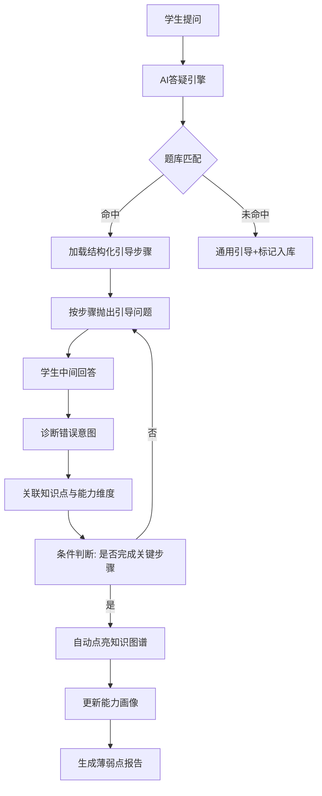

# 语雀-方案设计

> summary: 面试问语雀AI答疑的方案设计，答核心功能模块
> 权威度: 0.7 ｜ 来源: 语雀 ｜ 锚点: 语雀原文：AI答疑 方案设计
> 模块: ai-tutoring ｜ 节: 语雀-方案设计

---

### 五、防作弊与体验保障（安全防线）

**目标**：通过行为风控和体验设计，既防套取答案，又维护学习动力。

| 编号 | 功能点 | 说明 |
|------|--------|------|
| 23 | 行为风控模型 | 监测短时高频问同一题、大量只问答案、无思考痕迹等异常，升级引导策略 |
| 24 | 题目指纹去重 | 同一会话内相同指纹的题目只能获得一次引导流程，重复提问时提示先尝试作答 |
| 25 | 多轮对话状态保持 | 记忆当前答疑进度，支持中断后从断点继续 |
| 26 | 情绪感知与激励 | 识别挫败情绪，切换鼓励话术或降低难度，成功后给予正向反馈 |
| 27 | 学习报告与监护端可见 | 定期生成报告推送给家长/教师，内容包含答疑数量、薄弱点、点亮进度 |
| 28 | 安全与合规 | 敏感内容过滤、数据加密、满足个人信息保护法规、支持人工兜底 |

> **⚠️ 代码现状（2026-08 对账）**：功能 23 行为风控 **🚫 未落地**（真实 = 答案护栏 + 轮次护栏）；功能 24 题目指纹去重 **🚫 未落地**；功能 25 多轮状态保持 ✅ 落地（Redis + COS + 断点恢复）；功能 26 情绪激励部分落地（emotion 落库，话术为 prompt）；功能 27 学习报告/监护端 🚫；功能 28 安全过滤 ✅ 双层，合规全套未完整。

### 三者关联全景示意

这个清单将您需要的"题库存储步骤、AI答疑引导、知识点记录"紧密结合，形成一个闭环的学习诊断系统。

---

以下是将AI答疑系统拆解为具体功能小点，并描述整体过程、系统处理逻辑及后续演进的设计方案。
