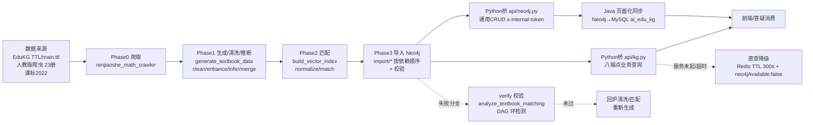

# 分析-01 知识图谱整体架构与数据链路（代码真相）

> summary: 解答「知识图谱从原始数据到服务消费的完整链路怎么走」——EduKG TTL/人教版教材爬虫/课标多来源 → Phase0爬取→Phase1生成清洗推断→Phase2匹配→Phase3导入Neo4j（两层图谱：教材结构层+语义层）→ Python桥 api/kg.py 八端点 + api/neo4j.py 通用CRUD(x-internal-token) → Java页面化同步MySQL → 前端只读消费；core/rag/query.py 按模块锚点检索知识图谱语料。
> 权威度: 0.8
> 模块: knowledge-graph
> COS路径: rag-source/knowledge-graph/代码/分析-01-知识图谱整体架构与数据链路.md
> 类别：架构设计

## 业务描述与业务场景

**业务描述**：人教版 K12 数学教材、EduKG 开源概念、义务教育课标等分散来源，要变成一张"教材结构 + 概念语义"两层互连、可检索可推理的知识图谱，支撑答疑时定位学生知识点缺口、掌握度诊断与图谱页面浏览——这条链路就是从原始数据加工入库、再被服务消费的端到端数据流。

**业务场景**：
- 学生在答疑页问一道题，系统要能通过图谱定位到知识点，并沿前置依赖链诊断"是当前点没掌握还是前置没学好"（消费侧 GraphRAG）
- 前端知识图谱页浏览教材导航（教材→章→节→知识点），Java 后端把 Neo4j 数据同步到 MySQL 供页面读取
- 教研拿到 EduKG 全学科 TTL/新教材目录，要跑一遍"拆分→生成→清洗→推断→匹配→导入→校验"把数据装进 Neo4j

## 职责

**职责**：把多来源教育数据加工成 Neo4j 知识图谱（离线构建），并通过 Python 桥 API 把图谱能力暴露给 Java/前端在线消费。
**不做什么**：不做业务派生数据的持久化（掌握度/点亮存 MySQL，不写权威图谱）；不做图数据库选型（已定 Neo4j）；不做前置依赖推断与匹配算法的细节（分别是分析-07/06 主题）。
**分工要点**：
- **Python 管道（edukg）**：离线构建，数据来源→加工→导入 Neo4j（`edukg/README.md:26-37` 定义 Phase0-3）
- **Python 桥（ai-service）**：`api/kg.py` 业务查询 + `api/neo4j.py` 通用 CRUD（Java 调用）+ `core/rag/query.py` RAG 检索编排（知识图谱语料按模块锚点召回）
- **Java 后端**：页面化同步（Neo4j→MySQL 双数据源）+ 掌握度派生（本主题仅对照，见语雀-方案总揽 §11）
- **前端**：React SPA 只读消费（教材导航/年级知识体系/知识点详情）

## 高层业务调用链（教材/课标数据 → 图谱入库 → 服务消费）

> 节点均可对应代码：A=`edukg/README.md:26-37`；B=爬虫脚本（README Phase0）；C=Phase1 脚本目录；D=Phase2 脚本目录；E=`edukg/scripts/kg_data/import/` 6 步（README:320-340）；F=`api/kg.py`；G=`api/neo4j.py`；H=语雀-方案总揽 §11（Java 端对照）；J=verify/校验脚本（README 提到）；L=语雀-方案总揽 §12 降级（Java 端对照）。

## 代码事实

### 数据链路（Phase 0-3，`edukg/README.md` + 教材目录 README）

| Phase | 功能 | 输入 → 输出 | 证据 |
|---|---|---|---|
| Phase 0 | 爬取教师之家 | 网页 → 23 册教材 JSON（小学12/初中6/高中人教A版2019 5） | edukg/README.md:26-37；5_教材目录README:17-100 |
| Phase 1 | 生成/清洗/增强/LLM推断/合并/属性 | 教材 JSON → 中间 JSON（textbooks/chapters/sections/textbook_kps） | 5_教材目录README:103-250 |
| Phase 2 | 知识点匹配 | 中间 JSON → matches_kg_relations.json | 5_教材目录README:254-316 |
| Phase 3 | Neo4j 导入 | 6 个 JSON → 节点/关系 | 5_教材目录README:318-340 |

### 图谱数据模型（Neo4j 落地，`edukg/README.md`）

- **两层图谱**：教材结构层（Textbook 23 / Chapter 148 / Section 580 / TextbookKP 1740，`CONTAINS`/`IN_UNIT` 结构关系）+ 语义层（Concept 1295 / Statement 2932 / Class 39，`HAS_TYPE`/`RELATED_TO`/`BELONGS_TO`/`PART_OF`/`SUB_CLASS_OF`），两层靠 `MATCHES_KG` 连接（TextbookKP→Concept，1690 条，置信度≥0.5）
- **关键约束**：每个 TextbookKP 有且仅有一个 IN_UNIT 指向 Section；RELATED_TO 方向固定 Statement→Concept；`content` 属性在 Statement 上不在 Concept 上；所有关系不可逆（edukg/README.md:110-115）
- **URI 版本**：v0.1（EduKG 原始）`/0.1/instance/math#xxx` / v0.2（小学新增）`/0.2/...` / v3.1（教材）`/3.1/textbook|chapter|section/...`（edukg/README.md:119-125）

### 端点清单（Python 桥，`api/kg.py` prefix `/api/kg`）

| 方法 | 路径 | 说明 | 参数约束 | 证据 |
|---|---|---|---|---|
| GET | /entities | 按 label 搜索实体 | label 1-100字, limit 默认20(1-100) | api/kg.py:34-50 |
| GET | /entity/{uri} | 按 URI 取详情（无则 404） | uri 为 path | api/kg.py:53-66 |
| POST | /link | 文本实体识别 | text 1-10000字, enrich_context | api/kg.py:69-83 |
| GET | /subject/{subject}/tree | 知识树 | depth 默认3(1-5), student_id 可选 | api/kg.py:86-102 |
| GET | /subject/{subject}/classes | 学科分类 | subject | api/kg.py:105-115 |
| GET | /student/{id}/progress | 学生进度 | subject 可选 | api/kg.py:118-132 |
| POST | /student/{id}/progress | 更新进度 | status 枚举, score 0-100 | api/kg.py:135-151 |
| GET | /student/{id}/statistics | 进度统计 | student_id | api/kg.py:154-164 |
| GET | /recommend | 知识点推荐 | limit 默认10(1-50) | api/kg.py:167-185 |
| GET | /learning-path | 学习路径 | target_entity_uri 必填 | api/kg.py:188-202 |

### 端点清单（Neo4j 通用桥，`api/neo4j.py` prefix `/api/neo4j`，全部 `x-internal-token` 鉴权）

| 方法 | 路径 | 说明 | 证据 |
|---|---|---|---|
| GET | /health | Neo4j 健康检查 | api/neo4j.py:30-40 |
| GET | /stats | 节点/关系统计 | api/neo4j.py:43-53 |
| POST | /nodes/{label} | 建节点（可选 merge_on） | api/neo4j.py:58-76 |
| POST | /nodes/{label}/batch | 批量建节点 | api/neo4j.py:79-94 |
| GET | /nodes/{label} | 查节点 | api/neo4j.py:97-117 |
| GET | /nodes/{label}/search | 属性 CONTAINS 搜索 | api/neo4j.py:120-136 |
| PUT | /nodes/{label} | 改节点 | api/neo4j.py:139-158 |
| DELETE | /nodes/{label} | 删节点（detach 可选） | api/neo4j.py:161-177 |
| GET | /nodes/{label}/count | 节点计数 | api/neo4j.py:180-193 |
| POST | /relationships | 建关系 | api/neo4j.py:198-220 |
| GET | /relationships | 查关系（direction 出/入/双向） | api/neo4j.py:223-242 |
| POST | /query | 裸 Cypher（read_only 默认 true） | api/neo4j.py:247-266 |

- **鉴权**：`verify_internal_token` 比对 `x-internal-token` 头与 `settings.INTERNAL_TOKEN`，不符 401（api/neo4j.py:18-22）
- **裸 Cypher 告警**：`/query` 允许任意 Cypher 执行，文档注明"Use with caution in production"（api/neo4j.py:257-264）

### RAG 检索编排中的知识图谱接入（`core/rag/query.py`）

- `MODULE_ANCHORS` 四模块闭集包含 `knowledge-graph`（query.py:68）；`MODULE_ANCHOR_RULES` 关键词"知识图谱/图谱/neo4j/知识点/概念/关系/节点"→ knowledge-graph 锚点（query.py:71-76）
- 流程：`rag_query` → `intent`（LLM 结构化意图，失败回退关键词）→ `retrieve_dual`（全量池向量 + 切片池双向量 + BM25）→ `orchestrate`（RRF×authority×节锚定加权）→ `generate`（doubao 面试口述答案）（query.py:789-814）
- 参数：RRF_K=60 / TOP_K=5 / BM25_K=10 / VEC_K=12（query.py:43-46）
- 重要定位：该文件是 **AI答疑 RAG 检索**，知识图谱是其语料模块锚点之一（图谱文档切片进池）；图谱**数据查询**走 api/kg.py + api/neo4j.py，两者是不同链路。

### 关键机制（在线服务，`edukg/core/kg/service.py` + `core/neo4j/`）

1. `KnowledgeGraphService` 懒加载 Neo4j 客户端与实体链接器（service.py:49-61）；实体链接器用 jieba 分词 + 内存实体字典（`data/edukg/entities/*_entities.json`，按学科 9 个文件加载，加入 jieba 自定义词典）（entity_linker.py:38-79）
2. Neo4j 客户端单例：连接池 `max_connection_pool_size=50`、`connection_timeout=30.0`（client.py:33-51）；读/写/裸事务封装 execute_read/execute_write/execute_query（client.py:133-186）
3. Neo4j 连接配置：`NEO4J_URI` 默认 `bolt://localhost:7687`、`NEO4J_USER=neo4j`、`NEO4J_DATABASE=neo4j`（edukg/config/settings.py:31-36；生产连接 `bolt://81.71.130.57:7687` 见 edukg/README.md:129-133）

### 枚举/常量/配置

| 类型 | 名称 | 取值 | 出处 |
|---|---|---|---|
| 模块锚点 | MODULE_ANCHORS | ai-tutoring / knowledge-graph / question-analysis / rag-system | query.py:68 |
| 图谱模块关键词 | MODULE_ANCHOR_RULES | 知识图谱/图谱/neo4j/知识点/概念/关系/节点 | query.py:71-76 |
| 学科枚举 | SubjectEnum | math/physics/chemistry/biology/chinese/history/geo/politics/english | models/kg.py:11-21 |
| 进度状态 | ProgressStatus | not_started / in_progress / mastered | models/kg.py:24-28 |
| 分数约束 | StudentProgressUpdateRequest.score | 0-100 | models/kg.py:51 |
| URI 版本 | v0.1/v0.2/v3.1 | EduKG原始/小学新增/教材 | edukg/README.md:119-125 |
| 匹配置信度 | MATCHES_KG | ≥0.5 才连边 | edukg/README.md:92 |
| Neo4j 连接池 | NEO4J_MAX_CONNECTION_POOL_SIZE | 50 | edukg/config/settings.py:35 |
| Neo4j 超时 | NEO4J_CONNECTION_TIMEOUT | 30 | edukg/config/settings.py:36 |

### 边界与降级

- api/kg.py 查询不到实体 → 404（api/kg.py:63-65）；`update_student_progress` 异常 → 返回 `success=False` 不抛错（service.py:333-336）
- `get_knowledge_tree` 是**简化实现**：取该学科前 100 个实体平铺成一个 root + children 两层，非真实多级树（service.py:180-208，注释"simplified - flat list for now"）；`get_learning_path` 只返回目标实体自身一项（service.py:436-455）
- Neo4j 健康检查失败 → `/health` 返回 unhealthy + version=None（service.py:49-63）
- RAG 检索降级：intent LLM 失败回退关键词锚定（query.py:227-258）；rewrite 失败回退原问题（query.py:418-420）

## 隐性坑与注意事项

- **在线服务查询 `:Entity` 标签 vs 离线导入的具体标签不一致（⚠️ 最大坑）**：`api/kg.py` 依赖的 `KnowledgeGraphService` 全部用 `MATCH (e:Entity {uri:...})` / `MATCH (e:Entity {subject:...})`（service.py:101-109, 180-185, 256-259）；但 `edukg/scripts/kg_data/import/*.py` 导入的节点标签是 `Textbook`/`Chapter`/`Section`/`TextbookKP`/`Concept`/`Statement`/`Class`（已核对 import 脚本 MERGE/MATCH），没有统一的 `Entity` 标签。要么 `Entity` 由 Java 通过 api/neo4j.py 动态建（该接口示例正是 `POST /api/neo4j/nodes/Entity`，api/neo4j.py:71-74），要么 service.py 查询是"期望面"而非"实际数据面"——联调核对前，直接调用 /entities、/tree 可能查不到离线导入的数据。
- **`get_knowledge_tree`/`get_learning_path`/`get_recommendations` 是简化桩**：知识树不是真层级、学习路径不是前置链、推荐只看一跳邻居，页面化真层级走 Java 同步 MySQL 侧（语雀-方案总揽 §11），不要从 Python 桥期待完整图谱能力。
- **`/query` 裸 Cypher 是后门**：有 `x-internal-token` 即可执行任意写 Cypher（read_only 参数可被调用方置 false，api/neo4j.py:247-266），生产需确保 token 不泄露。
- **core/rag/query.py 与图谱数据查询是两条独立链路**：前者是"AI答疑面试口述 RAG"（检索的是图谱**文档切片**，不是 Neo4j 节点数据），后者才是图谱在线查询；面试表述勿混。
- **`/api/neo4j` 默认 `id_property="id"`**：而 edukg 节点主键是 `uri`（edukg/README.md:115 URI 主键），Java 调用需显式传 `id_property=uri` 否则查不到（api/neo4j.py:206, 229）。
- **Neo4j 客户端单例 + 密码空默认**：`.env` 缺 `NEO4J_PASSWORD` 时默认空串，启动不报错但连接失败（settings.py:33）。

## 设计要点

- **离线构建/在线消费分离**：关系处理在 Python/CSV 完成，Neo4j 只是最终仓库；导入用 MERGE 幂等（import 脚本），避免重跑重复（语雀-方案总揽 §1 + import 脚本证据）。
- **权威图谱零写入**：EduKG 静态库冻结只读，业务派生数据（掌握度/点亮）存 MySQL——Neo4j 里只有事实与概念（语雀-方案总揽 §1:38；edukg/README.md 图谱只读语义）。
- **两层图谱解耦"无限业务事实"与"有限权威结构"**：教材结构层是逐年可增的业务事实，语义层是有限的权威概念，靠 MATCHES_KG 软连接，互不污染（edukg/README.md:102-115 + 语雀 §1）。
- **桥 API 分层**：业务查询（api/kg.py，面向前端/答疑）与通用 CRUD（api/neo4j.py，面向 Java 做任意操作）分离；通用层用 token 保护并暴露裸查询，方便 Java 侧扩展但风险自担。

## 对账要点

| 对账分类 | 项 | 语雀/design 口径 | 代码现状 | 结论 |
|---|---|---|---|---|
| 方案vs实现 | 整体架构 | 两层图谱 + Neo4j 存储 + 离线构建/在线消费分离（总揽 §1） | edukg/README.md:41-115 落地 6757 节点/20887 关系 | ✅ 落地 |
| 方案vs实现 | api/kg.py 端点 | 总揽 §10 称"八端点" | api/kg.py 实为 10 个路由（含 progress GET/POST 两态） | ⚠️ 翻转（口径"八端点"少算，实 10 路由） |
| 方案vs实现 | 通用 Neo4j API | 总揽 §10 称 /health /stats /nodes(+batch/search/count) /relationships /query | 与 api/neo4j.py 一致（12 路由） | ✅ 落地 |
| 接口契约 | 服务查询标签 | 总揽 §4 数据模型用具体标签 | service.py 查询统一 `:Entity`，import 用具体标签，标签体系可能不匹配 | ⚠️ 翻转（需联调核对） |
| 接口契约 | /query 读写 | 总揽未特别声明 | read_only 默认 true，但调用方可关 | ✅ 落地（有防护缺约束） |
| 注释vs运行行为 | 知识树/学习路径 | 页面化期望真层级/前置链 | Python 桥为简化桩（平铺/单点） | ⚠️ 翻转（真实能力在 Java/MySQL 侧） |

## 已读代码清单

- **Python 管道（edukg）**：`edukg/README.md`（Phase0-3 全链路/节点关系/URI 设计）、`edukg/data/edukg/math/5_教材目录(Textbook)/README.md`（管道）、`edukg/scripts/kg_data/import/*.py`（导入 MERGE/MATCH 具体标签核对）、`edukg/config/settings.py`（NEO4J 配置）
- **Python 桥（ai-service）**：`ai-edu-ai-service/api/kg.py`（八/十路由）、`ai-edu-ai-service/api/neo4j.py`（通用 CRUD + x-internal-token）、`ai-edu-ai-service/core/rag/query.py`（MODULE_ANCHORS/orchestrate/rag_query）、`ai-edu-ai-service/config/settings.py`（INTERNAL_TOKEN/COS_VECTORS_INDEXES）
- **Python（edukg 在线服务层）**：`edukg/core/kg/service.py`（KnowledgeGraphService，Entity 查询）、`edukg/core/kg/entity_linker.py`（jieba+实体字典）、`edukg/core/neo4j/client.py`（单例/连接池/事务）、`edukg/core/neo4j/service.py`（health/stats/CRUD）、`edukg/models/kg.py`（SubjectEnum/ProgressStatus）
- **Java**：本主题未读 Java 文件（页面化同步与前端对照来自语雀-方案总揽 §11/§12，非代码真值）
- **前端**：本主题未读前端文件（对照语雀，非代码真值）
> 本主题跨 4 端（Python 管道 / Python 桥 / Java / 前端）；Python 管道与桥已真实读取，Java/前端仅对照语雀方案口径，未读真实代码。
