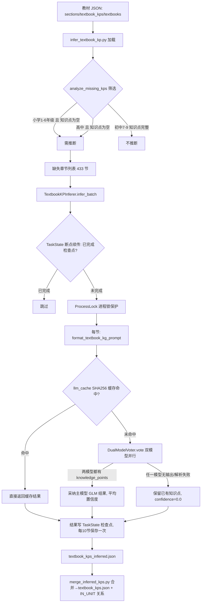

# 分析-06 教材知识点LLM推断（代码真相）

> summary: 解答「小学/高中教材缺知识点列表怎么补全、长任务中断怎么续跑、重复推断怎么省LLM钱」——本文档是知识图谱「教材知识点LLM推断」管道的代码真相分析。业务: 人教版小学1-6年级与高中必修教材原始JSON无知识点列表(初中7-9已带约252个), 由大模型照章节名推断核心知识点补全教材侧缺口, 是图谱节点重要来源。职责: 缺失章节分析→LLM双模型投票推断→断点续传/缓存→输出textbook_kps_inferred.json, 由merge_inferred_kps.py合并进textbook_kps.json(source=llm_inferred); 不做初中推断/属性推断/图谱匹配/直写Neo4j。调用链: CLI入口infer_textbook_kp.py(默认全部/--stage学段/--dry-run/--stats/--no-resume, 283-294) → analyze_missing_kps筛选(小学grade∈[一~六年级]且len(existing_kps)==0才推断、高中同、初中明确不推断, 159-164) → 缺失433节 → TextbookKPInferer.infer_batch → TaskState断点续传检查 → ProcessLock进程锁 → format_textbook_kg_prompt → llm_cache缓存命中? 命中直接返回(from_cache=True), 未命中DualModelVoter.vote双模型并行(主glm-4-flash免费+副deepseek-chat, config.py:9,11) → 两模型都输出非空knowledge_points即采纳主模型GLM结果、置信度取两模型confidence平均(dual_model_voter.py:288-316, 不比对内容); 任一无输出→consensus=False, 解析失败→5级fallback(直接json→正则{...}→```json```→ast.literal_eval, 125-170)并保留已有知识点confidence=0.0(225-244)。断点续传: TaskState("infer_kp")存检查点section_{section_id}, 恢复捞completed过滤pending_sections, 每checkpoint_interval=10节保存一次(260-356); CachedLLM缓存键=SHA256(prompt)[:16]存output/llm_cache/(llm_cache.py:30); ProcessLock timeout=3600秒防并发(process_lock.py:42)。实际数据: 433节(小学361+高中72)推断1616个知识点、平均置信度0.934、3条带error, 合并后textbook_kps.json共1905条(llm_inferred 1616+original 254+rule_extract_empty_chapter 35)。对账要点: D11断点续传三件套全落地; 语雀D12称MySQL但TaskState实为JSON文件存output/progress/无MySQL(翻转); D7阈值0.5/0.6/0.8不作用于推断路径(0.8/0.6仅vote_prerequisite方法内、当前未调用, 翻转); 缓存命中from_cache=0与语雀"命中高"不符(数据观察)。隐性坑: 推断只要求两模型都有输出、不校验内容一致性; 置信度来自模型自报非外部验证; --resume默认开启, 全量重跑须--no-resume; 缓存键是Prompt的SHA256, 改提示词模板=旧缓存全失效; 进程锁依赖portalocker未装即ImportError(process_lock.py:49-53); infer只输出json、须强制merge_inferred_kps.py才生效(infer_textbook_kp.py:313)。设计要点: 免费GLM当主模型、DeepSeek只在匹配/前置任务拿否决权(见分析-07); llmTaskLock三件套解耦复用给推断/匹配/标准化; state_manager原子写JSON落output/progress/、状态机pending/in_progress/completed/failed完备、resume()取pending+failed(state_manager.py:250-260)。
> 权威度: 0.8
> 模块: knowledge-graph
> COS路径: rag-source/knowledge-graph/代码/分析-06-教材知识点LLM推断.md
> 类别：操作流程

## 业务描述与业务场景

**业务描述**：人教版小学 1-6 年级、高中必修的教材原始 JSON 里没有知识点列表，只有初中(7-9 年级)带完整知识点(约 252 个)——这条管道就是让大模型照着教材章节名把小节里"学生必须掌握的核心知识点"推断出来，补全教材侧的知识点缺口，是图谱节点的重要来源之一。

**业务场景**：
- 教研拿到小学三年级上册"时、分、秒"章节，需要系统自动推断出"秒的概念""秒与分的关系""时间的读写"这类知识点
- 推断任务跑 2-3 小时中途断了，希望从断点接着跑而不是从头再来
- 同一个章节重复推断不能重复花 LLM 钱——相同提示词要直接命中缓存

## 职责

**职责**：缺失知识点章节分析 → LLM 双模型投票推断 → 断点续传/缓存 → 输出 `textbook_kps_inferred.json`，再由 `merge_inferred_kps.py` 合并进 `textbook_kps.json`（`source=llm_inferred`）。
**不做什么**：不做初中推断（初中已有知识点）；不做属性推断/专题增强（那是 KPAttributeInferer/ChapterEnhancer）；不做图谱匹配（那是 match_textbook_kp）；不直接写 Neo4j（输出 JSON 供合并/导入）。
**分工要点**：CLI 入口 `infer_textbook_kp.py`（分析+调度）；推断器 `TextbookKPInferer`（`core/llm_inference/textbook_kp_inferer.py`）；投票 `DualModelVoter`（`core/llm_inference/dual_model_voter.py`）；断点续传三件套 `core/llmTaskLock/`。本主题仅 Python edukg 端。

## 高层业务调用链（教材知识点 LLM 推断→合并入库）



## 代码事实

### CLI 入口（`infer_textbook_kp.py`）
| 命令 | 作用 | 证据 |
|---|---|---|
| `python infer_textbook_kp.py` | 推断所有缺失章节（断点续传默认开） | infer_textbook_kp.py:283-294 |
| `python infer_textbook_kp.py --stage primary/middle/high` | 按学段筛选（stage_map：小学/初中/高中） | infer_textbook_kp.py:141-144, 285 |
| `python infer_textbook_kp.py --dry-run` | 仅分析缺失章节，不推断 | infer_textbook_kp.py:214-219 |
| `python infer_textbook_kp.py --stats` | 显示当前进度与结果统计 | infer_textbook_kp.py:263-280 |
| `python infer_textbook_kp.py --no-resume` | 禁用断点续传，从头跑 | infer_textbook_kp.py:288-294 |

### 关键机制
1. **缺失判定**（`infer_textbook_kp.py:159-164`）：小学 `grade in [一~六年级]` 且 `len(existing_kps)==0` 才推断；高中同；初中明确"无需推断"（注释：初中 7-9 年级知识点完整约 252 个）。
2. **双模型投票特判路径**（`dual_model_voter.py:288-316`）：推断任务是 `knowledge_points` 分支——**不比较内容是否一致**，只要两模型都输出非空 `knowledge_points` 就采纳**主模型(GLM)**结果，置信度取两模型 `confidence` 平均值。任一无输出 → `consensus=False`，`error='某模型未输出知识点'`。
3. **推断失败降级**（`textbook_kp_inferer.py:225-244`）：投票不一致 → 保留已有知识点、`confidence=0.0`；`_parse_json_response` 解析失败（5 级 fallback：直接 json → 正则 `{...}` → ```` ```json ```` → ast.literal_eval，见 textbook_kp_inferer.py:125-170）→ 同样保留已有知识点。
4. **断点续传**（`textbook_kp_inferer.py:260-356`）：`TaskState("infer_kp")` 存检查点 `section_{section_id}`；恢复时从 `state.get('checkpoints')` 捞 completed 结果，过滤 `pending_sections`；每 `checkpoint_interval=10` 节 `_save_state()` 一次（textbook_kp_inferer.py:316, 344-348）。
5. **进程锁**（`textbook_kp_inferer.py:73-75, 308`）：`ProcessLock(output/progress/infer_kp.lock)` 包住批量循环，防多进程并发跑同一推断。
6. **LLM 缓存**（`textbook_kp_inferer.py:101-123`）：`get_cache_key(prompt)=SHA256(prompt)[:16]`（llm_cache.py:30），缓存文件存 `output/llm_cache/`；命中返回缓存并打 `from_cache=True`。
7. **LLM Gateway 延迟加载**（`dual_model_voter.py:75-91`）：`LLMFactory()` 动态导入；ImportError 时降级"模拟模式"（`_mock_call` 返回固定 `{"is_prerequisite": true,...}`，仅测试用，dual_model_voter.py:137-156）。
8. **合并入库**（`merge_inferred_kps.py`）：推断结果按 `section_id` 归位、按 `label` 去重，生成 `textbook-{primary|middle|high}-{seq:05d}` URI（merge_inferred_kps.py:75-87），`source='llm_inferred'`，重写 `in_unit_relations.json`。

### 枚举/常量/配置
| 类型 | 名称 | 取值 | 出处 |
|---|---|---|---|
| 模型 | PRIMARY_MODEL | glm-4-flash（免费主模型） | config.py:9 |
| 模型 | SECONDARY_MODEL | deepseek-chat（副模型） | config.py:11 |
| 阈值 | CONFIDENCE_THRESHOLD_HIGH | 0.8（≥→PREREQUISITE，用于前置投票方法） | config.py:15 |
| 阈值 | CONFIDENCE_THRESHOLD_LOW | 0.6（≥→PREREQUISITE_CANDIDATE） | config.py:17 |
| 批量 | BATCH_SIZE / RATE_LIMIT_DELAY | 10 / 1.0s | config.py:21,23 |
| 重试 | MAX_RETRIES / RETRY_DELAY | 3 / 2.0s | config.py:25,27 |
| 缓存键 | get_cache_key | SHA256(prompt) 前 16 位 | llm_cache.py:30 |
| 检查点 | checkpoint_interval | 10 节保存一次 | textbook_kp_inferer.py:264,316 |
| 进程锁 | ProcessLock timeout | 3600 秒 | process_lock.py:42 |
| 缓存 TTL | load_cache cache_ttl | 默认 None（永不过期） | llm_cache.py:83 |
| Prompt 约束 | 知识点数量 | 3-8 条/节，重点章节≤10 | prompts/textbook_kg.txt:18 |
| Prompt 约束 | 知识点长度 | 5-15 字 | prompts/textbook_kg.txt:16 |
| 输出 | 推断结果文件 | `output/textbook_kps_inferred.json` | infer_textbook_kp.py:240-241 |
| 输出 | 合并报告 | `output/merge_report.json` | merge_inferred_kps.py:236-239 |

> 实际数据（`output/textbook_kps_inferred.json`）：433 节（小学 361 + 高中 72），1616 个知识点，平均置信度 0.934，3 条带 error。合并后 `textbook_kps.json` 共 1905 条（llm_inferred 1616 + original 254 + rule_extract_empty_chapter 35）。

### 边界与降级
- 断点续传时 `completed_ids` 来自 TaskState 检查点，已完成的节直接跳过（textbook_kp_inferer.py:283-292）。
- 投票返回 `consensus=False` 的三种来源：LLM 调用异常（`LLMCallError`）、JSON 解析失败（`error='响应解析失败'`）、判断不一致——前两者由 `vote_with_retry` 重试（最多 MAX_RETRIES=3，解析失败重试、不一致不重试，dual_model_voter.py:492-507）。
- `infer_textbook_kp.py:315-323`：缺章节/知识点/教材文件 → `FileNotFoundError` 提示先跑 generate_textbook_data.py。

## 隐性坑与注意事项
- **推断≠严格一致性校验**：`knowledge_points` 分支只要求"两模型都有输出"，不比对内容——GLM 输出 3 条、DeepSeek 输出 5 条仍"consensus=True"采纳 GLM 的 3 条。想校验内容一致性需另改 `_check_consensus`。
- **置信度来自模型自报**：推断置信度是 LLM 自填的 `confidence` 两模型平均，不是外部验证，0.934 只代表模型自身把握度。
- **断点续传按节、不按 Prompt 级缓存去重**：恢复是 TaskState 检查点优先；`llm_cache` 是第二道（相同 Prompt 直接命中）。
- **`--resume` 默认开启**：想全量重跑必须 `--no-resume`，否则已完成检查点全跳过。
- **进程锁依赖 portalocker**：未安装直接 `raise ImportError`（process_lock.py:49-53）。
- **缓存键是 Prompt 的 SHA256**：改提示词模板 = 旧缓存全部失效（缓存键随内容变化），重跑会重新调 LLM。
- **推断结果必须 merge 才生效**：infer 只输出 `textbook_kps_inferred.json`，不合并，下一步强制 `merge_inferred_kps.py`（infer_textbook_kp.py:313）。

## 设计要点
- **免费模型当主模型**：GLM-4-flash 免费、DeepSeek 付费，投票结果采纳主模型输出，只在"有分歧风险"的匹配/前置任务里才让 DeepSeek 拿否决权（见分析-07）。
- **断点续传三件套解耦**：TaskState（状态）+ CachedLLM（缓存）+ ProcessLock（互斥）独立成 `core/llmTaskLock`，同一套基建复用给推断/匹配/标准化多个任务。
- **JSON 文件状态、不依赖外部服务**：state_manager 用原子写（临时文件+rename+备份）落 `output/progress/*.json`，无 MySQL 依赖，离线管道自洽。
- **状态机完备**：任务 pending/in_progress/completed/failed + 检查点 pending/completed/failed，`resume()` 取 pending+failed（state_manager.py:250-260）。

## 对账要点
| 对账分类 | 项 | 语雀/design 口径 | 代码现状 | 结论 |
|---|---|---|---|---|
| 方案vs实现 | D11 断点续传三件套 | TaskState+CachedLLM+ProcessLock | `llmTaskLock/` 三模块全落地，推断/匹配复用 | 落地 |
| 方案vs实现 | D11 状态存储 | 语雀 D12 称"MySQL 替代早期 SQLite" | `TaskState` 用 JSON 文件存 `output/progress/`，无 MySQL | 翻转（Python 管道实为 JSON 文件） |
| 方案vs实现 | 前置依赖权重 0.85 | 语雀 D9"定义依赖 0.85" | `prerequisite_inferer.py fuse_results` 定义依赖升级 PREREQUISITE 用 `confidence=0.9`（:302），LLM 升级 +0.1 封顶 1.0（:320） | 翻转（0.85→0.9，D9 已自注） |
| 方案vs实现 | 推断阈值 | 语雀 D7 提"阈值 0.5/0.6/0.8" | 推断任务（knowledge_points 分支）**无硬阈值**，只要求两模型都有输出；0.8/0.6 阈值仅在 `vote_prerequisite` 方法内（当前管线未调用） | 翻转（阈值不作用于推断路径） |
| 注释vs运行行为 | 缓存命中统计 | 语雀称推断缓存命中高 | 实际 `textbook_kps_inferred.json` 中 from_cache=0（该批次缓存未命中） | 数据观察 |

## 已读代码清单
- **Python 管道（edukg）**：`scripts/kg_data/textbook/infer_textbook_kp.py`（TextbookKPInferRunner/analyze_missing_kps/run_infer）、`scripts/kg_data/textbook/merge_inferred_kps.py`（merge_kps/生成 URI）、`core/llm_inference/textbook_kp_inferer.py`（TextbookKPInferer/infer_section/infer_batch/_parse_json_response）、`core/llm_inference/dual_model_voter.py`（DualModelVoter.vote/_check_consensus/vote_with_retry）、`core/llm_inference/config.py`（模型/阈值/重试）、`core/llm_inference/prompt_templates.py`（format_textbook_kg_prompt）、`core/llm_inference/prompts/textbook_kg.txt`、`core/llm_inference/__init__.py`
- **Python 管道（llmTaskLock）**：`core/llmTaskLock/state_manager.py`（TaskState）、`core/llmTaskLock/llm_cache.py`（CachedLLM/get_cache_key/save_cache/load_cache）、`core/llmTaskLock/process_lock.py`（ProcessLock/portalocker）、`core/llmTaskLock/__init__.py`
- **数据**：`core/textbook/config.py`（OUTPUT_DIR/OUTPUT_FILES）、`output/textbook_kps_inferred.json`、`output/textbook_kps.json`、`output/merge_report.json`（433 节/1616 知识点/平均置信 0.934）
> 本主题跨 1 端（Python edukg）；仅 Python 端有实际读取。Java/前端不参与离线推断。
