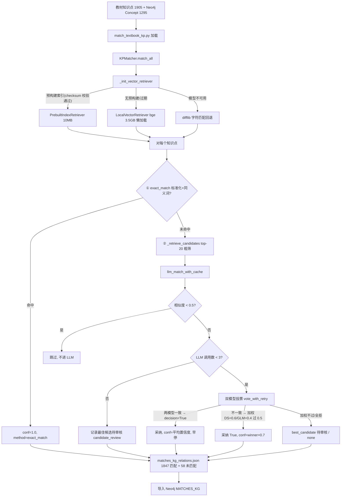

# 分析-07 知识点匹配与双模型投票（代码真相）

> summary: 解答「教材知识点怎么匹配进图谱、匹配率与双模型投票的真实实现」——knowledge-graph 代码深读:教材知识点→EduKG 概念匹配,输出 matches_kg_relations.json(精确/LLM 投票/未匹配三态);评审系统(D16 MySQL 审核表/推荐接口/导入脚本)无代码,仅 candidate_review 记录。三段式流水线(kp_matcher.py):①标准化精确匹配(:575-628):DeepSeek 标准化"1-5 的认识"→自然数等,best_match+同义词 16 组防误配,命中 conf=1.0;②向量粗筛 top-20(:630-702):PrebuiltIndex(10MB)→bge(3.5GB)→difflib 回退+包含加分 0.2;③双模型投票(dual_model_voter.py:217-396):一致采纳平均置信度;不一致加权 DS=0.6/GLM=0.4 阈值 0.5(仅 DS=True 可过=DS 否决),过则 winner×0.7;置信度归一 0.95/0.7/0.4。LLM 三重优化(0.5 阈值跳过+候选上限 3+早停)从 5000+ 压到 2 次/知识点;缓存键 SHA256(prompt)[:16] 可审计;并发防重复+30s 超时。实际数据:1905 条=exact 1639+llm_vote 208(匹配 1847,率 96.96%)+candidate_review 50+none 8(未匹配 58),平均置信度 0.973。对账:三段式/加权全落地;96.96% vs 97.1%(1690/1740)批次口径翻转;未匹配 58 vs 308 同因;缓存键语雀 md5 实为 SHA256[:16];vote_match/vote_prerequisite 定义未调用=死代码。坑:DS 否决是加权数学结果非显式分支;×0.7 可能跌破 0.5 别只看 decision;改阈值旧缓存不失效;method 五态为分组依据(:232-234)。CLI:match_textbook_kp.py 支持 --dry-run 成本估算/--stats/索引构建与回退/--candidate-top-n/--max-concurrent。
> 权威度: 0.8
> 模块: knowledge-graph
> COS路径: rag-source/knowledge-graph/代码/分析-07-知识点匹配与双模型投票.md
> 类别：数据关联

## 业务描述与业务场景

**业务描述**：教材里"1-5 的认识"这种教学知识点，和图谱里的抽象概念"自然数"说的是同一回事，但名字对不上——这条管道就是把每个教材知识点对到图谱里语义对应的 EduKG 概念上（产出 MATCHES_KG 关系），让答疑时能通过图谱定位知识点。

**业务场景**：
- 学生在答疑页问一道小学题，系统要能定位到图谱知识点，先决条件是教材知识点和图谱概念已建立关联
- 小学"连加连减"这类具体说法，直接字符串匹配永远对不上"减法"这种抽象概念，需要先翻译再匹配
- 五千多个图谱概念不可能每个都让大模型判断一遍，必须先粗筛出最像的少数几个候选

## 职责

**职责**：教材知识点 → EduKG 概念匹配，输出 `matches_kg_relations.json`（含精确匹配/LLM 投票/未匹配候选三态）。
**不做什么**：不做 LLM 推断知识点（那是 infer_textbook_kp）；不做匹配前标准化之外的其他清洗；不直接导入 Neo4j（输出 JSON 供 import 脚本）；评审系统（D16 MySQL 审核表/LLM 推荐接口/导入脚本）**代码中未见实现**。
**分工要点**：CLI `match_textbook_kp.py`（加载/成本估算/参数）；`KPMatcher`（`core/textbook/kp_matcher.py` 精确+粗筛+LLM 投票）；`DualModelVoter`（`core/llm_inference/dual_model_voter.py` 加权投票）；`KPNormalizer`（`core/textbook/kp_normalizer.py` 标准化预处理）。本主题仅 Python edukg 端。

## 高层业务调用链（教材知识点→图谱 MATCHES_KG 匹配）

## 代码事实

### CLI 入口（`match_textbook_kp.py`）
| 命令 | 作用 | 证据 |
|---|---|---|
| `python match_textbook_kp.py --dry-run` | 仅成本估算（estimate_match_cost） | match_textbook_kp.py:157-167 |
| `python match_textbook_kp.py --stats` | 显示已有结果统计 | match_textbook_kp.py:220-247 |
| `python match_textbook_kp.py --use-prebuilt-index` | 用预构建向量索引（约 10MB 注释口径） | match_textbook_kp.py:260-261 |
| `python match_textbook_kp.py --force-build-index` | 先 subprocess 跑 build_vector_index.py --force 再匹配 | match_textbook_kp.py:283-295 |
| `python match_textbook_kp.py --no-vector-retrieval` | 禁用向量检索，用 difflib | match_textbook_kp.py:264-265 |
| `python match_textbook_kp.py --candidate-top-n 30` | 粗筛候选数（默认 20） | match_textbook_kp.py:266-267 |
| `python match_textbook_kp.py --max-concurrent 5` | 并发匹配（默认 1 串行） | match_textbook_kp.py:270-271 |

### 关键机制
1. **图谱概念加载**（`match_textbook_kp.py:110-116`）：Cypher `MATCH (c:Concept) OPTIONAL MATCH (s:Statement)-[:RELATED_TO]->(c) ... RETURN c.uri, c.label, descriptions[0]`——描述取第一条 Statement 的 content。
2. **精确匹配**（`kp_matcher.py:575-628`）：`get_best_match`（读 `normalized_kps_complete.json` 的 best_match，kp_matcher.py:343-393）+ `_expand_with_synonyms`（完整词匹配，防"加法交换律"误配"加法"，kp_matcher.py:541-573）+ `_normalize_name`（小写/去空格/统一括号，kp_matcher.py:520-539）。命中 `confidence=1.0, method=exact_match`。
3. **向量粗筛**（`kp_matcher.py:630-702`）：`_retrieve_candidates` 优先 `vector_retriever.retrieve(normalized_name, top_n)`；异常/不可用回退 difflib `SequenceMatcher.ratio()` + 包含关系加分 0.2（:690-694），取 top-N。
4. **LLM 投票三重优化**（`kp_matcher.py:727-877`）：
   - `SIMILARITY_THRESHOLD=0.5` 低相似度直接跳过（:781-783）；
   - `LLM_CANDIDATE_LIMIT=3` 最多调 3 个候选（:786-796）；
   - 命中即早停 break（:825-826, 852-853）。
5. **双模型投票**（`dual_model_voter.py:217-396`）：`asyncio.gather` 并行两模型；`_check_consensus` 读 `is_prerequisite/is_match/decision` 字段；两模型一致 → 平均置信度采纳；不一致 → 加权 `WEIGHT_DS=0.6, WEIGHT_GLM=0.4, THRESHOLD=0.5`，`weighted_score = (GLM True?0.4:0)+(DS True?0.6:0)`，**只有 DeepSeek=True 才可能过阈值（DS 否决权）**，过则 `confidence=winner×0.7`（:354-396）。
6. **confidence 字符串归一**（`dual_model_voter.py:207-215`）：high=0.95 / medium=0.7 / low=0.4 / 默认 0.5。
7. **缓存并发安全**（`kp_matcher.py:704-724`）：`asyncio.Lock` 保护 `load_cache/save_cache`；缓存存完整 `vote_result`（含两模型响应/决策/理由，可审计）。缓存键 = `SHA256(prompt)[:16]`（llm_cache.py:30）。
8. **并发匹配**（`kp_matcher.py:879-1066, 1138-1165`）：`Semaphore(max_concurrent)` + `_processing_uris` 集合防重复处理（等待超时 30s 返回 timeout 记录，:921-946）。
9. **未匹配兜底**（`kp_matcher.py:874-875`）：全部候选无匹配 → 返回 `[{'best_candidate': best_unmatched}]`，method=candidate_review，供人工审核。

### 枚举/常量/配置
| 类型 | 名称 | 取值 | 出处 |
|---|---|---|---|
| 粗筛 | candidate_top_n | 20（--candidate-top-n 可改） | kp_matcher.py:277,297 |
| LLM 上限 | LLM_CANDIDATE_LIMIT | 3 | kp_matcher.py:727 |
| 相似度阈值 | SIMILARITY_THRESHOLD | 0.5 | kp_matcher.py:729 |
| 加权 | WEIGHT_DS / WEIGHT_GLM | 0.6 / 0.4 | dual_model_voter.py:356-357 |
| 加权 | THRESHOLD | 0.5 | dual_model_voter.py:358 |
| 降权 | 不一致时置信度 | winner_confidence × 0.7 | dual_model_voter.py:373,383 |
| 置信度映射 | high/medium/low | 0.95 / 0.7 / 0.4 | dual_model_voter.py:213 |
| 精确匹配置信度 | exact_match confidence | 1.0 | kp_matcher.py:614,624 |
| difflib 加分 | 包含关系 | +0.2 | kp_matcher.py:693-694 |
| 重试 | MAX_RETRIES / RETRY_DELAY | 3 / 2.0s | config.py:25,27 |
| 并发等待 | _match_single_concurrent 超时 | 30s | kp_matcher.py:921 |
| 成本估算 | exact_match_rate / avg_candidates | 0.15 / 20 | kp_matcher.py:1310-1311 |
| 同义词 | SYNONYM_MAP | 加法/减法/百分数/三角形…16 组 | kp_matcher.py:41-60 |
| 标准化缓存 | KPNormalizer 只用 DeepSeek | secondary_model（更严格） | kp_normalizer.py:220-222 |

> 实际数据（`output/matches_kg_relations.json`）：1905 条 = exact_match 1639 + llm_vote 208（匹配 1847，率 96.96%）+ candidate_review 50 + none 8（未匹配 58）。匹配平均置信度 0.973。

### 边界与降级
- 向量检索器初始化失败（缺依赖/模型加载失败）→ 回退 difflib（kp_matcher.py:511-518）。
- 预构建索引加载失败或 checksum 过期 → 回退懒加载 LocalVectorRetriever（kp_matcher.py:501-504, 486-491）。
- LLM 调用异常 → `errors+1`，继续下一个候选（kp_matcher.py:865-868）。
- 缓存命中但 decision=False → 不计调用、continue 下个候选（kp_matcher.py:809-827）。

## 隐性坑与注意事项
- **加权投票的 DS 否决权是数学结果不是显式分支**：`0.6+0.4` 结构下只有 DS=True 时 `weighted_score≥0.5` 才可能成立，代码注释已点明（dual_model_voter.py:365-366）。
- **不一致时置信度被 ×0.7 压低**：`winner_confidence*0.7` 后可能跌破 0.5，评审/统计时别只看 decision=True。
- **精确匹配用完整词**：`_expand_with_synonyms` 只在完全匹配时扩展同义词（`normalized_name == normalized_key`），"加法交换律"不会匹配到"加法"（kp_matcher.py:556-560）。
- **difflib 回退会漏语义**：纯字符相似度，同义不同字（如"小数"vs"小数概念"靠 SYNONYM_MAP 兜底）命中率低，是向量不可用时的降级方案。
- **缓存命中不重投**：缓存存的是完整 `vote_result`，改投票阈值/权重后旧缓存仍按旧结果返回（缓存键不含权重参数）。
- **结果文件 method 字段是分类依据**：exact_match / llm_vote / candidate_review / none / error 五态，`show_stats` 用 `r['method']` 分组（match_textbook_kp.py:232-234）。
- **评审系统无代码**：D16 描述的 MySQL 审核表/`/api/kp-match/recommend`/导入脚本在 `edukg/scripts` 与 `ai-edu-ai-service/api` 均未检索到实现；唯一痕迹是 `method='candidate_review'` 的 best_candidate 记录。

## 设计要点
- **三段式成本控制**：精确(0 元)→粗筛(本地 0 元)→LLM 投票(最贵)逐层收敛，把 LLM 调用从"全量 5000+ 候选"压到 top-20 里最多 3 个、再靠 0.5 阈值+早停压到实际 2 次/知识点。
- **LLM 标准化预处理解决抽象层级错位**：匹配前先用 DeepSeek 把"1-5 的认识"翻译成 `["数的认识","自然数","数字"]`，best_match 作向量检索 query（kp_normalizer.py:143-160）。
- **双模型共识抑制幻觉**：单模型可能自信地错，两模型一致才采纳；不一致时 DeepSeek 更严格的一方拿否决权。
- **缓存可审计**：缓存存完整 `vote_result`（含两模型响应/reason），能解释"为何判不匹配"。

## 对账要点
| 对账分类 | 项 | 语雀/design 口径 | 代码现状 | 结论 |
|---|---|---|---|---|
| 方案vs实现 | D6 匹配流水线 | 精确匹配→向量粗筛 top-20→双模型投票 | 三段式全落地（kp_matcher.py exact_match/_retrieve_candidates/llm_match_with_cache） | 落地 |
| 方案vs实现 | D7 加权投票 | WEIGHT_DS=0.6/WEIGHT_GLM=0.4/THRESHOLD=0.5，DS 否决 | dual_model_voter.py:356-396 全一致 | 落地 |
| 方案vs实现 | 匹配率 | 语雀 1690/1740=97.1%（早期里程碑） | 当前文件 1847/1905=96.96%（后续 merge 后批次） | 翻转（口径不同批次，非错误） |
| 方案vs实现 | 未匹配数量 | 语雀 308（297 投票不通过+11 无候选） | 当前 58（candidate_review 50+none 8） | 翻转（不同批次） |
| 方案vs实现 | D16 评审系统 | MySQL 审核表+/api/kp-match/recommend+导入脚本 | `edukg/scripts` 与 `ai-service/api` 无对应代码；仅 candidate_review 记录 | 方案有/代码无 |
| 接口契约 | 缓存键 | 语雀称 `md5(textbook_kp+kg_kp)` | 实际 `SHA256(prompt)[:16]`（llm_cache.py:30），Prompt 含名称+描述+学段 | 翻转 |
| 注释vs运行行为 | 三重优化 | 语雀"40→2 次 API/知识点" | LLM_CANDIDATE_LIMIT=3+0.5 阈值+早停逻辑全落地 | 落地 |
| 注释vs运行行为 | vote_match/vote_prerequisite | 模块文档列为匹配/前置投票规则 | 两方法定义但主流程未调用（主流程走 `vote()`→`_check_consensus`） | 死代码 |

## 已读代码清单
- **Python 管道（edukg）**：`scripts/kg_data/textbook/match_textbook_kp.py`（KPMatchRunner/load_kg_concepts/run_match）、`scripts/kg_data/textbook/normalize_textbook_kp.py`（NormalizationRunner）、`core/textbook/kp_matcher.py`（KPMatcher/LocalVectorRetriever/PrebuiltIndexRetriever/exact_match/_retrieve_candidates/llm_match_with_cache/_match_single_concurrent/match_all/estimate_match_cost）、`core/textbook/kp_normalizer.py`（KPNormalizer.normalize 只用 DeepSeek）、`core/llm_inference/dual_model_voter.py`（vote/_check_consensus/_normalize_confidence/vote_with_retry/vote_match/vote_prerequisite）、`core/llm_inference/config.py`、`core/llm_inference/prompt_templates.py`（format_kp_match_prompt）、`core/llm_inference/prompts/kp_match.txt`、`core/llmTaskLock/llm_cache.py`（缓存键）、`core/textbook/config.py`、`core/textbook/vector_index_manager.py`（checksum，详见分析-09）
- **评审系统（仅设计无代码）**：`openspec/changes/kp-match-review-system/design.md`、`proposal.md`、`specs/*`
- **数据**：`output/matches_kg_relations.json`（1905 条统计）、`output/normalized_kps_complete.json`、`output/textbook_kps.json`
> 本主题跨 1 端（Python edukg）；仅 Python 端有实际读取。评审系统（Java 侧 MySQL/API）无代码实现，未做跨端。
