# 分析-09 向量索引构建与校验（代码真相）

> summary: 解答「向量索引怎么构建与校验」——本文档讲匹配侧(edukg)与服务侧(ai-service)双端向量索引的构建、校验、消费与降级真相。业务场景上，匹配教材知识点要从 1295 个图谱概念里快速挑出最像的少数候选，不能逐个字符串比对，于是把概念提前向量化落盘，匹配时一查即得语义 top-N。预构建索引让启动内存从约 3.5GB 降到约 10MB，图谱新增删改后靠 checksum 检测过期。服务侧把"分数除法"这类题型名在线向量化查相似。职责上，匹配侧从 Neo4j 读 Concept，用 bge 本地编码 512 维，落盘 vector_index/ 四件套供 KPMatcher 加载检索。服务侧用 dashscope embedding 768 维写入腾讯云 COS 向量桶 put/query，两侧维度不同互不通用。高层调用链：Neo4j Concept → build_vector_index.py load_kg_concepts → VectorIndexManager.build_index 用 bge-small-zh-v1.5 把 label+description 编码 512 维 → 落盘 kg_vectors.npy+kg_texts.json+kg_concepts.json+index_meta.json(MD5 checksum) → match_textbook_kp.py --use-prebuilt-index → 校验成功走 PrebuiltIndexRetriever(~10MB)、失败回退懒加载 LocalVectorRetriever(3.5GB) → top-20 交 LLM 投票。CLI 入口四命令：默认构建(有 meta 则跳过, build_vector_index.py:99-108)、--force 强制重建(:177)、--status 只读校验(连 Neo4j 算 checksum 判有效/过期, :137-171)、--model 指定模型(:178)。匹配侧机制：数据源 Cypher 与匹配脚本同套(:70-76)，text=label+" "+description(:80-90)，VECTOR_DIM=512(vector_index_manager.py:23)。checksum=MD5(uri:label 按 uri 排序拼接)，只含 uri+label，改 description 不过期(:204-218)。四件套含 model_name/vector_dim/concept_count/created_at/neo4j_checksum(:26-35,114-161)。Local 全量 encode 约 3.5GB 检索<10ms，Prebuilt 只 np.load 约 10MB 检索<5ms(kp_matcher.py:63-147,150-232)。check_index_validity 比对不匹配→回退懒加载→difflib(:443-518)，构建/加载强制 HF_HUB_OFFLINE=1(:67-69)。服务侧机制：text-embedding-v3 显式 768 维(默认 1024, vector_store.py:26-28)，返回非 768 抛 RuntimeError 透传 500(:100-102)。COS 桶路由 vector_type→COS_VECTORS_INDEXES 映射，rag* 前缀走 RAG 桶、topic 走普通桶(settings.py:99-105)。put 后约 10s 异步生效，紧跟 query 可能 miss，失败错误冒泡由 Java 桥降级。边界与降级：index_meta 存在且非 --force 跳过，--status 无索引提示，Neo4j 无 Concept 不构建，预构建过期回退懒加载 3.5GB→difflib(kp_matcher.py:486-491,511-518)，COS_VECTORS_* 未配齐抛 RuntimeError 透传 500(:48-49)。隐性坑：checksum 只含 uri+label，改 description 会拿语义旧向量。COS 索引维度建好不可改，换模型/维度需重建，512/768 别混用。Prebuilt 仍要加载模型做查询编码，HF_HUB_OFFLINE 首跑需预热，--force-build-index 走 subprocess 失败直接 exit1(match_textbook_kp.py:283-295)。对账要点：双轨 embedding、索引规模 1295×512、懒加载 3.5GB、checksum MD5、COS 维度固定均 落地。唯一 翻转是预构建大小——语雀/注释口径约 10MB 偏大，实测文件约 3.1MB(npy 2.6MB+json 0.44MB)。检索耗时属注释口径未实测。
> 权威度: 0.8
> 模块: knowledge-graph
> COS路径: rag-source/knowledge-graph/代码/分析-09-向量索引构建与校验.md
> 类别：数据存储

## 业务描述与业务场景

**业务描述**：匹配教材知识点时要从 1295 个图谱概念里快速挑出最像的少数候选，不能逐个字符串比对——这套能力就是把所有图谱概念提前算成向量存好，匹配时一查就能拿到语义最接近的 top-N；服务侧答疑另用一套在线向量（dashscope 768 维）写腾讯云 COS 向量桶。

**业务场景**：
- 匹配脚本每次启动都加载 embedding 模型要几十秒，用预构建索引文件启动更快、内存占用从 3.5GB 降到约 10MB
- 图谱里新增/删改了概念后，旧索引可能对不上——启动时用 checksum 比对检测过期并提示重建
- 服务侧答疑要实时把"分数除法"这类题型名向量化并查相似，走 dashscope 在线 embedding + COS 向量桶，维度必须与已建索引一致（768）

## 职责

**职责**：匹配侧（edukg）从 Neo4j 读 Concept → bge 本地编码 512 维 → 落盘 `vector_index/`（npy+json+meta）供 `KPMatcher` 加载检索；服务侧（ai-service）dashscope embedding 768 维 → COS 向量桶 put/query。
**不做什么**：匹配侧不做服务侧在线检索（离线构建，查询用 npy 点积）；服务侧不落本地向量文件（向量存 COS 桶，Java 无 SDK 走 Python 桥）；两个 embedding 体系（bge 512 / dashscope 768）**维度不同、互相不通用**。
**分工要点**：构建 `build_vector_index.py`；管理 `VectorIndexManager`（`core/textbook/vector_index_manager.py`）；加载侧 `LocalVectorRetriever/PrebuiltIndexRetriever`（`core/textbook/kp_matcher.py`）；服务侧 `core/tutoring/vector_store.py`。本主题跨 2 端（Python edukg + Python 桥 ai-service）。

## 高层业务调用链（向量索引构建与双端消费）

```mermaid
flowchart TD
    subgraph 匹配侧 edukg
      A[Neo4j Concept 1295] --> B[build_vector_index.py load_kg_concepts]
      B --> C[VectorIndexManager.build_index bge-small-zh-v1.5 离线]
      C --> D[model.encode label+description → 512 维]
      D --> E[落盘 kg_vectors.npy + kg_texts.json + kg_concepts.json + index_meta.json MD5 checksum]
      E --> F[match_textbook_kp.py --use-prebuilt-index]
      F --> G{load_index 成功?}
      G -- 是 --> H{check_index_validity checksum 匹配?}
      H -- 匹配 --> I[PrebuiltIndexRetriever ~10MB 检索]
      H -- 不匹配(图谱已变) --> J[回退懒加载 LocalVectorRetriever 3.5GB]
      G -- 失败 --> J
      J --> K[向量检索 top-20 → LLM 投票]
      I --> K
    end
    subgraph 服务侧 ai-service
      L[题型名/文本] --> M[vector_store.embed dashscope text-embedding-v3 768 维]
      M --> N{vector_type 路由}
      N -- topic --> O[COS_VECTORS_BUCKET topic-index]
      N -- rag/rag-full/rag-slice --> P[COS_VECTORS_RAG_BUCKET rag-full/rag-slice]
      O --> Q[put_vectors / query_vectors ReturnMetaData+ReturnDistance]
      P --> Q
    end
```

## 代码事实

### CLI 入口（`build_vector_index.py`）
| 命令 | 作用 | 证据 |
|---|---|---|
| `python build_vector_index.py` | 构建索引（index_meta.json 已存在则跳过） | build_vector_index.py:99-108 |
| `python build_vector_index.py --force` | 强制重建 | build_vector_index.py:177 |
| `python build_vector_index.py --status` | 只读元数据+联网算 checksum 判有效/过期 | build_vector_index.py:137-171 |
| `python build_vector_index.py --model` | 指定 embedding 模型（默认 bge-small-zh-v1.5） | build_vector_index.py:178 |

### 关键机制（匹配侧）
1. **数据源**（`build_vector_index.py:70-76`）：Cypher 与匹配脚本同一套——`MATCH (c:Concept) OPTIONAL MATCH (s:Statement)-[:RELATED_TO]->(c) ... RETURN c.uri, c.label, descriptions[0]`。
2. **文本构造**（`vector_index_manager.py:80-90`）：`text = label + " " + description`（有描述才拼）。
3. **维度硬编码**（`vector_index_manager.py:23`）：`VECTOR_DIM = 512`（bge-small-zh-v1.5）。
4. **checksum 生成**（`vector_index_manager.py:204-218`）：`MD5("".join(f"{uri}:{label}" for c in sorted(concepts, key=uri)))`——**只含 uri+label**，description 变化不影响 checksum。
5. **索引文件四件套**（`vector_index_manager.py:26-35, 114-161`）：`kg_vectors.npy` / `kg_texts.json` / `kg_concepts.json` / `index_meta.json`（含 model_name、vector_dim、concept_count、created_at、neo4j_checksum）。
6. **两种检索器**（`kp_matcher.py`）：
   - `LocalVectorRetriever`（:63-147）：启动即 `SentenceTransformer` 全量 encode 1295 概念，内存约 3.5GB（注释口径），单次检索 <10ms（注释），向量归一化后 `np.dot` 余弦。
   - `PrebuiltIndexRetriever`（:150-232）：只 `np.load` 预置向量（约 10MB 注释口径），仍需加载模型做查询编码，单次检索 <5ms（注释）。
7. **校验与回退**（`kp_matcher.py:443-518`）：`check_index_validity` 用 `VectorIndexManager.get_checksum(kg_concepts)` 对比 `index_meta.neo4j_checksum`；不匹配→警告"索引过期，回退到懒加载模式"（:486-491）；加载失败同样回退（:501-504）；再失败回退 difflib（:511-518）。
8. **离线模式**：构建/加载都强制 `HF_HUB_OFFLINE=1`、`TRANSFORMERS_OFFLINE=1`（vector_index_manager.py:67-69、kp_matcher.py:94-95,187-188），避免启动联网检查更新。

### 关键机制（服务侧 ai-service，`vector_store.py`）
1. **embedding 模型**（vector_store.py:26-28）：`text-embedding-v3` + `dimensions=768` 显式指定（模型默认 1024，必须与已建索引维度一致）。
2. **维度校验**（vector_store.py:100-102）：返回向量长度 != 768 抛 `RuntimeError`，端点透传 500。
3. **COS 桶路由**（vector_store.py:106-121）：`vector_type` → `settings.COS_VECTORS_INDEXES` 映射；`rag*` 前缀走 `COS_VECTORS_RAG_BUCKET`，其余走 `COS_VECTORS_BUCKET`。
4. **put/query**（vector_store.py:124-179）：`put_vectors` 带 `data.float32`+metadata，key 相同 upsert 覆盖；`query_vectors` 带 `ReturnMetaData=True, ReturnDistance=True`（大写 M），可选 `Filter`（1.13 多模块条件筛选）。
5. **写入异步生效**（vector_store.py 头注释 + :127）：put 后约 10s 异步生效（CS 向量索引），立即 query 可能 miss。
6. **失败语义**（vector_store.py:8-9 注释）：错误冒泡 → 端点 HTTP 错误码，Java 桥降级（回退字符规则+原样落库，不阻塞主链路）。

### 枚举/常量/配置
| 类型 | 名称 | 取值 | 出处 |
|---|---|---|---|
| 模型 | DEFAULT_MODEL_NAME | BAAI/bge-small-zh-v1.5 | vector_index_manager.py:21 |
| 维度 | VECTOR_DIM | 512 | vector_index_manager.py:23 |
| checksum | neo4j_checksum | MD5(uri:label 按 uri 排序拼接) | vector_index_manager.py:204-218 |
| 索引目录 | VECTOR_INDEX_DIR | `output/vector_index` | config.py:84 |
| 索引文件 | VECTOR_INDEX_FILES | kg_vectors.npy/kg_texts.json/kg_concepts.json/index_meta.json | config.py:85-89 |
| 内存 | LocalVectorRetriever | 约 3.5GB（注释口径） | kp_matcher.py:73 |
| 内存 | PrebuiltIndexRetriever | 约 10MB（注释口径） | kp_matcher.py:159 |
| 检索耗时 | Local / Prebuilt | <10ms / <5ms（注释口径） | kp_matcher.py:74,161 |
| embedding 模型 | _EMBEDDING_MODEL | text-embedding-v3 | vector_store.py:26 |
| 维度 | _EMBEDDING_DIMENSIONS | 768 | vector_store.py:28 |
| base | _DASHSCOPE_BASE | dashscope.aliyuncs.com/compatible-mode/v1 | vector_store.py:29 |
| 路由 | COS_VECTORS_INDEXES | topic→topic-index; rag→rag-index(废弃); rag-full→rag-full; rag-slice→rag-slice | settings.py:99-105 |
| 桶 | COS_VECTORS_BUCKET / RAG_BUCKET | topic 桶 / rag-1318177119 | settings.py:91-92 |
| 生效延迟 | put 后 | ~10s 异步生效 | vector_store.py:12,127 |
| 离线 | HF_HUB_OFFLINE / TRANSFORMERS_OFFLINE | 1 | vector_index_manager.py:67-69 |

> 实际数据（`output/vector_index/index_meta.json`）：model=BAAI/bge-small-zh-v1.5，vector_dim=512，concept_count=1295，created_at=2026-04-12T18:46，neo4j_checksum=2a24e45a4585914a3d6cd696bad04b1d。文件大小：kg_vectors.npy≈2.6MB + kg_concepts.json≈0.29MB + kg_texts.json≈0.15MB（合计约 3.1MB）。

### 边界与降级
- `index_meta.json` 已存在且非 `--force` → 跳过构建（build_vector_index.py:99-108）。
- `--status` 时无索引 → 提示运行 build 命令（build_vector_index.py:141-144）。
- Neo4j 无 Concept → `load_kg_concepts` 空列表 → 警告不构建（build_vector_index.py:112-114）。
- 预构建索引过期 → 回退懒加载（3.5GB）；懒加载失败 → 回退 difflib（kp_matcher.py:486-491, 511-518）。
- 服务侧 COS_VECTORS_* 未配齐 → `_get_cos_client` 抛 RuntimeError，端点透传 500，Java 桥降级（vector_store.py:48-49）。

## 隐性坑与注意事项
- **checksum 只含 uri+label**：只改 description 不会触发过期检测，可能拿到语义旧向量。
- **维度不可变**：COS 索引维度建好不可改（vector_store.py:27 注释），换 embedding 模型/维度需重建索引；服务侧 768 与匹配侧 512 两套独立，别混用。
- **bge 预构建仍需加载模型**：PrebuiltIndexRetriever 只省了 1295 个概念的 encode 时间和内存，查询编码仍需 `SentenceTransformer` 模型加载——首次启动仍要读模型文件。
- **put 后异步生效**：写入成功不代表立刻能查到，紧跟的 query 可能 miss（~10s 延迟）。
- **强制离线模式**：首次跑没下载过模型会失败（HF_HUB_OFFLINE=1 禁联网），需先在有网环境预热模型缓存。
- **`--status` 也连 Neo4j**：show_status 要现场 load_kg_concepts 算 checksum 比对，Neo4j 不可用时 status 只能读到元数据部分。
- **`--force-build-index` 走 subprocess**：match_textbook_kp.py 里用 subprocess 调 build_vector_index.py（match_textbook_kp.py:283-295），构建失败直接 exit 1。

## 设计要点
- **构建/检索分离**：一次构建多次检索——离线把 1295 概念算好存 npy，匹配脚本免去每次全量 encode，是"预构建 10MB vs 懒加载 3.5GB"的核心取舍。
- **checksum 做数据血缘校验**：用 Neo4j 内容指纹（uri+label）标记索引版本，图谱变了索引就"过期"，宁可回退慢的懒加载也不拿脏索引匹配。
- **双轨 embedding 各司其职**：匹配侧要本地批量、免费、快（bge 512）；服务侧要在线、准确、与业务索引一致（dashscope 768）——一个离线管道、一个在线服务，互不干扰。
- **失败语义分端不同**：匹配侧"降级链"（预构建→懒加载→difflib 逐级后退）；服务侧"错误冒泡"，把降级责任交给 Java 桥，避免 Python 层吞错。

## 对账要点
| 对账分类 | 项 | 语雀/design 口径 | 代码现状 | 结论 |
|---|---|---|---|---|
| 方案vs实现 | D5 双轨 embedding | bge 本地 512 维匹配 + dashscope 768 服务侧 | bge VECTOR_DIM=512（vector_index_manager.py:23）+ dashscope 768（vector_store.py:28） | 落地 |
| 方案vs实现 | 索引规模 | 语雀 kg_vectors.npy(1295×512) | index_meta.json 实测 concept_count=1295, vector_dim=512 | 一致 |
| 方案vs实现 | 懒加载内存 | 语雀约 3.5GB | LocalVectorRetriever 注释 3.5GB（kp_matcher.py:73） | 一致 |
| 方案vs实现 | 预构建大小 | 语雀/注释约 10MB | 实际索引文件约 3.1MB（npy 2.6MB+json） | 翻转（注释"10MB"偏大，可能含内存口径） |
| 接口契约 | checksum 算法 | design 称"校验和"未指定算法 | MD5(uri:label 排序拼接)（vector_index_manager.py:204-218） | 落地 |
| 注释vs运行行为 | 单次检索耗时 | 注释 <10ms / <5ms | 代码未实测，属注释口径 | 注释声明 |
| 方案vs实现 | COS 索引维度固定 | design D2"索引建好不可改" | vector_store.py:28 显式 768，注释"必须与索引维度一致" | 一致 |

## 已读代码清单
- **Python 管道（edukg）**：`scripts/kg_data/textbook/build_vector_index.py`（VectorIndexBuilder/load_kg_concepts/build_index/show_status）、`core/textbook/vector_index_manager.py`（VectorIndexManager.build_index/save_index/load_index/_compute_checksum/is_index_valid）、`core/textbook/kp_matcher.py`（LocalVectorRetriever/PrebuiltIndexRetriever/load_vector_index/check_index_validity/_init_vector_retriever）、`core/textbook/config.py`（VECTOR_INDEX_DIR/VECTOR_INDEX_FILES）
- **Python 桥（ai-service）**：`ai-edu-ai-service/core/tutoring/vector_store.py`（embed/_get_cos_client/_resolve_bucket_index/put_vector/query_vector）、`ai-edu-ai-service/config/settings.py`（COS_VECTORS_SECRET_ID/KEY/REGION/BUCKET/RAG_BUCKET/INDEXES/COS_OBJ_*）
- **数据**：`output/vector_index/index_meta.json`（512 维/1295 概念/checksum 实测）、`output/vector_index/kg_vectors.npy`（2.6MB）
> 本主题跨 2 端（Python edukg + Python 桥 ai-service）；仅这两端有实际读取。Java/前端不直接操作向量索引（Java 通过 Python 桥 /api 间接使用）。
