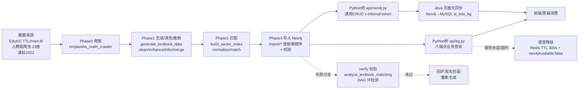

# 分析-01-知识图谱整体架构与数据链路-业务与流程

> summary: 知识图谱整体架构与数据链路业务与流程
> 来源: 切片 ｜ 锚点: 业务与流程
> 节: 分析-01-知识图谱整体架构与数据链路
> COS路径: rag-slices/knowledge-graph/代码/分析-01-知识图谱整体架构与数据链路-业务与流程.md
> 类别：业务流程
> target: 面试项目问答

---

## 业务描述与业务场景

这个模块解决的是：**把分散的教育数据变成一张可检索、可推理的知识图谱**。人教版 K12 数学教材、EduKG 开源概念、义务教育课标等来源互不相通，要通过一条端到端数据流把它们加工成"教材结构 + 概念语义"两层互连的图谱，入库后供答疑定位学生知识点缺口、掌握度诊断与图谱页面浏览消费。

典型场景：
1. 学生在答疑页问一道题，系统要能通过图谱定位到知识点，并沿前置依赖链诊断"是当前点没掌握还是前置没学好"（消费侧 GraphRAG）。
2. 前端知识图谱页浏览教材导航（教材→章→节→知识点），Java 后端把 Neo4j 数据同步到 MySQL 供页面读取。
3. 教研拿到 EduKG 全学科 TTL/新教材目录，要跑一遍"拆分→生成→清洗→推断→匹配→导入→校验"把数据装进 Neo4j。

## 职责

一条**离线构建 + 在线消费**的职责链路：Python 管道负责把多来源教育数据离线加工成 Neo4j 知识图谱；Python 桥把图谱能力以 API 暴露给 Java/前端在线消费；Java 后端做页面化同步（Neo4j→MySQL 双数据源）与掌握度派生；前端 React SPA 只读消费。

**明确不做的事**：不做业务派生数据的持久化（掌握度/点亮存 MySQL，不写权威图谱）；不做图数据库选型（已定 Neo4j）；不做前置依赖推断与匹配算法的细节（分别是分析-07/06 主题）。

**分工要点**：
- **Python 管道**：离线构建，数据来源→加工→导入 Neo4j（Phase0-3）
- **Python 桥**：业务查询 + 通用 CRUD（Java 调用）+ RAG 检索编排（知识图谱语料按模块锚点召回）
- **Java 后端**：页面化同步（Neo4j→MySQL 双数据源）+ 掌握度派生（本主题仅对照方案口径）
- **前端**：React SPA 只读消费（教材导航/年级知识体系/知识点详情）

## 高层业务调用链（教材/课标数据 → 图谱入库 → 服务消费）

**文字复述链路**：数据来源（EduKG TTL、人教版爬虫 23 册、课标2022）→ Phase0 爬取 → Phase1 生成/清洗/LLM推断 → Phase2 知识点匹配 → Phase3 按依赖顺序导入 Neo4j 并校验；导入后两条消费出口——Python 桥业务查询（八端点）直接供前端/答疑消费，Python 桥通用 CRUD 供 Java 做页面化同步（Neo4j→MySQL）再供前端消费。导入失败分支走 verify 校验（教材匹配分析 / DAG 环检测），未过回炉清洗/匹配重新生成；业务查询服务未起或超时降级为直查（Redis TTL 300s + neo4jAvailable:false）。

> 证据：详见 `3.代码/分析-01-知识图谱整体架构与数据链路.md`（§业务描述与业务场景 / §职责 / §高层业务调用链）｜ `4.完善文档/02-知识图谱数据入库主流程.md`
