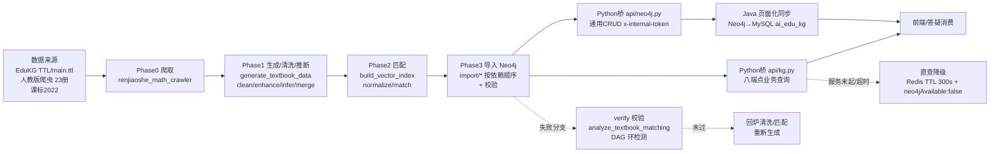

# 分析-01-知识图谱整体架构与数据链路-业务链路

> summary: 知识图谱整体架构与数据链路业务链路
> 来源: 切片 ｜ 锚点: 业务链路
> 节: 分析-01-知识图谱整体架构与数据链路
> COS路径: rag-slices/knowledge-graph/代码/分析-01-知识图谱整体架构与数据链路-业务链路.md
> 类别：业务流程
> target: 开发对账

---

## 业务描述与业务场景

**业务描述**：人教版 K12 数学教材、EduKG 开源概念、义务教育课标等分散来源，要变成一张"教材结构 + 概念语义"两层互连、可检索可推理的知识图谱，支撑答疑时定位学生知识点缺口、掌握度诊断与图谱页面浏览——这条链路就是从原始数据加工入库、再被服务消费的端到端数据流。

**业务场景**：
- 学生在答疑页问一道题，系统要能通过图谱定位到知识点，并沿前置依赖链诊断"是当前点没掌握还是前置没学好"（消费侧 GraphRAG）
- 前端知识图谱页浏览教材导航（教材→章→节→知识点），Java 后端把 Neo4j 数据同步到 MySQL 供页面读取
- 教研拿到 EduKG 全学科 TTL/新教材目录，要跑一遍"拆分→生成→清洗→推断→匹配→导入→校验"把数据装进 Neo4j

## 职责

**职责**：把多来源教育数据加工成 Neo4j 知识图谱（离线构建），并通过 Python 桥 API 把图谱能力暴露给 Java/前端在线消费。
**不做什么**：不做业务派生数据的持久化（掌握度/点亮存 MySQL，不写权威图谱）；不做图数据库选型（已定 Neo4j）；不做前置依赖推断与匹配算法的细节（分别是分析-07/06 主题）。
**分工要点**：
- **Python 管道（edukg）**：离线构建，数据来源→加工→导入 Neo4j（`edukg/README.md:26-37` 定义 Phase0-3）
- **Python 桥（ai-service）**：`api/kg.py` 业务查询 + `api/neo4j.py` 通用 CRUD（Java 调用）+ `core/rag/query.py` RAG 检索编排（知识图谱语料按模块锚点召回）
- **Java 后端**：页面化同步（Neo4j→MySQL 双数据源）+ 掌握度派生（本主题仅对照，见语雀-方案总揽 §11）
- **前端**：React SPA 只读消费（教材导航/年级知识体系/知识点详情）

## 高层业务调用链（教材/课标数据 → 图谱入库 → 服务消费）

> 节点均可对应代码：A=`edukg/README.md:26-37`；B=爬虫脚本（README Phase0）；C=Phase1 脚本目录；D=Phase2 脚本目录；E=`edukg/scripts/kg_data/import/` 6 步（README:320-340）；F=`api/kg.py`；G=`api/neo4j.py`；H=语雀-方案总揽 §11（Java 端对照）；J=verify/校验脚本（README 提到）；L=语雀-方案总揽 §12 降级（Java 端对照）。

**文字复述链路**：数据来源（EduKG TTL/main.ttl、人教版爬虫 23 册、课标2022）→ Phase0 爬取（renjiaoshe_math_crawler）→ Phase1 生成/清洗/推断（generate_textbook_data + clean/enhance/infer/merge）→ Phase2 匹配（build_vector_index + normalize/match）→ Phase3 导入 Neo4j（import/* 按依赖顺序 + 校验）→ 双出口：Python 桥 api/kg.py 八端点业务查询、api/neo4j.py 通用 CRUD（x-internal-token）→ Java 页面化同步 Neo4j→MySQL ai_edu_kg → 前端/答疑消费；导入失败分支走 verify 校验（analyze_textbook_matching / DAG 环检测），未过回炉清洗/匹配重新生成；api/kg.py 服务未起/超时直查降级（Redis TTL 300s + neo4jAvailable:false）。

> 证据：详见 `3.代码/分析-01-知识图谱整体架构与数据链路.md`（§业务描述与业务场景 / §职责 / §高层业务调用链）
