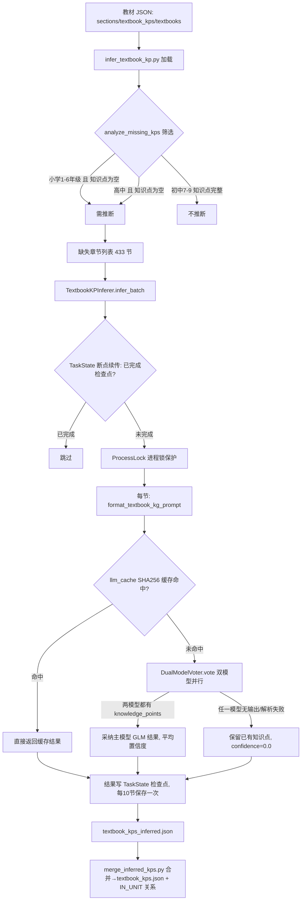

# 分析-06-教材知识点LLM推断-业务链路
> summary: 教材知识点LLM推断业务链路
> 来源: 切片 ｜ 锚点: 业务链路
> 节: 分析-06-教材知识点LLM推断
> COS路径: rag-slices/knowledge-graph/代码/分析-06-教材知识点LLM推断-业务链路.md
> 类别：业务流程
> target: 开发对账

---

## 业务描述与业务场景

**业务描述**：人教版小学 1-6 年级、高中必修的教材原始 JSON 里没有知识点列表，只有初中(7-9 年级)带完整知识点(约 252 个)——这条管道就是让大模型照着教材章节名把小节里"学生必须掌握的核心知识点"推断出来，补全教材侧的知识点缺口，是图谱节点的重要来源之一。

**业务场景**：
- 教研拿到小学三年级上册"时、分、秒"章节，需要系统自动推断出"秒的概念""秒与分的关系""时间的读写"这类知识点
- 推断任务跑 2-3 小时中途断了，希望从断点接着跑而不是从头再来
- 同一个章节重复推断不能重复花 LLM 钱——相同提示词要直接命中缓存

## 职责

**职责**：缺失知识点章节分析 → LLM 双模型投票推断 → 断点续传/缓存 → 输出 `textbook_kps_inferred.json`，再由 `merge_inferred_kps.py` 合并进 `textbook_kps.json`（`source=llm_inferred`）。
**不做什么**：不做初中推断（初中已有知识点）；不做属性推断/专题增强（那是 KPAttributeInferer/ChapterEnhancer）；不做图谱匹配（那是 match_textbook_kp）；不直接写 Neo4j（输出 JSON 供合并/导入）。
**分工要点**：CLI 入口 `infer_textbook_kp.py`（分析+调度）；推断器 `TextbookKPInferer`（`core/llm_inference/textbook_kp_inferer.py`）；投票 `DualModelVoter`（`core/llm_inference/dual_model_voter.py`）；断点续传三件套 `core/llmTaskLock/`。本主题仅 Python edukg 端。

## 高层业务调用链（教材知识点 LLM 推断→合并入库）

**文字链路复述**：CLI 入口 `infer_textbook_kp.py` 加载教材三份 JSON（sections/textbook_kps/textbooks）→ `analyze_missing_kps` 按"小学 1-6 年级且知识点为空"或"高中且知识点为空"筛选出需推断章节，初中 7-9 知识点完整直接不推断 → 得到缺失章节列表 433 节（小学 361 + 高中 72）→ `TextbookKPInferer.infer_batch` 先查 TaskState 断点：已完成检查点的节跳过；未完成的进 ProcessLock 进程锁保护 → 每节 `format_textbook_kg_prompt` 组提示词 → 先查 llm_cache SHA256 缓存：命中直接返回、未命中走 `DualModelVoter.vote` 双模型并行投票 → 两模型都有 knowledge_points 则采纳主模型 GLM 结果并取两模型 confidence 平均值；任一模型无输出/解析失败则保留已有知识点、confidence=0.0 → 结果写回 TaskState 检查点（每 10 节保存一次）→ 落盘 `textbook_kps_inferred.json` → `merge_inferred_kps.py` 合并进 `textbook_kps.json` 并生成 IN_UNIT 关系。

> 证据：详见 `3.代码/分析-06-教材知识点LLM推断.md`（§业务描述与业务场景 / §职责 / §高层业务调用链）
