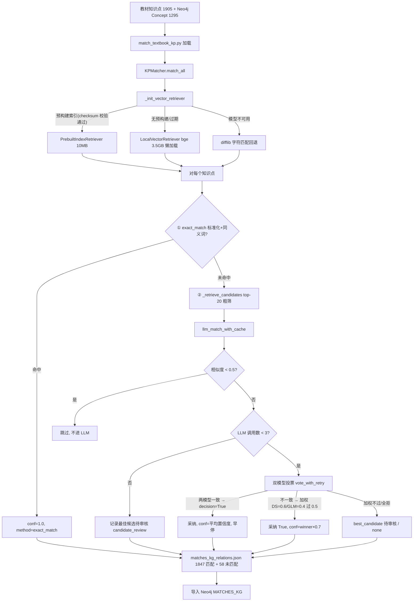

# 分析-07-知识点匹配与双模型投票-业务链路

> summary: 知识点匹配与双模型投票业务链路
> 来源: 切片 ｜ 锚点: 业务链路
> 节: 分析-07-知识点匹配与双模型投票
> COS路径: rag-slices/knowledge-graph/代码/分析-07-知识点匹配与双模型投票-业务链路.md
> 类别：业务流程
> target: 开发对账

---

## 业务描述与业务场景

**业务描述**：教材里"1-5 的认识"这种教学知识点，和图谱里的抽象概念"自然数"说的是同一回事，但名字对不上——这条管道就是把每个教材知识点对到图谱里语义对应的 EduKG 概念上（产出 MATCHES_KG 关系），让答疑时能通过图谱定位知识点。

**业务场景**：
- 学生在答疑页问一道小学题，系统要能定位到图谱知识点，先决条件是教材知识点和图谱概念已建立关联
- 小学"连加连减"这类具体说法，直接字符串匹配永远对不上"减法"这种抽象概念，需要先翻译再匹配
- 五千多个图谱概念不可能每个都让大模型判断一遍，必须先粗筛出最像的少数几个候选

## 职责

**职责**：教材知识点 → EduKG 概念匹配，输出 `matches_kg_relations.json`（含精确匹配/LLM 投票/未匹配候选三态）。
**不做什么**：不做 LLM 推断知识点（那是 infer_textbook_kp）；不做匹配前标准化之外的其他清洗；不直接导入 Neo4j（输出 JSON 供 import 脚本）；评审系统（D16 MySQL 审核表/LLM 推荐接口/导入脚本）**代码中未见实现**。
**分工要点**：CLI `match_textbook_kp.py`（加载/成本估算/参数）；`KPMatcher`（`core/textbook/kp_matcher.py` 精确+粗筛+LLM 投票）；`DualModelVoter`（`core/llm_inference/dual_model_voter.py` 加权投票）；`KPNormalizer`（`core/textbook/kp_normalizer.py` 标准化预处理）。本主题仅 Python edukg 端。

## 高层业务调用链（教材知识点→图谱 MATCHES_KG 匹配）

**文字链路复述**：`match_textbook_kp.py` 加载教材知识点（1905）与图谱 Concept（1295）后，`KPMatcher.match_all` 初始化向量检索器——有预构建索引且 checksum 校验通过用 10MB 的 PrebuiltIndexRetriever，无/过期则懒加载 bge 模型（3.5GB）的 LocalVectorRetriever，模型不可用回退 difflib 字符匹配。对每个知识点：① exact_match 标准化+同义词命中 → conf=1.0；未命中 → ② `_retrieve_candidates` 向量粗筛 top-20 → ③ `llm_match_with_cache`：相似度<0.5 跳过不进 LLM；LLM 调用数≥3 记录最佳候选待审核 candidate_review；否则双模型投票 `vote_with_retry`——两模型一致采纳（平均置信度）并早停；不一致按 DS=0.6/GLM=0.4 加权过 0.5 采纳（winner×0.7）；加权不过/全拒 → best_candidate 待审核或 none。结果汇入 `matches_kg_relations.json`（1847 匹配 + 58 未匹配），再导入 Neo4j 建 MATCHES_KG 关系。

> 证据：详见 `3.代码/分析-07-知识点匹配与双模型投票.md`（§业务描述与业务场景 / §职责 / §高层业务调用链）
