# 分析-09-向量索引构建与校验-业务链路

> summary: 向量索引构建与校验业务链路
> 来源: 切片 ｜ 锚点: 业务链路
> 节: 分析-09-向量索引构建与校验
> COS路径: rag-slices/knowledge-graph/代码/分析-09-向量索引构建与校验-业务链路.md
> 类别：业务流程
> target: 开发对账

---

## 业务描述与业务场景

**业务描述**：匹配教材知识点时要从 1295 个图谱概念里快速挑出最像的少数候选，不能逐个字符串比对——这套能力就是把所有图谱概念提前算成向量存好，匹配时一查就能拿到语义最接近的 top-N；服务侧答疑另用一套在线向量（dashscope 768 维）写腾讯云 COS 向量桶。

**业务场景**：
- 匹配脚本每次启动都加载 embedding 模型要几十秒，用预构建索引文件启动更快、内存占用从 3.5GB 降到约 10MB
- 图谱里新增/删改了概念后，旧索引可能对不上——启动时用 checksum 比对检测过期并提示重建
- 服务侧答疑要实时把"分数除法"这类题型名向量化并查相似，走 dashscope 在线 embedding + COS 向量桶，维度必须与已建索引一致（768）

## 职责

**职责**：匹配侧（edukg）从 Neo4j 读 Concept → bge 本地编码 512 维 → 落盘 `vector_index/`（npy+json+meta）供 `KPMatcher` 加载检索；服务侧（ai-service）dashscope embedding 768 维 → COS 向量桶 put/query。
**不做什么**：匹配侧不做服务侧在线检索（离线构建，查询用 npy 点积）；服务侧不落本地向量文件（向量存 COS 桶，Java 无 SDK 走 Python 桥）；两个 embedding 体系（bge 512 / dashscope 768）**维度不同、互相不通用**。
**分工要点**：构建 `build_vector_index.py`；管理 `VectorIndexManager`（`core/textbook/vector_index_manager.py`）；加载侧 `LocalVectorRetriever/PrebuiltIndexRetriever`（`core/textbook/kp_matcher.py`）；服务侧 `core/tutoring/vector_store.py`。本主题跨 2 端（Python edukg + Python 桥 ai-service）。

## 高层业务调用链（向量索引构建与双端消费）

```mermaid
flowchart TD
    subgraph 匹配侧 edukg
      A[Neo4j Concept 1295] --> B[build_vector_index.py load_kg_concepts]
      B --> C[VectorIndexManager.build_index bge-small-zh-v1.5 离线]
      C --> D[model.encode label+description → 512 维]
      D --> E[落盘 kg_vectors.npy + kg_texts.json + kg_concepts.json + index_meta.json MD5 checksum]
      E --> F[match_textbook_kp.py --use-prebuilt-index]
      F --> G{load_index 成功?}
      G -- 是 --> H{check_index_validity checksum 匹配?}
      H -- 匹配 --> I[PrebuiltIndexRetriever ~10MB 检索]
      H -- 不匹配(图谱已变) --> J[回退懒加载 LocalVectorRetriever 3.5GB]
      G -- 失败 --> J
      J --> K[向量检索 top-20 → LLM 投票]
      I --> K
    end
    subgraph 服务侧 ai-service
      L[题型名/文本] --> M[vector_store.embed dashscope text-embedding-v3 768 维]
      M --> N{vector_type 路由}
      N -- topic --> O[COS_VECTORS_BUCKET topic-index]
      N -- rag/rag-full/rag-slice --> P[COS_VECTORS_RAG_BUCKET rag-full/rag-slice]
      O --> Q[put_vectors / query_vectors ReturnMetaData+ReturnDistance]
      P --> Q
    end
```

**文字复述链路**：匹配侧 edukg 从 Neo4j 读 1295 个 Concept → `build_vector_index.py` 的 load_kg_concepts 取概念 → `VectorIndexManager.build_index` 用 bge-small-zh-v1.5 离线编码 label+description 为 512 维 → 落盘四件套（kg_vectors.npy + kg_texts.json + kg_concepts.json + index_meta.json，含 MD5 checksum）→ `match_textbook_kp.py --use-prebuilt-index` 加载，load_index 成功后再 check_index_validity 比对 checksum：匹配则用 PrebuiltIndexRetriever（约 10MB）检索，不匹配（图谱已变）回退懒加载 LocalVectorRetriever（约 3.5GB），加载失败同样回退懒加载 → 最终向量检索 top-20 → LLM 投票。服务侧 ai-service：题型名/文本 → `vector_store.embed` dashscope text-embedding-v3 768 维 → 按 vector_type 路由（topic 走 COS_VECTORS_BUCKET topic-index；rag/rag-full/rag-slice 走 COS_VECTORS_RAG_BUCKET）→ put_vectors / query_vectors（ReturnMetaData+ReturnDistance）。

> 证据：详见 `3.代码/分析-09-向量索引构建与校验.md`（§业务描述与业务场景 / §职责 / §高层业务调用链）
