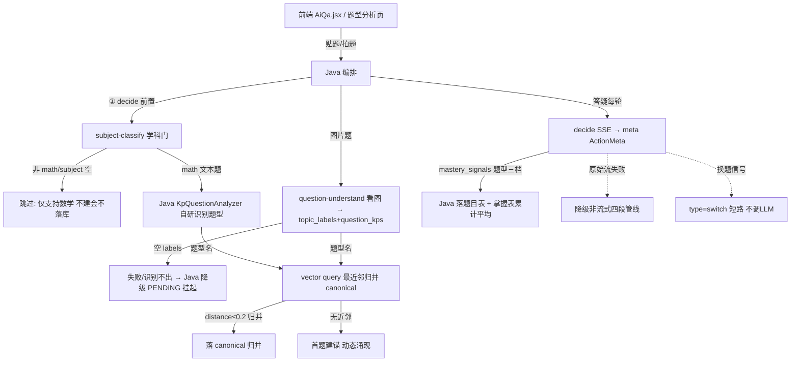

# 分析-01 题型分析完整流程（代码真相）

> summary: 解答「题目从发起到掌握度信号完整链路怎么走」——学科门→图片识别→decide信号→向量归并→Java落库，含各类失败降级路径。
> 权威度: 0.8
> 模块: question-analysis
> COS路径: rag-source/question-analysis/代码/分析-01-题型分析完整流程.md
> 类别：操作流程

## 业务描述与业务场景

**业务描述**：学生把一道题发到 AI 答疑/题型分析页，系统要认出是什么题型、判定学科、记录掌握度——「题目→题型→掌握度」就是本节代码支撑的完整业务闭环。

**业务场景**：
1. 学生在答疑页拍一张数学题图片或贴文本，期望先被判定是不是数学题（非数学直接拒），再被认出题型（鸡兔同笼/相遇问题），答题过程中记录 Ta 对这类型题的掌握程度。
2. 学生在题型分析页贴题/拍题，期望直接得到「题型 + 关联知识点」清单，识别不出时进入待确认（PENDING）而非死胡同。
3. AI 答疑每轮答题后，期望系统把「这次答对/答错/求助后答对」折算进该题型掌握度，下一次决策时优先关注薄弱题型。

## 职责

一道题从学生发起 → 题型识别 → 掌握度信号的**端到端链路**。Python 侧是 stateless 四端点（信号源 + 向量原语），由 Java 编排；掌握度/canonical/落库在 Java。

## 高层业务调用链（题目→题型→掌握度信号）

## 代码事实

### 端点与契约（Python 四类，全 `x-internal-token`）

- `POST /api/tutoring/subject-classify` 同步 JSON：学科闭集，None 放行。（`api/tutoring.py:136-149`）
- `POST /api/tutoring/question-understand` 同步 JSON：图片题型识别，空 labels=失败降级 PENDING。（`api/tutoring.py:121-133`、`models/tutoring.py:170-176`）
- `POST /api/tutoring/decide` SSE 流式：agent→thinking*→meta(ActionMeta)→done。（`api/tutoring.py:41-81`）
- `POST /api/tutoring/vector/put|query` 同步 JSON：embedding + COS 向量桶路由。（`api/vector.py:30-81`）

### 关键机制（从代码确认）

- **调用链**：主题单题文本题走 Java `KpQuestionAnalyzer`（Python 无文本题型识别端点）；**图片题**走 Python `question-understand`。decide 每轮输出 `ActionMeta`（type 硬信号 + eval 软信号 + `mastery_signals` 题型三档 + `question_kps` 顺带知识点）。（`core/tutoring/decider.py:56-89`）
- **题型名归一**：`vector query` 查最近邻 → Java `TopicLabelAggregationService.aggregate` 归并 canonical（首题建锚动态涌现、distance ≤0.2 归并）。（`core/tutoring/vector_store.py:106-121`、`settings.py:99-105`）
- **落库全在 Java**：题目表（事实源）+ 掌握表（canonical key + 累计平均）+ 答疑会话（Java Redis）。Python 不落业务库。（`core/tutoring/decider.py:56-89`）

### 边界与降级

- **decide 流式主路径失败** → 降级非流式 `decide()`（四段结构化管线），该次无 thinking。（`core/tutoring/decider.py:158-163`）
- **换题短路**：`is_new_question=true`（Java 换题信号）→ 直接 `type=switch` 不调 LLM。（`decider.py:67-74`）
- **question-understand 失败** → 空 topic_labels → Java 降级 PENDING（不是错误）。（`api/tutoring.py:128`、`models/tutoring.py:173`）

### 枚举/常量/配置

| 类型 | 名称 | 取值 | 出处 |
|---|---|---|---|
| 枚举 | SubjectType | math/physics/chemistry/biology/chinese/english/politics/geography/history/other | `models/tutoring.py:182-197` |
| 枚举 | ActionType | hint/approach/reveal/concept/switch/end | `models/tutoring.py:17-24` |
| 枚举 | MasterySignal | mastered/practicing/struggling | `models/tutoring.py:38-42` |
| 配置 | subject-classify 模型 | doubao-seed-2-0-mini-260428 / temp 0.3 / 关思考+20s 超时+重试0 | `core/tutoring/subject_classify.py:24-26,66-73` |
| 配置 | question-understand 模型 | doubao-seed-2-0-mini-260428 / temp 0.3 / 关思考 / 题型名上限 5 | `core/tutoring/question_understand.py:24-26` |
| 配置 | decide 换题短路 | `is_new_question=true` → type=switch | `models/tutoring.py:143` |
| 配置 | 历史截断 | 最近 12 条 | `context.py:19-23` |

## 隐性坑与注意事项

- **文本题题型识别在 Java，Python 只有图片题端点**——别误以为 Python 收全部题目识别。
- **PENDING 语义**：识别失败 = 空 topic_labels → Java 降级 PENDING；不是 Python 报错。
- **掌握度信号只能在答疑链路产生**——`decide` 输出 `mastery_signals`，题型分析页只记题不产生信号。
- **换题短路**：`is_new_question=true` 直接 `type=switch`，Java 会真收尾，别把它当正常决策。

## 设计要点

- **Python 纯智能无状态**：不落库，所有状态在 Java Redis/掌握表；Python 只做 LLM + 向量原语。
- **信号跟题目走，不跟题型走**：PENDING 题型照常采信号落题目表，归属确定后再聚合，不因待定丢数据。（`decider.py` + `mastery_signals`）
- **四类失败语义分治**：业务判定吞异常降级空结果；向量基础设施错误冒泡让 Java 感知后降级。（`api/vector.py:8-9`）

## 对账要点

| 对账分类 | 项 | 语雀/design 口径 | 代码现状 | 结论 |
|---|---|---|---|---|
| 方案vs实现 | 掌握度主体 | 知识点 URI | 题型（canonical 题型名） | ⚠️翻转 |
| 方案vs实现 | 掌握度数值 | 离散四档 max 单调不减 | 连续 0-100 累计平均 | ⚠️翻转 |
| 方案vs实现 | canonical 来源 | 预置题型池 | 动态涌现 + 首题建锚 | ⚠️翻转 |
| 方案vs实现 | 题目向量 | 题目向量为主 + 题型名向量为辅 | 只题型名向量单信号 | ⚠️翻转 |
| 接口契约 | 文本题识别 | 方案未明确 | Python 无此端点，Java `KpQuestionAnalyzer` 自研 | ✅ Java 承担 |
| 注释vs运行行为 | 掌握度信号字段 | `kp_label` | `topic_label`（Java `@JsonAlias` 兼容） | ⚠️翻转 |

## 已读代码清单
- **Python**：`api/tutoring.py`、`api/vector.py`、`models/tutoring.py`、`core/tutoring/{decider,subject_classify,question_understand,vector_store,context}.py`、`config/settings.py`
- **Java**：`aiEduPlatform`（TutoringAppService / KpQuestionAnalyzer / TopicLabelAggregationService 参照分析与 design，未逐行重读）
- **前端**：`AiQa.jsx` / `useTutoringSession.js`（refer 分析-02 + design）