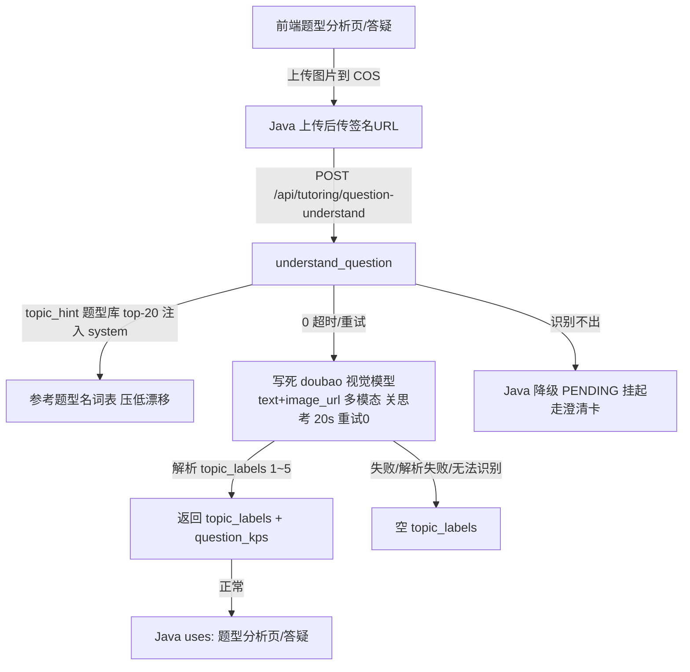

# 分析-04 题型识别与题目理解（代码真相）

> 来源：ai-edu-ai-service 深读（2026-08-27 真读代码）｜权威度 0.8 ｜ 模块=question-analysis
> 解决提问：question-analysis.md「图片题怎么识别题型？」「识别失败怎么办？」（问题表·操作节）
> COS路径: rag-source/question-analysis/代码/分析-04-题型识别与题目理解.md

## 职责

**图片题**的题型识别（视觉多模态），Java 传 COS 签名 URL → Python 看图 → 题型名 1~5 个 + 顺带知识点。文本题在 Java（`KpQuestionAnalyzer` 自研），Python 无此端点。

## 高层业务调用链

## 代码事实

- **输入**：`QuestionUnderstandRequest(image_url 必填, topic_hint 可选, grade 可选)`。（`models/tutoring.py:160-167`）
- **输出**：`QuestionUnderstandResponse(topic_labels: List[str] 1~5 个, question_kps: Optional[List[str]])`；**空 topic_labels = 识别失败，Java 降级 PENDING（不视为错误）**。（`models/tutoring.py:170-176`）
- **模型**：写死 doubao 视觉模型，`text + image_url` 多模态消息；提示词"每行一个、不要编号、1~5 个题型名"，顺带知识点行。（`question_understand.py:24-26,31-38,92-98`）
- **status 枚举**：**Python 侧没有** RESOLVED/PENDING/CANDIDATE——那是 Java `QuestionAnalysisDTO` 概念。Python 只返回 topic_labels，空 = 失败。（`models/tutoring.py:170-176`）
- **解析**：`_parse_labels` 按行拆解，去编号/bullet 前缀（`1.` `1、` `-` `•`），"知识点："前缀行单独拆 kps，"无法识别/无法辨认"行跳过。（`question_understand.py:53-71`）
- **别名/命名收敛**：`topic_hint`（Java 传题型库 top-20 常用题型名）注入 system prompt 作为"参考题型名词表"，"优先从这些名字里选，词汇不足可自拟"——从源头压低变体漂移。（`question_understand.py:40-50`）
- **护栏/韧性**：同 subject-classify——关思考 + 20s 超时 + 重试 0；LLM 失败/解析失败 → 空结果，绝不抛异常。（`question_understand.py:82-91,109-111`）
- **题型名上限**：`_MAX_TOPIC_LABELS = 5`，与 Java `KpQuestionAnalyzer` 1~5 一致。（`question_understand.py:28-29`）

### 枚举/常量/配置

| 类型 | 名称 | 取值 | 出处 |
|---|---|---|---|
| 配置 | 模型 | doubao-seed-2-0-mini-260428（写死） | `question_understand.py:24-26` |
| 配置 | 温度 | 0.3 | `question_understand.py:26` |
| 配置 | 思考 | 关（thinking disabled） | `question_understand.py:86` |
| 配置 | 超时 | 20s（OpenAI SDK 默认 600s → 显式设 20） | `question_understand.py:87-90` |
| 配置 | 重试 | 0（关 SDK 重试） | `question_understand.py:90` |
| 常量 | 题型名上限 | 5 | `question_understand.py:28-29` |
| 常量 | 参考词表 | topic_hint top-20 | `question_understand.py:16,49` |

## 隐性坑与注意事项

- **识别失败不是错误**：空结果 → Java PENDING（低置信挂起，走澄清卡），不编造题型名。（`question_understand.py:109-111`）
- **两层 PENDING 分开**（语雀-方案设计2-问题1 坑2）：analyze-question 的 PENDING = "题型没认出来"；getMastery 的 PENDING = "题型已练、知识点待确认"。Python 侧只产生前者（空结果），后者在 Java。（`models/tutoring.py:170-176`）
- **"知识点："行要单独拆**：混进 topic_labels 会把知识点当题型。（`question_understand.py:60-64`）
- **topic_hint 冷启动跳过**：题型库为空时 `_build_system` 不注入词表，模型自拟题目名动态涌现。（`question_understand.py:48-50`）

## 设计要点

- **topic_hint 词表收敛**：题型库有锚点时用它压漂移；冷启动（库空）时自拟名，动态涌现补。（`question_understand.py:40-50`）
- **慢修复复用**：视觉模型走"关思考 + 20s"，实测看图 1.2s 出答案，杜绝 32s+ 卡顿。（`question_understand.py:84-85` 注释）
- **独立 stateless 一次性端点**（不从 decide 拆整个流程）：单题分析是"贴题→结果"无状态请求，模型写死 doubao，多入口复用题目理解能力。（`question_understand.py:4-9`）

## 对账要点

| 对账分类 | 项 | 语雀/design 口径 | 代码现状 | 结论 |
|---|---|---|---|---|
| 方案vs实现 | 文本题识别 | 方案未明确 | Python 无此端点，Java `KpQuestionAnalyzer` 自研 | ✅ Java 承担 |
| 接口契约 | WEAK 状态 | WEAK 曾返回 RESOLVED conf=70 | Python 不落后，空 labels=Java PENDING | ⚠️翻转（WEAK→PENDING 降级） |
| 注释vs运行行为 | 题型名上限 | KpQuestionAnalyzer 一致 1~5 | `_MAX_TOPIC_LABELS=5` 硬上限 | ✅落地 |
| 方案vs实现 | topic_hint 词表 | 设计 D1/D3 建议 | 落地为 system prompt"参考题型名词表" | ✅落地 |

## 已读代码清单
- **Python**：`core/tutoring/question_understand.py`（全）、`models/tutoring.py:160-176`、`api/tutoring.py:121-133`
- **Java**：`KpQuestionAnalyzer`（参照，未逐行重读）
- **前端**：不涉及（纯后端端点）