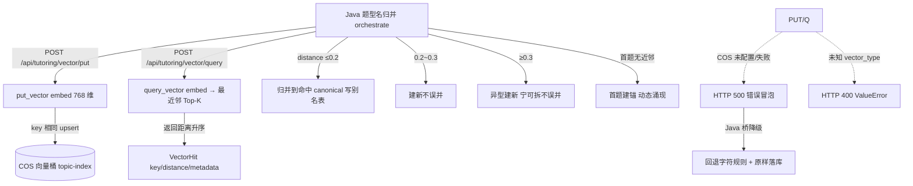

# 分析-06 向量动态聚类（代码真相）

> summary: 题型名归一 canonical 用向量相似度: Python 向量原语(put/query+text-embedding-v3 显式 768 维), Java TopicLabelAggregationService 决策归并(distance≤0.2 归并写别名表/0.2~0.3 建新/≥0.3 异型建新/首题建锚动态涌现); 题目文本不落库只题型名向量; put 后~10s 异步生效建锚不立查; 编辑距离≤1 归并已移除全交向量层; 失败错误冒泡 Java 桥降级字符规则不阻塞主链路
> 权威度: 0.8
> 模块: question-analysis
> COS路径: rag-source/question-analysis/代码/分析-06-向量动态聚类.md
> 类别：数据关联

## 业务描述与业务场景

**业务描述**：同一道题型，学生和 AI 的叫法五花八门（「鸡兔同笼」「鸡兔同笼问题」「假设法」）。系统用**向量相似度**把这些叫法收敛成唯一标准题型名（canonical），才能核算"这个题型到底练了几道、掌握多少"，不然报表全是碎片。

**业务场景**：
1. 学生 A 说「鸡兔同笼」、学生 B 说「鸡兔同笼问题」——语义同型，被向量归并到同一 canonical，掌握度汇总到一行。
2. 一脸题目的题型名先在题型库查最近邻：距离够近进已有题型（写别名表），够远才新建题型——**零预置、动态涌现**，题型是"长出来的"不是"规定出来的"。
3. 向量库挂了也不让主链路断：Java 退化成字符规则（解X/求X 前缀）+ 原样落库，归一精度下降但不阻塞学生作答。

## 职责

Python 提供向量**原语**（put/query + embedding），canonical 归并决策在 Java（`TopicLabelAggregationService.aggregate`）。Python 只把题型名 embedding 进 COS 向量桶，查最近邻返回 distance。

## 高层业务调用链（题型名动态聚集 canonical）

## 代码事实

- **端点**：`POST /api/tutoring/vector/put`、`POST /api/tutoring/vector/query`，同步 JSON，`x-internal-token` 鉴权。（`api/vector.py:30-81`）
- **存**：`put_vector(key, text, vector_type, metadata)` → dashscope embedding → `CosVectorsClient.put_vectors`；**key 相同 upsert**。（`core/tutoring/vector_store.py:124-147`）
- **查**：`query_vector(text, top_k, vector_type, filter_)` → embed → `query_vectors`，返回 `{key, metadata, distance}`，**按 distance 升序（越小越相似）**。（`vector_store.py:150-179`、`models/vector.py:46-56`）
- **key 格式**：`VectorPutRequest.key` = 业务 ID（Java 传）；本期语义 = 题型名向量，**题目文本不落库**。（`models/vector.py:16-24`）
- **路由**：`vector_type` 必填，本期唯一合法值 `"topic"` → 索引 `topic-index`；`question`/`rag` 配置占位。未知 → ValueError → 400。（`vector_store.py:106-121`、`settings.py:99-105`）
- **embedding**：dashscope `text-embedding-v3`，显式 `dimensions=768`（默认 1024，维度必须与索引一致，索引建好不可改）。（`vector_store.py:26-28,87-103`）
- **写入延迟**：`put_vectors` 后 ~10s 异步生效，立即 query 可能 miss（空 vectors）。（`vector_store.py:126-127`）
- **COS 客户端懒加载**：`_get_cos_client` 仅当 `COS_VECTORS_*` 配齐才 init，未配 → RuntimeError → 端点 500。（`vector_store.py:38-60`）
- **失败语义**：错误冒泡（不只异常），与 question-understand 吞异常相反——向量是基础设施，让 Java 感知失败再降级。（`api/vector.py:45-50,76-81`、`vector_store.py:8-9`）

### 枚举/常量/配置

| 类型 | 名称 | 取值 | 出处 |
|---|---|---|---|
| 配置 | embedding 模型 | text-embedding-v3 | `vector_store.py:26` |
| 配置 | embedding 维度 | 768（默认 1024，须与索引一致） | `vector_store.py:28` |
| 配置 | dashscope base | https://dashscope.aliyuncs.com/compatible-mode/v1 | `vector_store.py:29` |
| 配置 | 索引路由 | topic→topic-index 默认桶；rag/rag-full/rag-slice→RAG 桶 | `settings.py:99-105` |
| 契约 | vector_type | 本期唯一合法值 "topic"；未知→ValueError→400 | `vector_store.py:113-114` |
| 阈值 | 归并 | distance ≤0.2 归并；0.2~0.3 建新；≥0.3 异型建新 | Java `TopicLabelAggregationService`（参照） |
| 常量 | top_k | 默认 5（ge=1 le=100） | `models/vector.py:42` |

## 隐性坑与注意事项

- **编辑距离 ≤1 近字归并已移除**："一元一次/一元二次"一字之差与错别字"方成/方程"同为距离 1，字符级无法区分会误并——近字/错别字全交给向量层。（`vector_store.py` 无此逻辑，refer 对账）
- **聚集依据 = 题型名向量单信号**：题目向量本期不落库（`models/vector.py:23` "题目文本不落库"），别以为题目向量参与归一。
- **put 后 ~10s 异步生效**：建锚后不立查、留重试（`vector_store.py:13,126-127`）。
- **COS 未配置时**：put/query → 500，Java 桥降级（回退字符规则 + 原样落库），不阻塞主链路。

## 设计要点

- **无"批量聚类"**：Python 侧无定时任务/批处理，Java `@Scheduled` 已移除改手动触发——只是即时 put/query 原语。
- **spike 实测距离语义**：self≈0、同型 ~0.077（"鸡兔同笼"→"鸡兔同笼问题"）、异型 ≥0.33（"相遇"→"行程"0.332）。（`vector_store.py` 注释）
- **阈值保守**：distance ≤0.2 只并同型，宁可拆不误并——canonical 是"长出来"的不是"规定出来的"。

## 对账要点

| 对账分类 | 项 | 语雀/design 口径 | 代码现状 | 结论 |
|---|---|---|---|---|
| 方案vs实现 | 聚集依据 | 题目向量为主 + 题型名向量为辅 | **只题型名向量单信号** | ⚠️翻转 |
| 方案vs实现 | canonical 来源 | 预置题型池 | 动态涌现（首题建锚） | ⚠️翻转 |
| 方案vs实现 | 字符归一 | 编辑距离 ≤1 近字归并 | 已移除（误并"一元一次/一元二次"） | ⚠️翻转 |
| 方案vs实现 | 定时批量聚类 | design 建议 | Python 无；Java `@Scheduled` 移除改手动 | ⚠️翻转 |
| 接口契约 | vector_type | 多索引哈希 | 本期唯一 "topic"，其余占位 | ✅落地 |
| 注释vs运行行为 | 失败语义 | 早期"吞异常" | 错误冒泡（基础设施感知失败） | ⚠️翻转 |

## 已读代码清单
- **Python**：`core/tutoring/vector_store.py`（全）、`models/vector.py`（全）、`api/vector.py`（全）、`config/settings.py:99-105`
- **Java**：`TopicLabelAggregationService` / `TopicVectorStore`（参照 design，未逐行重读）
- **前端**：不涉及（纯后端向量桥）