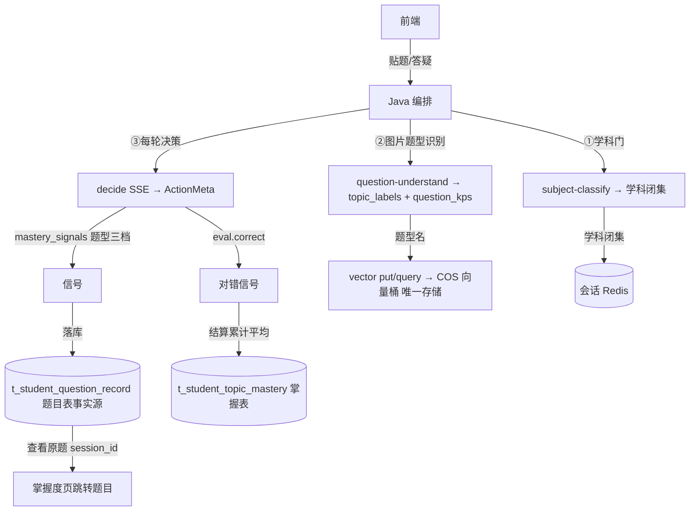

# 分析-07 数据流与存储（代码真相）

> summary: 数据存哪怎么回流: Python stateless 不落任何业务库仅写 COS 向量桶(题型名向量), 落库全在 Java(题目表 t_student_question_record 事实源+掌握表 t_student_topic_mastery+会话 Redis); mastery_snapshot 回流 decide 薄弱升序 top10; 历史截断最近 12 条; 题目表 session_id 关联原题可跳回; 信号唯一来源 AI 答疑 decide
> 权威度: 0.8
> 模块: question-analysis
> COS路径: rag-source/question-analysis/代码/分析-07-数据流与存储.md
> 类别：数据存储

## 业务描述与业务场景

**业务描述**：一道题的「作答记录 + 掌握度 + 会话状态」最终存在哪、怎么回流给下一次决策——这是业务数据的完整落库与回读链路，也是"掌握度可追溯"的根基。

**业务场景**：
1. 学生答完一道「鸡兔同笼」→ 题目落题目表（事实源，可回查原题），掌握度更新掌握表——下次看「掌握度页·查看原题」能跳到那一次作答。
2. 多轮答疑中会话状态在 Java Redis，学生断开重连会话不丢；AI 服务本身无状态，任何一轮都可被新机器接管。
3. 系统把学生已有掌握度快照回流给下一次 decide——"记得你以前这类型不行"，薄弱题型优先讲解。

## 职责

数据流的**全局视角**：Python 侧 stateless 不落业务库，只产出信号 + 向量原语；落库/存储全在 Java（题目表 + 掌握表 + Redis 会话 + 向量桶）。

## 高层业务调用链（数据流转与落库）

## 代码事实

- **Python 不落任何业务库**（无 ORM/MySQL/Redis 依赖）。当前题目完全由 history 推断（Java 零题目状态）。（`core/tutoring/decider.py:56-89`、`context.py:19-23`）
- **Python 唯一"存储" = COS 向量桶**：put/query，metadata 透传不落库。（`vector_store.py:124-179`）
- **decide SSE 事件**：`agent(perceive/analyze/plan/decide) → thinking* → meta(ActionMeta) → done`。（`api/tutoring.py:55-72`、`core/tutoring/agent_events.py`）
- **generate SSE 事件**：`meta(action_type) → agent(generate) → thinking* → token* → done`。（`api/tutoring.py:97-109`、`core/tutoring/generator.py:53-75`）
- **question-understand / subject-classify**：同步 JSON，一请求一返回。（`api/tutoring.py:121-149`）
- **mastery_snapshot 回流输入**：`DecideRequest.mastery_snapshot: List[KpSnapshot]`（Java 从掌握表组装，Python 只排序取 top-10 薄弱在前）。（`models/tutoring.py:141`、`context.py:33-43`）
- **历史截断**：`truncate_history` 保留最近 12 条。（`context.py:19-23`）

### 枚举/常量/配置

| 类型 | 名称 | 取值 | 出处 |
|---|---|---|---|
| 常量 | 历史截断条数 | 12 | `context.py:15,19-23` |
| 常量 | 快照 top-N | 10 | `context.py:15-16,33-43` |
| 结构 | KpSnapshot | kp_key(题型名 canonical) + label + mastery_level 0-100 | `models/tutoring.py:70-79` |
| 事件 | decide SSE | agent→thinking*→meta→done | `api/tutoring.py:55-72` |
| 事件 | generate SSE | meta→agent(generate)→token*→done | `api/tutoring.py:97-109` |

## 隐性坑与注意事项

- **Python 无状态**：会话历史在 Java Redis，掌握度快照在 Java 掌握表，Python 只接收 snapshot 作上下文提示。（`context.py` + `models/tutoring.py:138,141`）
- **"唯一存储"是 COS 向量桶**——别误以为 Python 把题目/掌握度存了库。
- **题目表跳答疑会话**：`session_id` 关联原题，掌握度页"查看原题"靠它；无会话链接显示题目原文（Java 侧）。

## 设计要点

- **事件驱动 → 信号 → 落库**：答疑事件 → 信号（mastery_signals + eval.correct）→ 题目落库 + 掌握表累计平均，数据可追溯。
- **信号源唯一**：AI 答疑 `decide` 是唯一产出掌握信号的入口；题型分析页只记题目不产生信号。
- **状态与数据分离**：Python stateless（纯智能），Java 管状态（Redis/session）与数据（两表）。

## 对账要点

| 对账分类 | 项 | 语雀/design 口径 | 代码现状 | 结论 |
|---|---|---|---|---|
| 方案vs实现 | 掌握度主体 | 知识点 URI | 题型（canonical key） | ⚠️翻转 |
| 方案vs实现 | Python 落库 | 早期方案 | Python 不落业务库，Java 全落 | ⚠️翻转 |
| 接口契约 | 题目文本是否落向量 | 题目向量为主 + 题型名向量 | 只题型名向量，题目不落库 | ⚠️翻转 |
| 注释vs运行行为 | 会话存储 | — | Java Redis，Python 无状态 | ✅落地 |

## 已读代码清单
- **Python**：`core/tutoring/context.py`、`core/tutoring/decider.py`、`api/tutoring.py`、`vector_store.py`、`generator.py`、`models/tutoring.py`
- **Java**：`t_student_question_record` / `t_student_topic_mastery` /会话 Redis（参照，未逐行）
- **前端**：`AiQa.jsx` / `useTutoringSession.js` / `Mastery.jsx`（跳题目，参照）