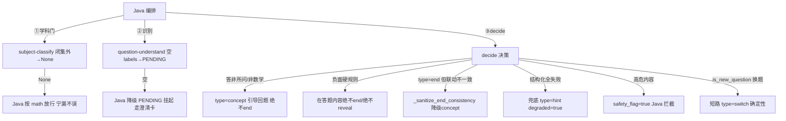

# 分析-09 防作弊与异常（代码真相）

> summary: 解答「怎么防作弊 / 防乱答 / 答非所问怎么办」——识别失败降级 PENDING、闭集外放行、答非所问引导 concept、end 联动护栏、结构化四段兜底。
> 权威度: 0.8
> 模块: question-analysis
> COS路径: rag-source/question-analysis/代码/分析-09-防作弊与异常.md
> 类别：开发难点

## 职责

题型识别链路 + decide 决策的**护栏与异常防护**：低置信挂起、闭集外放行、答非所问引导、end 一致性护栏、结构化输出兜底。Python 侧护栏集中在"别让 LLM 乱答/别泄答案/别拖慢"。

## 高层业务调用链（防作弊护栏与异常路径）

## 代码事实

- **低置信挂起**：Python 不判置信度——"识别失败 = 空 topic_labels = Java 降级 PENDING"（Java 端再走澄清卡 resolve/vote）。（`models/tutoring.py:173`、`api/tutoring.py:128`）
- **闭集外放行**：subject-classify 闭集外 → None → Java 按 math 放行（宁可漏拦不误拦）。（`subject_classify.py:45-55,85-87`、`models/tutoring.py:213-219`）
- **答非所问/非数学题**：decide 提示词——不在答题（闲聊/非数学题/状态表达）→ `type=concept` 引导回题，绝不 end；唯一 end 例外是明确结束意图。（`prompts.py:61-68`）
- **否定硬规则**：任何在答题内容（无论对错/跑偏）绝不 `type=end`、绝不 `type=reveal`（答错 ≠ 要答案）。（`prompts.py:66`）
- **end 一致性护栏**：`_sanitize_end_consistency`——`type=end` 但 end_reason 缺失或 COMPLETED 但 correct/exercise_complete 不满足 → 降级 `type=concept`，防"答错被恭喜/泄答案"。（`core/tutoring/decider.py:24-53`）
- **换题短路护栏**：Java 检测新题 → `is_new_question=true` → 直接 `type=switch` 不调 LLM（确定性 100% 准，省调用）。（`decider.py:67-74`）
- **safety_flag**：学生消息含自伤/暴力 → `safety_flag=true`（拦截由 Java 执行）。（`prompts.py:85-86`）

### 结构化输出兜底（四段降级管线）

- **① function calling → ② JSON mode → ③ 正则提取 → ④ 兜底**，保证 ActionMeta 绝不畸形、绝不抛异常。（`core/tutoring/structured.py:251-277`、`_fallback` `structured.py:28-36`）
- **情绪值宽容归一**：模型关思考后偶发填中文/小写情绪值 → `_normalize_emotion` 映射为大写枚举，避免整条 ActionMeta 校验失败丢信号。（`structured.py:101-129`）

### 枚举/常量/配置

| 类型 | 名称 | 取值 | 出处 |
|---|---|---|---|
| 枚举 | ActionType | hint/approach/reveal/concept/switch/end | `models/tutoring.py:17-24` |
| 枚举 | EndReason | COMPLETED/ANSWER_REVEALED/ABANDONED/ROUND_LIMIT | `models/tutoring.py:45-50` |
| 护栏 | end 联动 | COMPLETED 必须 correct=true 且 exercise_complete=true；end_reason 缺失→无效 | `decider.py:24-53` |
| 兜底 | degraded | 四段全失败 `type=hint, degraded=true` | `structured.py:28-36` |
| 兜底 | 纠错重试 | corrective_retries=1（只修 schema 不整段重生成） | `structured.py:252-256` |

## 隐性坑与注意事项

- **end 联动收紧**：答错的学生禁止被"恭喜"、summary 禁止泄出完整解答——`type=end` 但联动不一致会降级 concept。（`decider.py:24-53`）
- **负面硬规则**：在答题内容绝不 end / 绝不 reveal——答错 ≠ 要答案。（`prompts.py:66`）
- **PENDING 不是错误**：识别失败 → PENDING → 澄清卡，不是 Python 抛异常。
- **结构化兜底与降级监控**：兜底 `degraded=true` 让 Java 监控 Python 降级频次。

## 设计要点

- **确定性护栏不信任模型格式**：end 联动、换题短路都是代码层面的硬校验，LLM 只被当候选输出，不是最终裁决。
- **两类失败语义分治**：业务判定（学科门/题型识别）= 吞异常降级空（宁返回空不阻塞）；向量基础设施 = 错误冒泡（Java 有降级，Python 正常报错便于定位）。
- **识别失败不是错误**：空结果 → Java PENDING（低置信挂起，走澄清卡），不编造题型名。

## 对账要点

| 对账分类 | 项 | 语雀/design 口径 | 代码现状 | 结论 |
|---|---|---|---|---|
| 方案vs实现 | 答非所问处理 | 澄清卡 | decide 提示词 type=concept 引导回题 | ✅落地 |
| 方案vs实现 | end 收尾 | 模型自判完成 | end 联动护栏 + 降级 concept | ✅落地 |
| 接口契约 | 换题 | — | is_new_question=true 短路 type=switch | ✅落地 |
| 注释vs运行行为 | WEAK 冒充 RESOLVED | 曾返回 RESOLVED conf=70 | 识别失败→PENDING，不冒充 | ⚠️翻转 |
| 注释vs运行行为 | 失败语义 | 统一降级空 | 业务判定吞异常 vs 向量冒泡 | ⚠️翻转 |

## 已读代码清单
- **Python**：`core/tutoring/decider.py:24-53,67-74`、`core/tutoring/structured.py（全）`、`core/tutoring/subject_classify.py:45-55`、`models/tutoring.py`、`prompts.py`（参照）
- **Java**：`TutoringGuardrailService` / 澄清卡 / PENDING 处理（参照，未逐行）
- **前端**：澄清卡交互（参照）