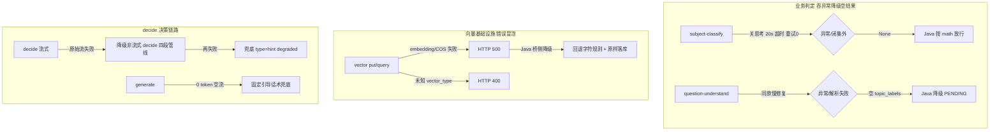

# 分析-10 工程韧性（代码真相）

> 来源：ai-edu-ai-service 深读（2026-08-27 真读代码）｜权威度 0.8 ｜ 模块=question-analysis
> 解决提问：question-analysis.md「这些服务挂了/慢了有什么兜底？」（问题表·难点节）
> COS路径: rag-source/question-analysis/代码/分析-10-工程韧性.md

## 职责

Python 桥的**工程韧性**设计：超时/降级/重试/兜底，保证各端点在 LLM 或 COS 异常时不让主链路卡死。

## 高层业务调用链（降级全景）

## 代码事实

- **题型识别/学科门统一"慢修复"**：关思考（thinking disabled）+ `request_timeout=20` + `max_retries=0`，慢/失败快速返回空结果，不让调用方无限等。开思考实测 50~145s、关思考秒出。（`core/tutoring/question_understand.py:82-91`、`subject_classify.py:66-73`）
- **吞异常降级空结果**：question-understand / subject-classify 全部 try/except，失败返回空 topic_labels / 空 subject。（`question_understand.py:109-111`、`subject_classify.py:85-87`）
- **向量端点相反：错误冒泡**（不吞异常）：embedding 失败 / COS 失败 → HTTP 500，未知 vector_type → 400；Java 桥侧降级（回退字符规则 + 原样落库，不阻塞主链路）。（`api/vector.py:45-50,76-81`）
- **COS 向量桶挂了兜底**：`_get_cos_client` 懒加载，`COS_VECTORS_*` 未配齐抛 RuntimeError → 端点 500 → Java 桥降级；向量是增强层，主干（题目落库/掌握表/接口）不依赖向量。（`vector_store.py:38-60`）
- **decide 流式失败降级**：原始方舟 SSE 流失败/args 非法 → 降级非流式 `decide()`（四段管线），该次无 thinking 展示。（`decider.py:158-163`）
- **generate 空流兜底**：0 token 时输出固定引导话术，避免学生收到空回复。（`generator.py:20-26,69-72`）
- **结构化四段降级**：function calling → JSON mode → 正则提取 → 兜底 type=hint degraded=true。（`structured.py:251-277`）
- **非流式主路径（decide 提示词）**：关思考 mini 偶发不走 tool_call 直接吐 JSON 也有 content 兜底解析。（`decider.py:150-157`、`structured.py:182-205`）

### 枚举/常量/配置

| 类型 | 名称 | 取值 | 出处 |
|---|---|---|---|
| 配置 | 识别/学科门超时 | 20s | `question_understand.py:89`、`subject_classify.py:71` |
| 配置 | 重试 | 0（关 SDK 重试） | `question_understand.py:90`、`subject_classify.py:72` |
| 配置 | 思考 | 关（thinking disabled） | `question_understand.py:86` |
| 兜底 | generate 空流话术 | "我这边刚才有点卡顿…你先说说你读到了哪些关键条件？" | `generator.py:20-26` |
| 兜底 | degraded 标记 | 四段全失败 type=hint degraded=true | `structured.py:28-36` |
| 降级 | decide 流→非流 | 原始流失败走 decide() | `decider.py:158-163` |

## 隐性坑与注意事项

- **开思考是 32s+ 卡顿根源**：decide/generate 全关思考，别在识别/学科门开思考当"精确提升"。（`question_understand.py:84-85` 注释）
- **向量增强层哲学**：主链路不依赖向量，挂了只是归一退化为字符规则 + 原样落库。（`vector_store.py:8-9`、`api/vector.py:44`）
- **COS 未配置 ≠ 不可启动**：懒加载保证 endpoints 可加载，调时 500。
- **degraded 监控**：Java 依 degraded=true 监控 Python 降级频次，排查是降级不是 bug。

## 设计要点

- **两类失败语义分治**：LLM 前置（学科门/题型识别）= 吞异常降级空（宁返回空不阻塞）；向量基础设施 = 错误冒泡（Java 有降级，Python 正常报错便于定位）。
- **慢修复是性能护栏**：题型识别/学科门不能成为答疑链路新卡点。
- **确定性优先**：关思考 + 重试 0 + 兜底，宁可略降精度也要秒回 + 不阻塞。

## 对账要点

| 对账分类 | 项 | 语雀/design 口径 | 代码现状 | 结论 |
|---|---|---|---|---|
| 方案vs实现 | 慢修复 | 方案建议 | 关思考+20s+重试0 秒出 | ✅落地 |
| 方案vs实现 | 向量失败语义 | 早期吞异常 | 错误冒泡（Java 感知再降级） | ⚠️翻转 |
| 注释vs运行行为 | COS 挂了 | — | 懒加载 500 → Java 降级不阻塞 | ✅落地 |
| 接口契约 | generate 空流 | — | 固定引导话术兜底 0 token | ✅落地 |

## 已读代码清单
- **Python**：`core/tutoring/question_understand.py:82-111`、`core/tutoring/subject_classify.py:66-87`、`core/tutoring/vector_store.py:38-60`、`api/vector.py`、`core/tutoring/decider.py:158-163`、`core/tutoring/generator.py:20-26,69-72`、`structured.py`
- **Java**：桥侧降级（参照，未逐行）
- **前端**：不涉及（后端韧性）