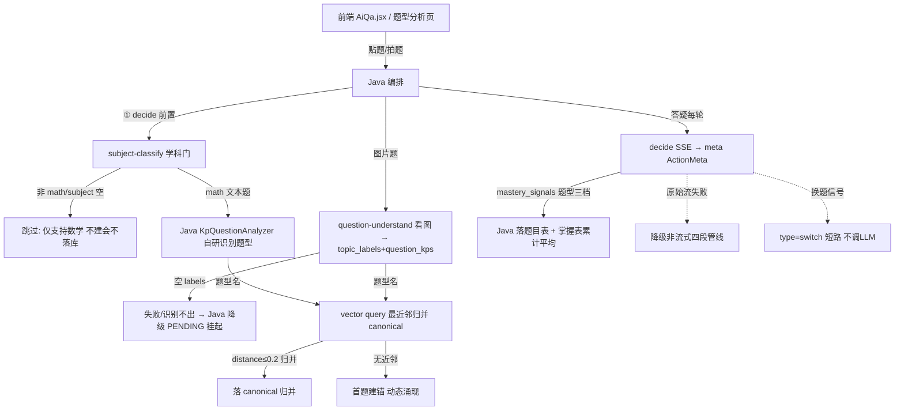

# 分析-01-题型分析完整流程-业务链路

> summary: 解答「题型分析这个业务做什么、题目进来怎么走」——贴题/答疑/图片三入口，学科门→题型识别→向量归并 canonical→掌握度落库，含各类失败降级路径。
> 权威度: 0.8 ｜ 来源: 代码 ｜ 锚点: 业务链路
> 模块: question-analysis ｜ 节: 分析-01-题型分析完整流程
> COS路径: rag-slices/question-analysis/代码/分析-01-题型分析完整流程-业务链路.md
> 类别：操作流程

---

## 业务描述与业务场景

**业务描述**：学生把一道题发到 AI 答疑/题型分析页，系统要认出是什么题型、判定学科、记录掌握度——「题目→题型→掌握度」就是本节代码支撑的完整业务闭环。

**业务场景**：
1. 学生在答疑页拍一张数学题图片或贴文本，期望先被判定是不是数学题（非数学直接拒），再被认出题型（鸡兔同笼/相遇问题），答题过程中记录 Ta 对这类型题的掌握程度。
2. 学生在题型分析页贴题/拍题，期望直接得到「题型 + 关联知识点」清单，识别不出时进入待确认（PENDING）而非死胡同。
3. AI 答疑每轮答题后，期望系统把「这次答对/答错/求助后答对」折算进该题型掌握度，下一次决策时优先关注薄弱题型。

## 职责

一道题从学生发起 → 题型识别 → 掌握度信号的**端到端链路**。Python 侧是 stateless 四端点（信号源 + 向量原语），由 Java 编排；掌握度/canonical/落库在 Java。

## 高层业务调用链（题目→题型→掌握度信号）

> 文本链路复述（embedding 可读版）：前端贴题/拍题 → Java 编排 → ① decide 前置过 subject-classify 学科门（非 math 直接跳过不落库）→ 文本题走 Java KpQuestionAnalyzer 识别题型、图片题走 Python question-understand（失败降级 PENDING 挂起）→ 题型名走 vector query 最近邻归并 canonical（distance≤0.2 归并 / 无近邻首题建锚动态涌现）→ 答疑每轮 decide SSE 输出 ActionMeta → mastery_signals 题型三档落题目表+掌握表累计平均；decide 原始流失败降级非流式四段管线、换题信号短路 type=switch。