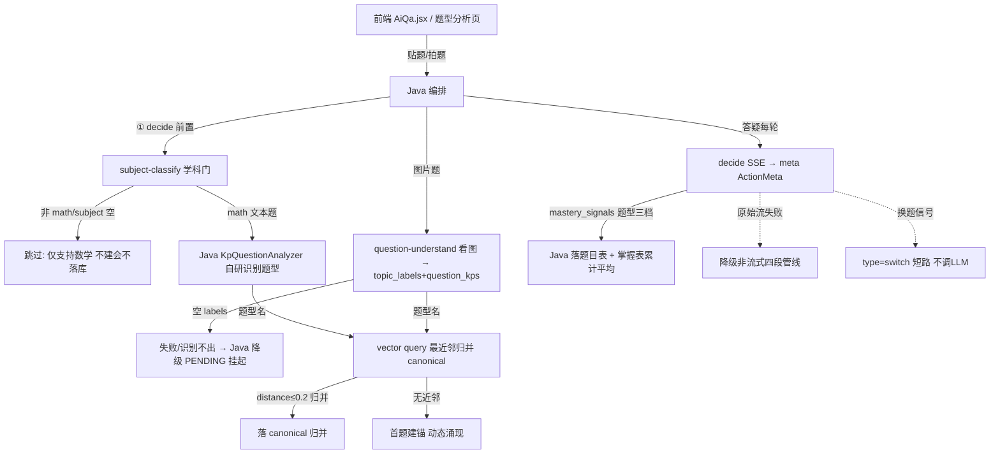

# 分析-01-题型分析完整流程

> summary: (无 summary)
> 权威度: 0.8 ｜ 来源: 代码 ｜ 锚点: 高层业务调用链（题目→题型→掌握度信号）
> 模块: question-analysis ｜ 节: 分析-01-题型分析完整流程

---

## 高层业务调用链（题目→题型→掌握度信号）

```mermaid
flowchart TD
    FE[前端 AiQa.jsx / 题型分析页] -->|贴题/拍题| JAVA[Java 编排]
    JAVA -->|① decide 前置| SC[subject-classify 学科门]
    SC -->|非 math/subject 空| MATHGATE[跳过: 仅支持数学 不建会不落库]
    SC -->|math 文本题| ANALYZER[Java KpQuestionAnalyzer 自研识别题型]
    JAVA -->|图片题| QU[question-understand 看图 → topic_labels+question_kps]
    QU -->|空 labels| QUFAIL[失败/识别不出 → Java 降级 PENDING 挂起]
    ANALYZER -->|题型名| VEC[vector query 最近邻归并 canonical]
    QU -->|题型名| VEC
    VEC -->|distance≤0.2 归并| MERGE[落 canonical 归并]
    VEC -->|无近邻| NEWANCH[首题建锚 动态涌现]
    JAVA -->|答疑每轮| DECIDE[decide SSE → meta ActionMeta]
    DECIDE -->|mastery_signals 题型三档| APPLY[Java 落题目表 + 掌握表累计平均]
    DECIDE -.原始流失败.-> DECIDEFALLBACK[降级非流式四段管线]
    DECIDE -.换题信号.-> SWITCH[type=switch 短路 不调LLM]
```
