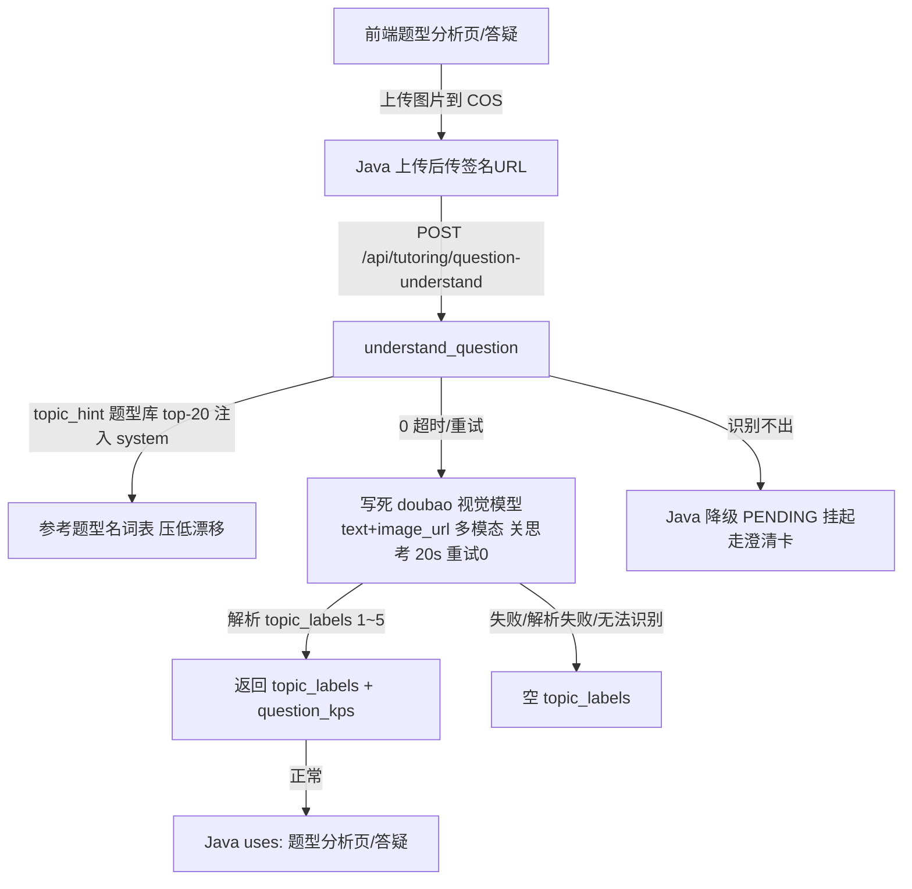

# 分析-04-题型识别与题目理解

> summary: (无 summary)
> 权威度: 0.8 ｜ 来源: 代码 ｜ 锚点: 高层业务调用链（图片题型识别）
> 模块: question-analysis ｜ 节: 分析-04-题型识别与题目理解

---

## 高层业务调用链（图片题型识别）

```mermaid
flowchart TD
    FE[前端题型分析页/答疑] -->|上传图片到 COS| JAVA[Java 上传后传签名URL]
    JAVA -->|POST /api/tutoring/question-understand| QU[understand_question]
    QU -->|topic_hint 题型库 top-20 注入 system| DBG[参考题型名词表 压低漂移]
    QU -->|0 超时/重试| LLM[写死 doubao 视觉模型<br/>text+image_url 多模态 关思考 20s 重试0]
    LLM -->|解析 topic_labels 1~5| OK[返回 topic_labels + question_kps]
    LLM -->|失败/解析失败/无法识别| FAIL[空 topic_labels]
    QU -->|识别不出| JPEND[Java 降级 PENDING 挂起走澄清卡]
    OK -->|正常| JUSE[Java uses: 题型分析页/答疑]
```
