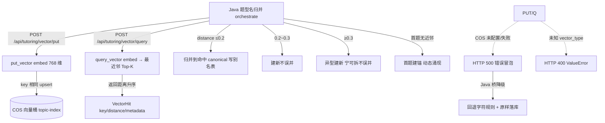

# 分析-06-向量动态聚类

> summary: (无 summary)
> 权威度: 0.8 ｜ 来源: 代码 ｜ 锚点: 高层业务调用链（题型名动态聚集 canonical）
> 模块: question-analysis ｜ 节: 分析-06-向量动态聚类

---

## 高层业务调用链（题型名动态聚集 canonical）

```mermaid
flowchart TD
    JAVA[Java 题型名归并 orchestrate] -->|POST /api/tutoring/vector/put| PUT[put_vector embed 768 维]
    PUT -->|key 相同 upsert| COS[(COS 向量桶 topic-index)]
    JAVA -->|POST /api/tutoring/vector/query| Q[query_vector embed → 最近邻 Top-K]
    Q -->|返回距离升序| HIT[VectorHit key/distance/metadata]
    JAVA -->|distance ≤0.2| MERGE[归并到命中 canonical 写别名表]
    JAVA -->|0.2~0.3| KEEP[建新不误并]
    JAVA -->|≥0.3| NEW[异型建新 宁可拆不误并]
    JAVA -->|首题无近邻| ANCHOR[首题建锚 动态涌现]
    PUT/Q -.COS 未配置/失败.-> ERR[HTTP 500 错误冒泡]
    PUT/Q -.未知 vector_type.-> ERR2[HTTP 400 ValueError]
    ERR -->|Java 桥降级| FALLBACK[回退字符规则 + 原样落库]
```
