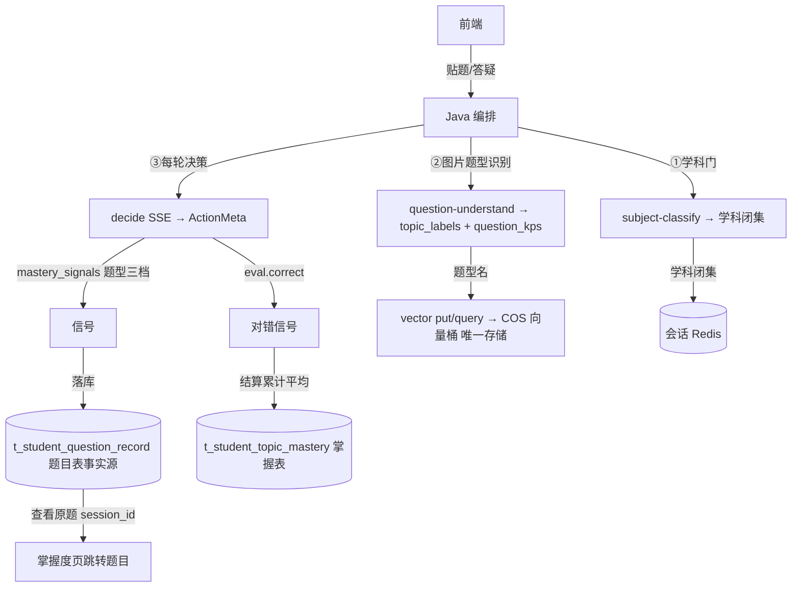

# 分析-07-数据流与存储

> summary: (无 summary)
> 权威度: 0.8 ｜ 来源: 代码 ｜ 锚点: 高层业务调用链（数据流转与落库）
> 模块: question-analysis ｜ 节: 分析-07-数据流与存储

---

## 高层业务调用链（数据流转与落库）

```mermaid
flowchart TD
    FE[前端] -->|贴题/答疑| JAVA[Java 编排]
    JAVA -->|①学科门| SC[subject-classify → 学科闭集]
    JAVA -->|②图片题型识别| QU[question-understand → topic_labels + question_kps]
    JAVA -->|③每轮决策| DECIDE[decide SSE → ActionMeta]
    DECIDE -->|mastery_signals 题型三档| SIGN[信号]
    DECIDE -->|eval.correct| EVAL[对错信号]
    QU -->|题型名| VEC[vector put/query → COS 向量桶 唯一存储]
    SIGN -->|落库| Q1[(t_student_question_record 题目表事实源)]
    EVAL -->|结算累计平均| Q2[(t_student_topic_mastery 掌握表)]
    SC -->|学科闭集| Q3[(会话 Redis)]
    Q1 -->|查看原题 session_id| FE2[掌握度页跳转题目]
```
