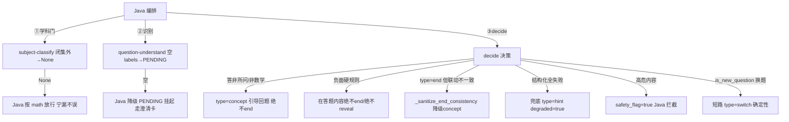

# 分析-09-防作弊与异常

> summary: (无 summary)
> 权威度: 0.8 ｜ 来源: 代码 ｜ 锚点: 高层业务调用链（防作弊护栏与异常路径）
> 模块: question-analysis ｜ 节: 分析-09-防作弊与异常

---

## 高层业务调用链（防作弊护栏与异常路径）

```mermaid
flowchart TD
    J[Java 编排] -->|①学科门| SC[subject-classify 闭集外→None]
    SC -->|None| PASS1[Java 按 math 放行 宁漏不误]
    J -->|②识别| QU[question-understand 空labels→PENDING]
    QU -->|空| JPEND[Java 降级 PENDING 挂起 走澄清卡]
    J -->|③decide| DEC[decide 决策]
    DEC -->|答非所问/非数学| CON[type=concept 引导回题 绝不end]
    DEC -->|负面硬规则| NG[在答题内容绝不end/绝不reveal]
    DEC -->|type=end 但联动不一致| SAN[_sanitize_end_consistency 降级concept]
    DEC -->|结构化全失败| FB[兜底 type=hint degraded=true]
    DEC -->|高危内容| SAFE[safety_flag=true Java 拦截]
    DEC -->|is_new_question 换题| SW[短路 type=switch 确定性]
```
