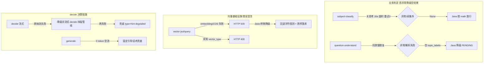

# 分析-10-工程韧性

> summary: (无 summary)
> 权威度: 0.8 ｜ 来源: 代码 ｜ 锚点: 高层业务调用链（降级与兜底全景）
> 模块: question-analysis ｜ 节: 分析-10-工程韧性

---

## 高层业务调用链（降级与兜底全景）

```mermaid
flowchart TD
    subgraph 业务判定 吞异常降级空结果
    SC[subject-classify] -->|关思考 20s 超时 重试0| SCHR{异常/闭集外}
    SCHR -->|None| J1[Java 按 math 放行]
    QU[question-understand] -->|同款慢修复| QHR{异常/解析失败}
    QHR -->|空 topic_labels| J2[Java 降级 PENDING]
    end
    subgraph 向量基础设施 错误冒泡
    PUT[vector put/query] -->|embedding/COS 失败| VERR[HTTP 500]
    VERR -->|Java 桥侧降级| VF[回退字符规则 + 原样落库]
    PUT -->|未知 vector_type| V400[HTTP 400]
    end
    subgraph decide 决策链路
    DR[decide 流式] -->|原始流失败| DF[降级非流式 decide 四段管线]
    DF -->|再失败| DBD[兜底 type=hint degraded]
    GEN[generate] -->|0 token 空流| GFB[固定引导话术兜底]
    end
```
