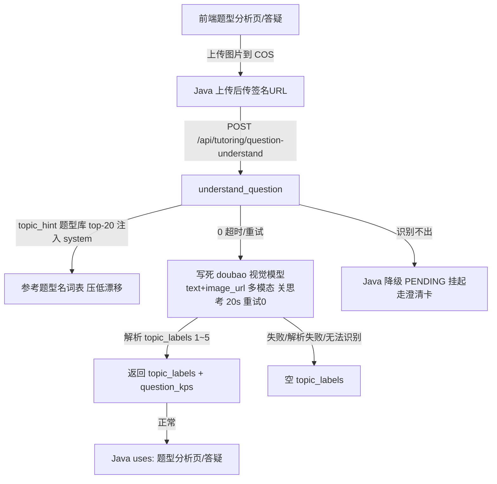

# 分析-04-题型识别与题目理解-业务链路

> summary: 题型识别与题目理解业务链路
> 来源: 切片 ｜ 锚点: 业务链路
> 节: 分析-04-题型识别与题目理解
> COS路径: rag-slices/question-analysis/代码/分析-04-题型识别与题目理解-业务链路.md
> 类别：业务流程
> target: 开发对账

---

## 业务描述与业务场景

**业务描述**：图片题（拍照/截图题目）由 AI 看图直接识别出题型名和顺带知识点——让"拍下题目"就能知道"这是什么题"，不用手打题目文本。

**业务场景**：
1. 题型分析页学生拍一张题图 → 期望直接看到「鸡兔同笼」「相遇问题」这类题型名（1~5 个），并顺带知道涉及的知识点（若有）。
2. 识别不出/图片模糊/不是数学题时，不硬猜——返回空结果，Java 侧降级为待确认（PENDING），事后通过澄清卡让学生确认，不留死胡同。
3. 答疑链路多入口复用同一能力；题型名有现成词表时优先从词表选，冷启动没词表时允许 AI 自拟题型名（后续动态涌现收敛）。

## 职责

**图片题**的题型识别（视觉多模态），Java 传 COS 签名 URL → Python 看图 → 题型名 1~5 个 + 顺带知识点。文本题在 Java（`KpQuestionAnalyzer` 自研），Python 无此端点。

## 高层业务调用链（图片题型识别）

**文字复述**：前端在题型分析页/答疑上传图片到 COS → Java 上传后把签名 URL 传给 Python（`POST /api/tutoring/question-understand`，进入 `understand_question`）→ 端点把题型库 top-20 的 `topic_hint` 注入 system prompt 作为"参考题型名词表"压低命名漂移 → 调用写死的 doubao 视觉模型（text+image_url 多模态、关思考、20s 超时、重试 0）→ 解析出 1~5 个题型名（`topic_labels`）与顺带知识点（`question_kps`）返回；若识别失败/解析失败/无法识别，则返回空 `topic_labels`，Java 侧降级 PENDING 挂起走澄清卡；正常结果供题型分析页/答疑使用。

> 证据：详见 `3.代码/分析-04-题型识别与题目理解.md`（§业务描述与业务场景 / §职责 / §高层业务调用链）
