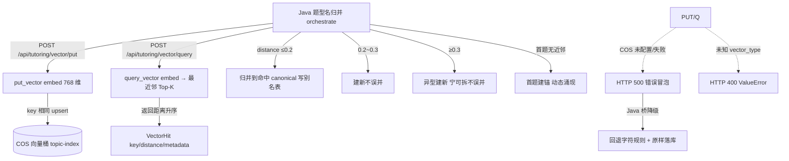

# 分析-06-向量动态聚类-业务链路
> summary: 向量动态聚类业务链路
> 来源: 切片 ｜ 锚点: 业务链路
> 节: 分析-06-向量动态聚类
> COS路径: rag-slices/question-analysis/代码/分析-06-向量动态聚类-业务链路.md
> 类别：业务流程
> target: 开发对账

---

## 业务描述与业务场景

**业务描述**：同一道题型，学生和 AI 的叫法五花八门（「鸡兔同笼」「鸡兔同笼问题」「假设法」）。系统用**向量相似度**把这些叫法收敛成唯一标准题型名（canonical），才能核算"这个题型到底练了几道、掌握多少"，不然报表全是碎片。

**业务场景**：
1. 学生 A 说「鸡兔同笼」、学生 B 说「鸡兔同笼问题」——语义同型，被向量归并到同一 canonical，掌握度汇总到一行。
2. 一脸题目的题型名先在题型库查最近邻：距离够近进已有题型（写别名表），够远才新建题型——**零预置、动态涌现**，题型是"长出来的"不是"规定出来的"。
3. 向量库挂了也不让主链路断：Java 退化成字符规则（解X/求X 前缀）+ 原样落库，归一精度下降但不阻塞学生作答。

## 职责

Python 提供向量**原语**（put/query + embedding），canonical 归并决策在 Java（`TopicLabelAggregationService.aggregate`）。Python 只把题型名 embedding 进 COS 向量桶，查最近邻返回 distance。

## 高层业务调用链（题型名动态聚集 canonical）

**文字链路复述**：Java 题型名归并服务（orchestrate）发起两类向量请求：(1) `POST /api/tutoring/vector/put` 写入——put_vector 把题型名 embed 成 768 维，key 相同则 upsert 进 COS 向量桶 `topic-index`；(2) `POST /api/tutoring/vector/query` 查询——query_vector embed 后返回最近邻 Top-K 的 VectorHit（key/distance/metadata），按距离升序（越小越相似）。Java 拿到 distance 后决策：≤0.2 归并到命中 canonical 并写别名表；0.2~0.3 建新不误并；≥0.3 异型建新、宁可拆不误并；首题无近邻则建锚——动态涌现。异常分支：COS 未配置或失败时 put/query 冒泡 HTTP 500，Java 桥降级回退字符规则 + 原样落库，不阻塞主链路；未知 vector_type 抛 ValueError 返回 HTTP 400。

> 证据：详见 `3.代码/分析-06-向量动态聚类.md`（§业务描述与业务场景/职责/高层业务调用链）
