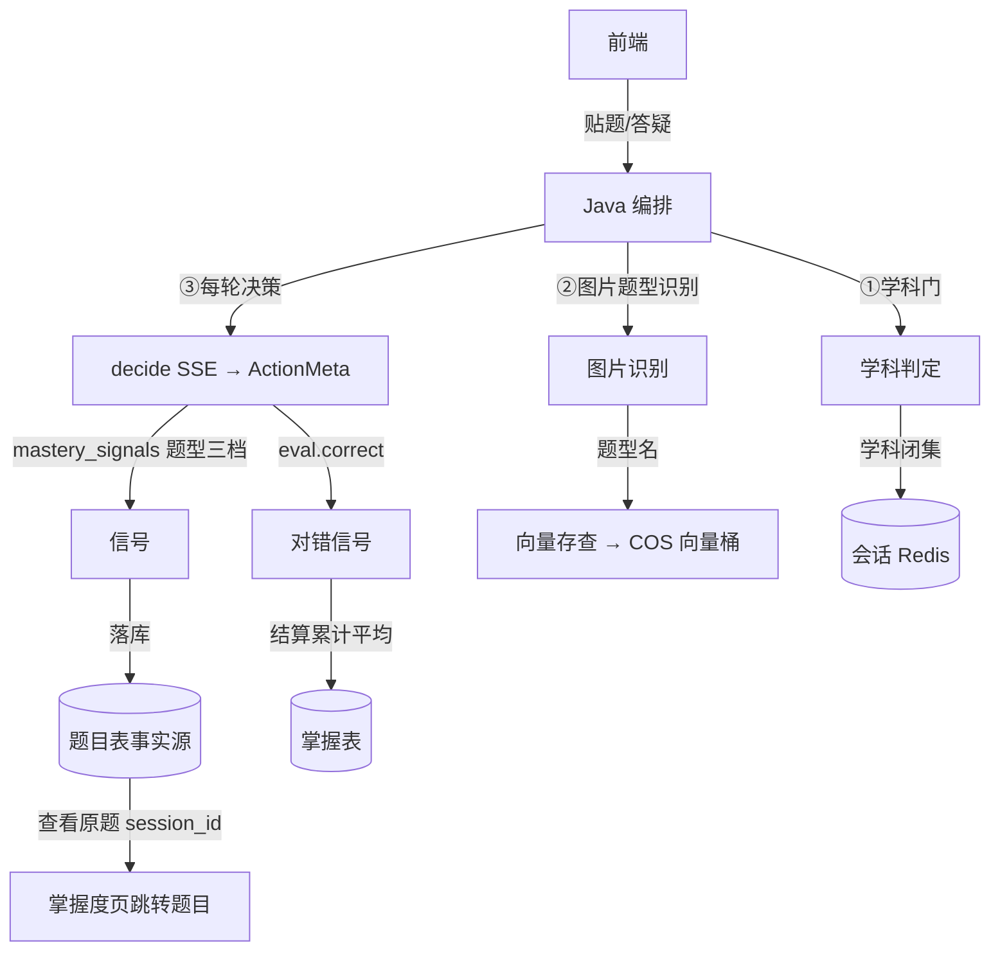

# 分析-07-数据流与存储-业务与流程

> summary: 数据流与存储业务与流程
> 来源: 切片 ｜ 锚点: 业务与流程
> 节: 分析-07-数据流与存储
> COS路径: rag-slices/interview/question-analysis/分析-07-数据流与存储-业务与流程.md
> 类别：业务流程
> target: 面试项目问答

---

## 业务描述与业务场景

一道题的「作答记录 + 掌握度 + 会话状态」最终存在哪、怎么回流给下一次决策——这是业务数据的完整落库与回读链路，也是"掌握度可追溯"的根基。

典型场景：
1. 学生答完一道「鸡兔同笼」→ 题目落题目表（事实源，可回查原题），掌握度更新掌握表——下次看「掌握度页·查看原题」能跳到那一次作答。
2. 多轮答疑中会话状态在 Java Redis，学生断开重连会话不丢；AI 服务本身无状态，任何一轮都可被新机器接管。
3. 系统把学生已有掌握度快照回流给下一次决策——"记得你以前这类型不行"，薄弱题型优先讲解。

## 职责

数据流的**全局视角**：Python 侧无状态不落业务库，只产出信号 + 向量原语；落库/存储全在 Java（题目表 + 掌握表 + Redis 会话 + 向量桶）。

## 高层业务调用链（数据流转与落库）

**文字复述**：前端贴题/答疑 → Java 编排 → ①学科判定 ②图片题型识别（题型名走向量存查 COS 向量桶）③每轮 decide SSE 出 ActionMeta → 掌握度题型三档信号落题目表（事实源）、对错信号结算累计平均落掌握表、学科闭集进会话 Redis → 掌握度页通过 session_id 跳转原题。

> 证据：详见 `3.代码/分析-07-数据流与存储.md`（§业务描述与业务场景 / §职责 / §高层业务调用链）｜ `4.完善文档/05-数据落库与掌握度.md`