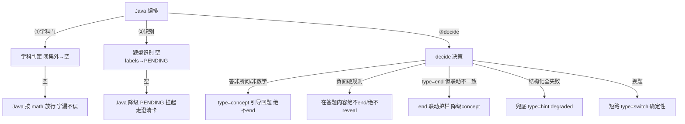

# 分析-09-防作弊与异常-业务与流程

> summary: 防作弊与异常业务与流程
> 来源: 切片 ｜ 锚点: 业务与流程
> 节: 分析-09-防作弊与异常
> COS路径: rag-slices/interview/question-analysis/分析-09-防作弊与异常-业务与流程.md
> 类别：业务流程
> target: 面试项目问答

---

## 业务描述与业务场景

AI 答疑直接面对学生，学生可能乱答、抄答案、发非数学闲聊、或者换题——系统需要一层护栏保证「答错了不会恭喜、不直接给答案、识别不出不硬猜、闲聊不乱收尾」，这是答疑体验和防作弊（成绩可信度）的底线。

典型场景：
1. 学生答错但 AI 却断言"做对了"还收尾道歉恭喜——不允许：end 联动校验兜住，降级为继续引导（type=concept），保持会话。
2. 学生直接说「把答案给我」——reveal 有门禁（请求答案计数），第一次只给思路不给完整解答，防止抄答案当熟练度。
3. 学生发「帮我写作文/今天心情不好」——不是答题内容，AI 引导回题、绝不乱端会话；识别不出题型的图片题走 PENDING 挂起，待学生确认，不留死胡同。

## 职责

题型识别链路 + 决策的**护栏与异常防护**：低置信挂起、闭集外放行、答非所问引导、end 一致性护栏、结构化输出兜底。Python 侧护栏集中在"别让 LLM 乱答/别泄答案/别拖慢"。

## 高层业务调用链（防作弊护栏与异常路径）

**文字复述**：Java 编排 → ①学科门（闭集外返回空 → Java 按 math 放行宁漏不误）→ ②题型识别（空 labels → Java 降级 PENDING 走澄清卡）→ ③decide 决策：答非所问/非数学 → 引导回题绝不 end；在答题内容绝不 end/绝不 reveal；type=end 但联动不一致 → 降级 concept；结构化全失败 → 兜底 hint degraded；换题 → 短路 switch 确定性。

> 证据：详见 `3.代码/分析-09-防作弊与异常.md`（§业务描述与业务场景 / §职责 / §高层业务调用链）｜ `4.完善文档/04-防作弊与异常防护.md`