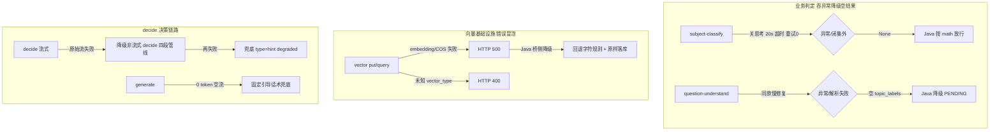

# 分析-10-工程韧性-业务链路
> summary: 工程韧性业务链路
> 来源: 切片 ｜ 锚点: 业务链路
> 节: 分析-10-工程韧性
> COS路径: rag-slices/question-analysis/代码/分析-10-工程韧性-业务链路.md
> 类别：业务流程
> target: 开发对账

---

## 业务描述与业务场景

**业务描述**：学生作答时 AI 服务可能慢、可能挂、向量库可能不可用——系统必须让每个环节都有超时/降级兜底，保证学生**不干等、不收白屏**，主链路（答疑/掌握度记录）永远走得通。

**业务场景**：
1. AI 识别题型超时（>20s）→ 快速返回空结果让 Java 降级 PENDING，学生看到「待确认」而不是转圈卡死；开思考才慢，所以全链路关思考秒出。
2. 向量库挂了 → Python 报错让 Java 感知 → 桥侧退化成字符规则 + 原样落库，归一精度降一点但学生作答不受影响。
3. AI 生成时模型 0 token（网络抖动）→ 给固定引导话术（"说说你读到了哪些关键条件"），学生收到可继续对话，而不是空回复。

## 职责

Python 桥的**工程韧性**设计：超时/降级/重试/兜底，保证各端点在 LLM 或 COS 异常时不让主链路卡死。

## 高层业务调用链（降级与兜底全景）

**文字复述（全链路降级与兜底）**：业务判定段——subject-classify 关思考 + 20s 超时 + 重试0，异常/闭集外返回 None → Java 按 math 放行；question-understand 同款慢修复，异常/解析失败返回空 topic_labels → Java 降级 PENDING。向量基础设施段——vector put/query 的 embedding/COS 失败 → Python 报 HTTP 500 → Java 桥侧降级回退字符规则 + 原样落库；未知 vector_type → HTTP 400。decide 决策链路段——decide 流式原始流失败 → 降级非流式 decide 四段管线 → 再失败兜底 type=hint degraded；generate 0 token 空流 → 固定引导话术兜底。三条子链任一降级都不让学生主链路（答疑/掌握度记录）卡死。

> 证据：详见 `3.代码/分析-10-工程韧性.md`（§业务描述与业务场景 / §职责 / §高层业务调用链）
