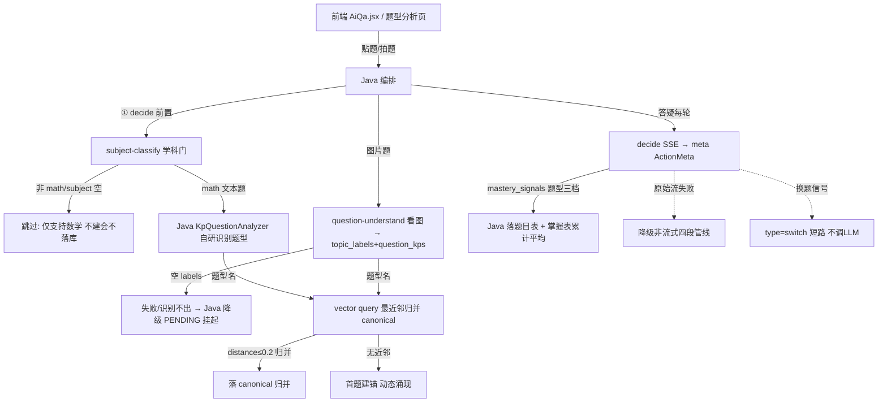

# 分析-01-题型分析完整流程-业务与流程

> summary: 题型分析完整流程业务与流程
> 权威度: 0.8 ｜ 来源: 面试切片 ｜ 锚点: 业务与流程
> 模块: question-analysis ｜ 节: 分析-01-题型分析完整流程
> COS路径: rag-slices/interview/question-analysis/分析-01-题型分析完整流程-业务与流程.md
> 类别：业务流程
> target: 面试项目问答

---

## 业务描述与业务场景

题型分析解决的是：**学生做了一道题，系统要知道"这是什么题型、学生这个题型掌握得怎么样"**。它支撑「题目 → 题型 → 掌握度」这条业务闭环。

典型场景：
1. 学生在答疑页拍一道数学题图片或贴文本，系统先判断是不是数学题（非数学直接拒绝），再认出题型（鸡兔同笼/相遇问题），答题过程中记录他对这类题的掌握程度。
2. 学生在题型分析页贴题，期望直接拿到「题型 + 关联知识点」清单；识别不出时进入待确认（PENDING），而不是卡死。
3. 每轮答疑后，把"答对/答错/求助后答对"折算进该题型掌握度，下一次决策优先关注薄弱题型。

## 职责

一道题从学生发起 → 题型识别 → 掌握度信号，是**端到端链路**。Python 侧是无状态 AI 桥（信号源 + 向量原语），Java 负责编排、掌握度/canonical 归一、落库。

## 高层业务调用链（题目→题型→掌握度信号）

**文字复述链路**：前端贴题/拍题 → Java 编排 → ① decide 前置过学科门（非数学直接跳过不落库）→ 文本题走 Java 自研题型识别、图片题走 Python 看图识别（失败降级 PENDING 挂起）→ 题型名走向量最近邻归并 canonical（distance≤0.2 归并 / 无近邻首题建锚动态涌现）→ 答疑每轮 decide 输出 ActionMeta → 掌握度题型三档信号落题目表 + 掌握表累计平均；decide 原始流失败降级非流式管线、换题信号短路 switch。

> 证据：详见 `3.代码/分析-01-题型分析完整流程.md`（§业务描述与业务场景 / §职责 / §高层业务调用链）｜ `4.完善文档/02-题型分析主流程怎么走.md`