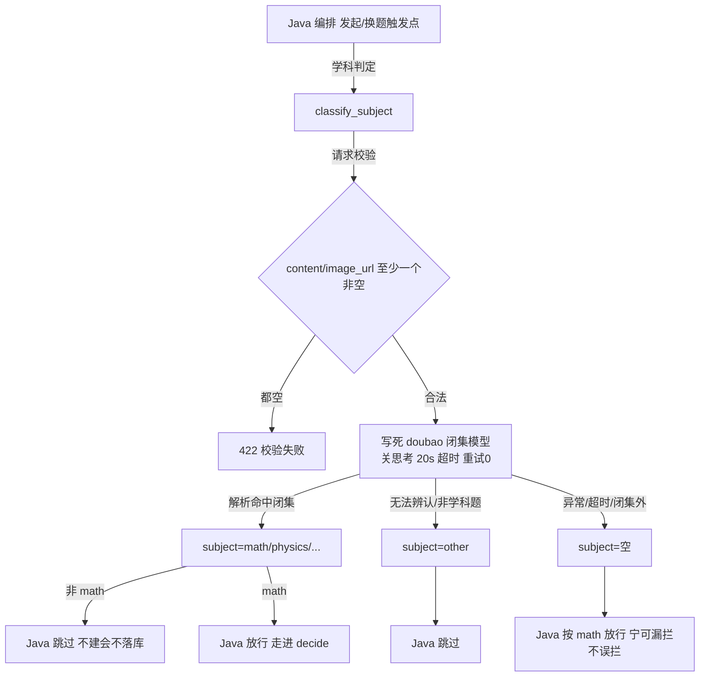

# 分析-03-subject-classify学科门-业务与流程

> summary: subject-classify学科门业务与流程
> 来源: 面试切片 ｜ 锚点: 业务与流程
> 节: 分析-03-subject-classify学科门
> COS路径: rag-slices/interview/question-analysis/分析-03-subject-classify学科门-业务与流程.md
> 类别：业务流程
> target: 面试项目问答

---

## 业务描述与业务场景

答疑系统**只服务数学**。学生可能发语文/英语/闲聊，或拍一张模糊的题图——系统需要在进入 AI 决策前先筛掉非数学内容，同时确保数学题永远不被误拦。

典型场景：
1. 学生发第一句消息或换新题时，先做学科判定：数学题才建/续会话，非数学（语文/英语/闲聊）直接回「仅支持数学」，不浪费 AI 调用。
2. 图片模糊、拿不准时系统宁可放行当作数学题——数学题被误拦是对学生更糟的事故。
3. 判定失败/超时（AI 不可用）时返回"不知道"，Java 也按数学放行，保证答疑不被卡住。

## 职责

decide 之前的**前置学科判定**，只判学科不解题。"宁可放过，不可把数学题误判成别的学科"；拿不准 → math；图片无法辨认/非学科 → other。

## 高层业务调用链（学科门判定）

**文字复述**：Java 在发起/换题触发点调学科判定 → 校验入参非空（都空 422）→ 写死闭集模型（关思考/20s 超时/重试0）→ 命中闭集返回学科 / 无法辨认返回 other / 异常超时闭集外返回空 → Java：非 math 跳过不落库、math 放行进 decide、空也按 math 放行（宁漏不误）。

> 证据：详见 `3.代码/分析-03-subject-classify学科门.md`（§业务描述与业务场景 / §职责 / §高层业务调用链）｜ `4.完善文档/04-防作弊与异常防护.md`