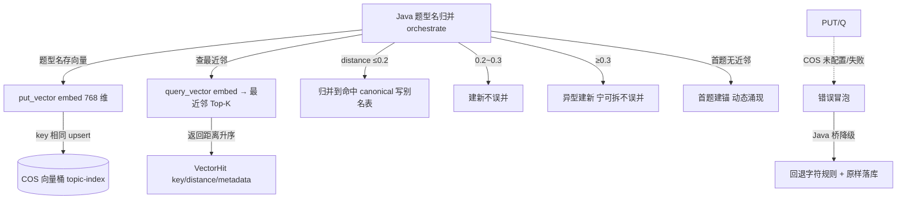

# 分析-06-向量动态聚类-业务与流程

> summary: 向量动态聚类业务与流程
> 权威度: 0.8 ｜ 来源: 面试切片 ｜ 锚点: 业务与流程
> 模块: question-analysis ｜ 节: 分析-06-向量动态聚类
> COS路径: rag-slices/interview/question-analysis/分析-06-向量动态聚类-业务与流程.md
> 类别：业务流程
> target: 面试项目问答

---

## 业务描述与业务场景

同一道题型，学生和 AI 的叫法五花八门（「鸡兔同笼」「鸡兔同笼问题」「假设法」）。系统用**向量相似度**把这些叫法收敛成唯一标准题型名（canonical），才能核算"这个题型到底练了几道、掌握多少"，不然报表全是碎片。

典型场景：
1. 学生 A 说「鸡兔同笼」、学生 B 说「鸡兔同笼问题」——语义同型，被向量归并到同一 canonical，掌握度汇总到一行。
2. 新题目的题型名先在题型库查最近邻：距离够近进已有题型（写别名表），够远才新建题型——**零预置、动态涌现**，题型是"长出来的"不是"规定出来的"。
3. 向量库挂了也不让主链路断：Java 退化成字符规则（解X/求X 前缀）+ 原样落库，归一精度下降但不阻塞学生作答。

## 职责

Python 提供向量**原语**（存/查 + embedding），canonical 归并决策在 Java。Python 只把题型名 embedding 进 COS 向量桶，查最近邻返回距离。

## 高层业务调用链（题型名动态聚集 canonical）

**文字复述**：Java 题型名归并 → 题型名存向量（embedding 768 维，key 相同 upsert）→ 查最近邻（返回距离升序）→ 距离 ≤0.2 归并写别名表 / 0.2~0.3 建新不误并 / ≥0.3 异型建新 / 首题无近邻建锚动态涌现；COS 未配置/失败错误冒泡 → Java 桥降级（回退字符规则 + 原样落库）。

> 证据：详见 `3.代码/分析-06-向量动态聚类.md`（§业务描述与业务场景 / §职责 / §高层业务调用链）｜ `4.完善文档/06-题型动态聚集与向量.md`