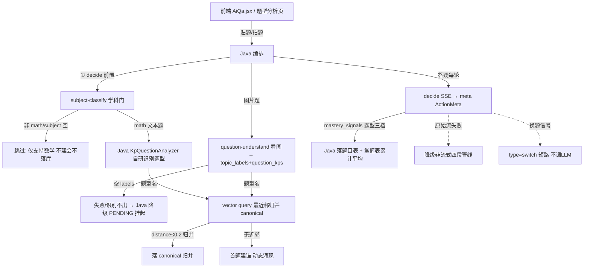

# 题型分析/掌握度的完整流程图是什么样的？端到端画出来？

> summary: 题型分析/掌握度的完整流程图是什么样的？端到端画出来？
> 权威度: 1.0
> 模块: question-analysis
> COS路径: rag-slices/question-analysis/引导问题/引导问题-10-操作流程-题型分析掌握度完整流程图.md
> 类别：操作流程

---

## 回答

**核心结论**：题目从答疑/贴题/图片三入口进来 → 学科门筛掉非数学 → 识别题型 → 题型名向量归并 canonical → 落题目表 + 掌握表 + 向量桶 → 掌握度页展示 → 掌握度快照回流下一次 decide——端到端闭环。

**分层展开**（完整流程，图源自 `3.代码/分析-01`）：

- **识别两条线**：文本题 Java `KpQuestionAnalyzer` 自研；图片题 Python `question-understand`（视觉多模态 + topic_hint 词表收敛）。（依据：分析-01 / 分析-04）
- **归并在落库前**：题型名过向量最近邻（distance ≤0.2 归并 / 首题建锚），canonical 落库前动态锚定，掌握表源头不裂行。（依据：完善文档 02 落地真相 / 分析-06）
- **回流**：掌握度快照（mastery_snapshot）由 Java 从掌握表组装，按薄弱升序取 top-10 回传 decide 作上下文——薄弱题型优先讲解。（依据：完善文档 09 / 分析-07）

> 证据：详见 `7. 引导问题/问题列表.md`（第 10 问）｜ `4.完善文档/02-题型分析主流程怎么走.md` ｜ `3.代码/分析-01-题型分析完整流程.md`
