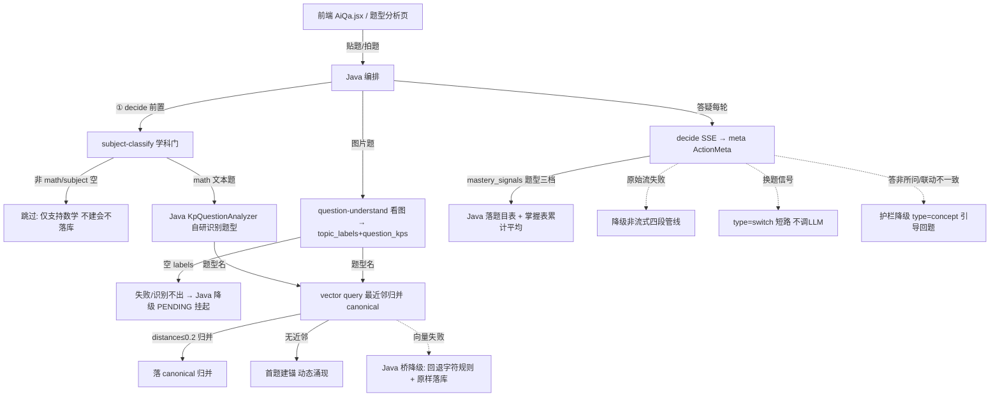

# 业务闭环的流程图（含异常/降级分支）是什么样的？

> summary: 业务闭环的流程图（含异常/降级分支）是什么样的？
> 权威度: 1.0
> 模块: question-analysis
> COS路径: rag-slices/question-analysis/引导问题/引导问题-40-业务流程-业务闭环流程图异常降级分支.md
> 类别：业务流程

---

## 回答

**核心结论**：业务闭环是"三入口 → 学科门 → 识别 → 归并 → 落库 → 展示 → 回流"，每个环节都带**异常/降级分支**：学科门失败放行、识别失败降 PENDING、向量挂退字符规则、decide 流失败降非流式。

**分层展开**（图源自 `3.代码/分析-01` + `分析-09`，含降级分支）：

- **降级分支全景**：学科门闭集外→None 放行；识别失败→空 labels→Java PENDING；向量失败→错误冒泡→Java 回退字符规则；decide 流失败→降非流式四段管线；generate 空流→固定引导话术兜底。（依据：分析-01 / 分析-09 / 分析-10）
- **端到端语义**：题目进来不丢——PENDING 题型照常采信号落题目表，归属确定后再聚合。（依据：分析-01 设计要点）

> 证据：详见 `7. 引导问题/问题列表.md`（第 40 问）｜ `4.完善文档/09-业务闭环与两域解耦.md` ｜ `3.代码/分析-01-题型分析完整流程.md`
