# 分析-01 整体架构与调用链（代码真相）

> summary: RAG问答系统双入口(旧1.6C query + 新白盒assistant SSE)、双池(rag-full整篇23块 + rag-slice切片294块双向量-c/-q)、四路RRF×权威×锚定加权、范围门0.75/0.5仅白盒链路生效、token usage真采、评测agent(hit@5+编造封顶3分)、引导问题=池入口且池内原题直返
> 权威度: 0.8
> 模块: rag-system
> COS路径: rag-source/rag-system/代码/分析-01-整体架构与调用链.md
> 类别：项目介绍

## 业务描述与业务场景

RAG 问答系统是给「AI答疑」项目面试准备用的问答引擎：把项目语料（完善文档/代码/语雀/OpenSpec）切片进向量桶，面试官提问后双池召回 + doubao 生成带引用的口述答案，并用评测 agent 用数据证明"检索准、答案好"。不是纯 RAG——产品是"讲清每个页面"，RAG 是证明能力的引擎。

场景（谁/何时触发/期望结果）：
1. **面试问答（主链路）**：面试官在页面提问 → 系统返回答案 + 来源引用 + 语料版本；追问靠 history 改写补全指代，期望答案可溯源、不编造。
2. **引导入口**：用户进页面点引导问题（`GET /api/rag/assistant/guide`）或会话结束给建议 → 期望 0 token 返回池内原题，点开即答。
3. **评测闭环（离线）**：触发 `POST /api/rag/eval/run`（或 CLI `scripts/rag/run_eval.py`）→ 跑评测集 → 聚合 hit@k/质量分/cost/latency 落盘报告，期望可版本对比证明有效。

## 职责

一句话：编排"意图 → 双池召回 → RRF 融合 → 生成"的检索问答链路，并给评测/引导/查看原文配套端点。**不做**：不落会话状态（Python 无状态，history/trace_id 由 Java 传入只消费，turns/close/累计 token 归 Java Redis，`api/rag_assistant.py:9-12`）；不产权限（角色门在 Java，`api/rag_assistant.py:9`）；不做图谱检索召回（语料是文档不是图谱，`design-python-project-intro-rag.md` Non-Goal）。

模块分工要点：
- `api/rag.py`（旧 1.6C 契约 + 评测 + 查看原文）：`POST /api/tutoring/rag/query` 同步非流式问答（带三级降级），`GET /api/rag/source/{key}` 读 COS 普通桶，`POST /api/rag/eval/run` + `GET /api/rag/eval/report` 评测触发/查报告。
- `api/rag_assistant.py`（白盒链路 B 组）：`POST /api/rag/assistant/ask` SSE 流式/非流式（事件时序 intent→clarify|switch→rewrite→rerank→boundary|token→done），`GET /api/rag/assistant/guide` 引导入口，`GET /api/rag/assistant/eval/report` 报告白盒，`POST /api/rag/assistant/eval/run` 后台线程重跑评测。
- `core/rag/query.py`（检索编排核心，两入口共用单元）：intent（模块+类别）→ rewrite → retrieve_dual（双池三路）→ orchestrate（四路 RRF×authority×锚定）→ generate。
- `core/rag/assistant.py`（白盒编排引擎）：把 query.py 单元编排成事件流，追加澄清/切换/范围门/引用校验/建议/usage 组装。
- `core/rag/eval_agent.py`（评测 agent）：真实检索原语（不降级）+ hit@k + LLM 判分 + 聚合。
- `core/rag/guide_pool.py`（引导底座池）：每模块 {方向→问题} 静态池，guide/建议的数据源。
- `scripts/rag/rag_query.py`（CLI 薄壳）：复用 query.py 的完整问答闭环，供本地调试。
- `scripts/rag/run_eval.py`（评测执行）：跑评测集→聚合→trace/报告落盘→版本对比；被两个 API 延迟导入复用。

## 高层业务调用链（用户提问→双池检索→生成）

两条生产入口共享 `core/rag/query.py` 的检索单元，但分支语义不同。

```mermaid
flowchart TD
    A[用户提问] --> B{入口}
    B -->|POST /api/tutoring/rag/query| C[api.rag.rag_query<br>api/rag.py:75]
    B -->|POST /api/rag/assistant/ask| D[api.rag_assistant.pipeline_events<br>core/rag/assistant.py:543]
    B -->|GET /api/rag/assistant/guide| G[assistant.guide → guide_pool<br>assistant.py:528 / guide_pool.py:358]

    C --> C1[verify_internal_token<br>api/rag.py:81]
    C1 --> C2[intent 模块+类别<br>query.py:293 → _llm_intent:227]
    C2 --> C3[rewrite_query 追问改写<br>query.py:394]
    C3 --> C4[retrieve_dual 双池三路<br>query.py:507]
    C4 --> C5{向量路异常?}
    C5 -->|是| C5a[降级纯 BM25<br>api/rag.py:100-106]
    C5 -->|否| C6[orchestrate 四路RRF×权威×锚定<br>query.py:620]
    C6 --> C7{无命中?}
    C7 -->|是| C7a[拒答 语料未覆盖<br>api/rag.py:120-126]
    C7 -->|否| C8[generate doubao<br>query.py:759]
    C8 --> C9{doubao 异常?}
    C9 -->|是| C9a[references 当答案<br>api/rag.py:129-135]
    C9 -->|否| C10[1.6C 响应 answer+references+intent+version]

    D --> D0{问候预检?}
    D0 -->|是| D0a[固定欢迎+池内建议 0token<br>assistant.py:580-586]
    D0 -->|否| D1[intent 事件<br>assistant.py:571]
    D1 --> D2{clarify?}
    D2 -->|是| D2a[clarify→done 0token<br>assistant.py:589-595]
    D2 -->|否| D3{switch?}
    D3 -->|是| D3a[switch 事件+按 to_anchor 续<br>assistant.py:600-603]
    D3 -->|否| D4[rewrite 事件<br>assistant.py:606]
    D4 --> D5[recall 双池三路 2s超时降级<br>assistant.py:91 → 611]
    D5 --> D6[rerank 精排事件 Top-3<br>assistant.py:613 / rerank_blocks:139]
    D6 --> D7{范围门?}
    D7 -->|是| D7a[boundary→done 固定话术 0token<br>assistant.py:617-625]
    D7 -->|否| D8[stream_generate 流式+usage<br>assistant.py:634 / 411]
    D8 --> D9[lcs_quote_match 引用校验<br>assistant.py:646]
    D9 --> D10[done answer+quoted+tokens_usage+suggestions<br>assistant.py:650]

    C10 --> Z[前端渲染 引用面板 + 查看原文 /api/rag/source]
    D10 --> Z
    G --> Z
```

关键降级分支汇总（代码中均可见）：
- 旧 query 端点三级降级（`api/rag.py:10-14` docstring + 实现）：COS 向量挂 → 纯 BM25（`api/rag.py:100-106`）；doubao 挂 → references 当答案（`api/rag.py:129-135`）；无命中 → 拒答"该问题语料未覆盖"（`api/rag.py:120-126`）。所有降级响应结构不变。
- 白盒链路降级：向量路超时（`RAG_RECALL_TIMEOUT=2.0`）→ 空路 + degraded 标记（`assistant.py:71-88`）；BM25 无命中 → degraded（`assistant.py:115-116`）；范围门触发 → boundary 固定话术、短路不调 generate（`assistant.py:617-625`）；生成超时/异常 → 写死话术 + 召回清单，0 token（`assistant.py:466,472`，`RAG_GEN_TIMEOUT=8.0`）。

## 代码事实

### 端点清单 + 契约

| 端点 | 方法 | 文件:行 | 鉴权 | 说明 |
|---|---|---|---|---|
| `/api/tutoring/rag/query` | POST | `api/rag.py:75` | `verify_internal_token`（`api/rag.py:81`） | 旧 1.6C 契约 `RAGQueryResponse{answer, references, intent, version}`（`models/rag.py:39-44`），请求 `RAGQueryRequest{question, top_k=5, current_project="ai-tutoring", history}`（`models/rag.py:11-19`）。同步执行。 |
| `/api/rag/source/{file_path:path}` | GET | `api/rag.py:57` | 同上 | U4 "查看原文"：从 COS 普通桶 `COS_OBJ_BUCKET=ai-edu-1318177119` 读源文件（`api/rag.py:50-54`）。只允许 `rag-source/`、`rag-slices/` 前缀（`api/rag.py:65`），读失败 → 404。 |
| `/api/rag/eval/run` | POST | `api/rag.py:153` | 同上 | 触发评测（离线工具，同步执行，`run_in_threadpool(run_eval.run_evaluation)`），延迟导入 `scripts/rag/run_eval.py`。 |
| `/api/rag/eval/report` | GET | `api/rag.py:171` | 同上 | 查询最新报告 + 版本列表。`reports[-1]` 按文件名排序取末位（`api/rag.py:180`）。 |
| `/api/rag/assistant/ask` | POST | `api/rag_assistant.py:105` | 同上 | 白盒问答：`stream=true` SSE 流式（`_ask_stream`，`api/rag_assistant.py:123`），否则非流式 done+stages（`_run_once`，`api/rag_assistant.py:75-102`）。请求 `RagAssistantAskRequest{current_project="rag-system", question, history, trace_id, stream, top_k=3}`（`models/rag_assistant.py:12-27`）。 |
| `/api/rag/assistant/guide` | GET | `api/rag_assistant.py:144` | 同上 | 开始引导：返回 `{"suggestions":[{title, direction}]}`，0 token 非 SSE。`current_project` 缺省/未知 → `guide_pool.FALLBACK_MODULE`（`assistant.py:535-536`）。 |
| `/api/rag/assistant/eval/report` | GET | `api/rag_assistant.py:155` | 同上 | baseline 报告白盒 + running 标志。最新报告按文件 mtime 取（`api/rag_assistant.py:169`，注释明确"版本=语料 sha1 前缀，不能靠文件名排序取末位"）。 |
| `/api/rag/assistant/eval/run` | POST | `api/rag_assistant.py:203` | 同上 | 后台线程真实跑一轮评测，立即 200，`_eval_running` 全局锁防重复触发（`api/rag_assistant.py:49-67`）。 |

路由挂载：`main.py:131-143` 注册 `rag_router / rag_source_router / rag_eval_router / rag_assistant_router`。

### 双池落地（核心机制 1）

- **双池 = 两个 COS 向量索引**（非方案里的 doc_type=qa/source 区分）：
  - `rag-full` 全量池：整篇文档，23 块（`scripts/rag/data/rag_slices_full.jsonl` 实测行数），tags 含 `pool="full"`。索引配置 `COS_VECTORS_INDEXES["rag-full"]="rag-full"`（`settings.py:103`）。
  - `rag-slice` 切片池：细节块 + 引导问题，294 块（`rag_slices.jsonl` 实测行数），tags 含 `pool="slice"`。索引 `settings.py:104`。
  - 模块按 `tags.module` 区分，靠 `MODULE_DATA` 加载（`query.py:37-40`：ai-tutoring + question-analysis；**无 rag-system jsonl**）。
- **key 规则**：`{池前缀}/{module}/{file}/{anchor}#{idx}`（`build_index.py:59-65`，`query.py:_key_of:584-592`），池前缀 = `rag-{tags.pool}`，2026-08-27 起加 module 段防跨模块同名文件覆盖。
- **双向量（task #78）**：切片池每块写两个 key，同索引 rag-slice，后缀 `-c`（embed(summary+text) 内容路）/ `-q`（embed(summary) 问题路）（`build_index.py:166-175`）。查询侧 `_split_roles` 按 key 后缀拆两路（`query.py:487-504`），`orchestrate` 四路 RRF（full + slice-c + slice-q + bm25）。
- **全量池单向量条件式**：`summary+全文 ≤5000 字符 → embed(summary+全文)`，超限（大语雀 10~12K 字符）只 embed(summary)（`build_index.py:176-183`）。
- **metadata 10 字段无 doc_type**：`version/module/category/source/authority/section/file/file_path/anchor/summary`（`build_index.py:145-157`）。注释："doc_type 与 module 同值冗余已去掉(2026-08-26)"——方案里的 qa/source 分类在代码里被 module + pool 取代。

### 页面锚定（核心机制 2）

- 方案 D3 的"前端传 page + 页面模式锁页/全局模式跨页"在代码中**无 page 参数**。演变为两层锚定：
  1. **模块级**：`current_project`（请求字段，`models/rag.py:15`、`models/rag_assistant.py:18`）+ intent LLM 输出 `anchor`（闭集 `MODULE_ANCHORS`，`query.py:68`），决定从哪个模块语料池召回（`select_corpus`，`query.py:609-617`）。
  2. **节级**：`locked_sections`（01~08 完善文档节），来自 ANCHOR_RULES 关键词表（`query.py:51-62`）或 LLM category 映射 `CATEGORY_SECTIONS`（`query.py:88-96`）。orchestrate 中 `anchor_w = ANCHOR_WEIGHT(1.5) if section in locked else 1.0`（`query.py:665`）——**节级锚定只加权不过滤**。
- 页面模式/全局模式 ≈ `locked_sections` 非空/空，无显式模式布尔。
- **重要细节**：白盒 assistant 链路 `recall` 里 `strategy = {"locked_sections": [], ...}`（`assistant.py:118`），且 `pipeline_events` 只传 `locked_categories` 不传 `locked_sections`（`assistant.py:611-612`）——**节级锚定加权 1.5 在白盒链路被旁路**，只走模块级 corpus 过滤；旧 query 端点则把完整 `it` 传入 orchestrate（`api/rag.py:108-110`），节级锚定生效。
- 指代词确定性兜底：`_deictic_anchor` 强制"这个功能/它/本功能"指代 current_project，防止 LLM 因"底层/实现"跳走 rag-system（`query.py:275-290`）。

### 两道门（核心机制 3）

- **权限门（前置）**：**Python 代码未见**。`api/rag.py`、`api/rag_assistant.py` 所有端点只有 `verify_internal_token`（内部服务鉴权），请求模型无 role/permission/page 字段。`api/rag_assistant.py:9` 明确："permission 由 Java 网关产(角色门在 Java)；Python 生产端点不产 permission，从 intent 开始。" 方案 D4 的"当前页权限点 vs 角色"由 Java 侧承接。
- **范围门（后置）**：`BOUNDARY_VEC_CONF=0.75`、`BOUNDARY_BM_CONF=0.5`（`assistant.py:388-389`），`check_boundary`（`assistant.py:394-408`）判定：rerank 空 → 拒答；非空但 `vec_conf < 0.75 且 bm_conf < 0.5` → 拒答（双路都低才算低置信，单路高即过）。`pipeline_events` 中 `vec_conf = max(full置信, slice置信)`（`assistant.py:616-619`）。触发 → boundary 事件 + done（固定话术"未找到关联文档，我尚未掌握。"，reason="low_confidence"），**短路不调 generate**（`assistant.py:621-625`，注释"冒烟定稿: rerank 空时 doubao 会自生成'未覆盖'话术 32 token, 编排器必须防无谓成本"）。
- **范围门只在白盒链路生效**：旧 `POST /api/tutoring/rag/query` 无阈值门，只有"无命中 → 拒答"的粗粒度空命中判断（`api/rag.py:120-126`）。

### token 真算（核心机制 4）

- **白盒链路**：`stream_generate` 直连方舟 `include_usage=True`（`assistant.py:448`），流末尾 usage chunk 经 `_parse_sse_lines` yield（`ark_stream.py:39-40, 57-61, 128-129`）→ `assemble_usage` 组装 prompt/completion/cache_hit/total（`assistant.py:486-502`，cache_hit 从 `prompt_tokens_details.cached_tokens` 取，取不到 → 0）→ done.tokens_usage（`assistant.py:514`）。**真采自流末 usage chunk，非估算**。
- **评测**：`query.generate(hits, question, return_usage=True)` 读 `resp.usage_metadata`（`query.py:776-782`）→ `eval_agent.calc_cost`（`eval_agent.py:46-52`）。
- **未真采/未暴露的地方**：旧 query 端点响应 `RAGQueryResponse` 无 usage/token 字段（`models/rag.py:39-44`）；embedding tokens 未单列（`vector_store.embed` 不返回 usage，`vector_store.py:87-103`，方案 D7 说"embedding 单列"未落地）；`ark_stream.py` docstring 说旧实现"当前不采 usage"，现白盒链路已采。

### 评测 agent（核心机制 5）

- `HIT_K = 5`（`eval_agent.py:31`，注释"2026-08-26: 3→5"——**方案 D4 的 hit@3 已演进为 hit@5**）。
- 流程（`run_eval_case`，`eval_agent.py:222-304`）：**走真实检索原语**（`_load_all_blocks` → `intent` → `retrieve_dual` → `orchestrate`，`eval_agent.py:235-242`），不经 rag_query API——注释明确"API 带降级语义, 评测要看真实质量, 向量挂了就暴露, 不让降级掩盖问题"（`eval_agent.py:13-14`）。
- `hit_at_k` 纯函数：expected 引用 file 与召回块 file 双向子串匹配，命中 top-k 比例（`eval_agent.py:58-83`）；`precision_at_k` 补充"top-k 里相关块占比"（`eval_agent.py:89-105`）。
- **判分**：LLM 只输出 `{covered_count, fabricated, rationale}`（`_JUDGE_SYSTEM`，`eval_agent.py:111-122`），分数由 `_score_from_covered` 规则硬算（`eval_agent.py:164-183`）：覆盖比例 100%→5 / ≥80%→4 / ≥60%→3 / ≥40%→2 / >0%→1 / 0%→0，**编造 ≥1 处 → 封顶 3 分**（`min(base, 3) if fabricated else base`，`eval_agent.py:183`）。判分解析失败重试 1 次，仍失败记 0 并 `judged=False`（`eval_agent.py:140-161`）。
- **边界拒答评测**（`BOUNDARY_TYPE="边界拒答"`，`eval_agent.py:34`）：断言触发 `check_boundary`，触发 → score=5，未触发 → score=0，0 token 不进 generate（`_boundary_trace`，`eval_agent.py:307-347`）。
- 聚合 `aggregate`（`eval_agent.py:353-389`）：count/hit_at_k_avg/quality_avg/judged_ratio/avg_latency_ms/total_cost_yuan/avg_cost_yuan/avg_tokens/hit_cases/precision_at_k_avg/quoted_valid_ratio。
- 评测集：`scripts/rag/data/eval/ai-tutoring.jsonl`（实测 6 条：项目介绍/操作/数据关联/难点/最危险 + 1 条边界拒答"帮我写一封辞职信"）。`eval_dataset.load_dataset` 强制 `module == "ai-tutoring"`（`eval_dataset.py:76`），≥5 条才跑。
- 落盘：`run_eval.py:70-95` trace_latest.jsonl + `reports/<version>.json`，`version = YYYY-MM-DD-<全块text sha1[:6]>`（`query.py:817-823`）。
- 实际报告（`data/eval/reports/` 实测）：最新 2026-08-26-259c06，count=6, hit@5=0.583, quality=3.833, avg_latency_ms=17393, avg_cost=¥0.0181。

### 引导问题 = 索引层入口（核心机制 6）

- `GET /api/rag/assistant/guide` → `assistant.guide`（`assistant.py:528-540`）→ `guide_pool.entry_for`（`guide_pool.py:358-370`）：入口池取 3 条入门级问题，`_ENTRY_TEMPLATES` 通用模板 + 模块中文名动态替换（"能不能先介绍一下{模块}？"等，`guide_pool.py:342-347`）。0 token。
- 结束建议 `gen_suggestions`（`assistant.py:347-355`）：**直接返回池内原题**（必含 ≥1 条 rag 组，`_pool_suggestions`，`assistant.py:334-344`），不 LLM 改编——代码注释记录了 2026-08-26 用户实测：LLM 改编会偏离池内范围导致新问题无对应切片匹配不上，故反转方案（`assistant.py:327-331`）。这与方案 D3"引导问题=索引层规范问题的变体写法"**相反**。
- `GUIDE_POOL`（`guide_pool.py:27-310`）：ai-tutoring/question-analysis/knowledge-graph 三模块有池，**rag-system 无独立池**（注释"后续 rag-system 语料就绪再加一条"，`guide_pool.py:309`），`pool_for("rag-system")` 兜底 FALLBACK_MODULE="ai-tutoring"（`guide_pool.py:313, 319-321`）。
- 引导问题可答性：切片池含引导问题块（实测 `rag_slices.jsonl` 首块 source="引导问题"、file="引导问题-01-项目介绍-..."），双向量 -q 问题路对池内原题命中 sim~0.99（`assistant.py:331` 注释）。

### rag-system 模块现状（关键事实）

- `MODULE_ANCHORS` 含 rag-system（`query.py:68`），`MODULE_ANCHOR_RULES` 关键词"rag/检索/召回/向量/bm25/rrf" → rag-system（`query.py:73`）。
- **但 MODULE_DATA 无 rag-system 的 jsonl**（`query.py:37-40`），当前数据实测全为 ai-tutoring（切片 294 + 全量 23）+ question-analysis（切片 317 + 全量）。`select_corpus(blocks, "rag-system")` → 空池 → 向量 filter module=rag-system 无命中、BM25 空 → orchestrate 无命中 → 范围门/拒答。
- 即：**anchor=rag-system 的问题当前必然落边界拒答**（"该问题语料未覆盖"），与完善文档 01 落地真相"rag-system 模块语料整理中"（`4.完善文档/01-产品定位.md:21`）一致。
- 设计上 rag-system 的意图优先级规则已写进 `_INTENT_SYSTEM`（`query.py:163-165`）：只有问题无指代且明确问 RAG 系统整体实现（点名"rag 系统/整体架构/召回算法"）才选 rag-system，否则保持 current_project——这是为 rag-system 语料就绪后铺路。

### 意图/改写/召回参数

| 参数 | 取值 | 出处 |
|---|---|---|
| RRF_K（RRF 融合常数） | 60 | `query.py:43` |
| TOP_K（生成用块数） | 5 | `query.py:44` |
| BM25_K（BM25 召回数） | 10 | `query.py:45` |
| VEC_K（向量召回数） | 12（切片池双向量时 +2） | `query.py:46`，`query.py:520-521` |
| MAX_GEN_TEXT（生成单块截断） | 1200 | `query.py:47` |
| ANCHOR_WEIGHT（节锚定加权） | 1.5 | `query.py:63` |
| HISTORY_LIMIT（history 截断轮） | 3 | `query.py:79` |
| RAG_RECALL_TIMEOUT（召回单路超时） | 2.0s | `settings.py:119` |
| RAG_GEN_TIMEOUT（生成流超时） | 8.0s | `settings.py:120` |
| 意图/改写/判分模型 | doubao-seed-2-0-mini-260428（`TUTORING_DECIDE_MODEL`） | `settings.py:56`，`query.py:236,362,402`，`eval_agent.py:188` |
| 生成模型 | doubao-seed-2-0-mini-260428（`TUTORING_GENERATE_MODEL`） | `settings.py:60`，`assistant.py:432` |
| 生成温度/超时/重试 | 0.2 / 60s / 1 | `query.py:751-756` |
| 意图等短调用温度/超时/重试 | 0.0 / 20s / 0 | `query.py:236-239,362-365,402-405` |
| 范围门阈值 | vec 0.75 / bm 0.5 | `assistant.py:388-389` |
| RERANK_K（精排回传块数） | 3 | `assistant.py:31` |
| QUOTE_LEN_CN / QUOTE_LEN_EN | 8 / 12 | `assistant.py:189-190` |
| HIT_K（评测 hit@k） | 5 | `eval_agent.py:31` |
| doubao 单价（元/千 token） | in 0.003 / out 0.009 | `eval_agent.py:37-40` |
| 双池索引 | rag-full / rag-slice | `settings.py:103-104` |
| 向量维度/模型 | 768 / text-embedding-v3 | `vector_store.py:27-28, 94-102` |
| FALLBACK_MODULE | ai-tutoring | `guide_pool.py:313` |

## 隐性坑与注意事项

1. **两个入口行为不一致**：旧 `query` 端点有节级锚定加权（it 含 locked_sections），白盒 `ask` 链路 `recall` 写死 `locked_sections=[]`（`assistant.py:118`），节锚定被旁路——同一问题两个入口召回排序可能不同。
2. **范围门只在白盒链路**：旧 query 端点无 0.75/0.5 阈值门，只有空命中拒答。方案里"两道门"对旧端点实际只有一道（且是粗粒度）。
3. **权限门整体不在 Python**：面试若问"权限门怎么实现"，代码里只有 `verify_internal_token`，角色门在 Java，Python 侧代码未见实现（`api/rag_assistant.py:9`）。
4. **rag-system 自身语料为空**：anchor=rag-system 的问题必然边界拒答；引导入口 `guide("rag-system")` 返回的入口题（"能不能先介绍一下RAG项目？"）也因无 rag-system 语料而答不出。这是"语料整理中"的过渡状态。
5. **两个 eval/report 端点选报告逻辑不一致**：`api/rag.py:180` 用 `reports[-1]`（文件名排序取末位），`api/rag_assistant.py:169` 用 max-by-mtime（注释明确文件名排序不可靠，因 version 是 sha1 前缀与时间无关）。同一份报告两端点可能返回不同"最新"。
6. **类目过滤已被废弃**：LLM 输出 9 类 `categories` 仅签名兼容，向量层/编排层都不再按类别过滤（`query.py:461-464, 514-516, 666` 注释："LLM 判类别不准, 类别过滤误伤相关块"）。若读旧设计以为会筛类别会误判行为。
7. **切片池双向量 -c/-q 各占一个 top-k 位**：向量 top-k 多取 2（VEC_K+2）补偿同块双记录占位（`query.py:519-521`）。
8. **生成降级话术固定**：白盒链路生成超时/异常降级话术写死（`assistant.py:161-162`），0 token，但旧 query 端点降级是把 references 拼成文本当 answer（`api/rag.py:133-135`），两种降级产物格式不同。
9. **history 只消费最近 3 轮**（含 clarify 轮，`query.py:79, 217-224`），Java 传再多也截断；Python 不落会话态，跨轮状态靠 Java Redis。
10. **评测"不降级"**：`eval_agent` 走真实检索原语，向量挂了评测会暴露失败而不是走降级（`eval_agent.py:13-14`）——评测时 COS/网络不稳会得到差的指标，这是特性不是 bug。

## 设计要点

- **双池定位演进**：方案"索引层 QA（doc_type=qa，可控）+ 源文档池（doc_type=source，纯 RAG）"在代码中落地为"切片池（rag-slice 294 块细节 + 引导问题双向量，-q 问题路专答引导）+ 全量池（rag-full 23 块整篇）"，doc_type 被 module + pool 取代。两池各管一个目标：切片池管引导/细节，全量池管整体/自由问。
- **打分公式**：`final = RRF_score × authority × anchor_w`（`query.py:667`），四路 RRF（full + slice-c + slice-q + bm25）各贡献 `1/(RRF_K + rank)`，权威度（1.0 完善文档 / 0.8 代码 / 0.7 语雀，实测数据）参与连乘，节锚定命中 ×1.5。
- **白盒链路纪律**：boundary 短路不调 generate（防无谓 token），clarify/问候 0 token，生成降级 0 token——token 成本是被显式管控的。
- **Python 无状态（D-D）**：history/trace_id 只消费不落库，turns/close/累计 token 归 Java Redis，水平扩展叙事有代码支撑（`api/rag_assistant.py:9-12`）。
- **意图 LLM 结构化 + 多层兜底**：LLM 输出 anchor/category/categories/switch_detected/ambiguous/candidates（`_INTENT_SYSTEM`，`query.py:139-187`）→ schema 校验 `_sanitize_intent`（`query.py:190-214`）→ 失败回退模块关键词 `_fallback_module` + 节关键词 `_fallback_anchor`（`query.py:118-135`）→ 指代词兜底 `_deictic_anchor`（`query.py:275-290`）。degraded 标记走 200 不报错。
- **引用确定性**：LCS 最长公共子串硬匹配（`assistant.py:193-238`），连续 ≥8 中文字符（或 12 英文字符折算）命中即 is_quoted，纯函数可入评测。

## 对账要点

| 对账分类 | 项 | 语雀/design口径 | 代码现状 | 结论(翻转/落地/🚫不做) |
|---|---|---|---|---|
| 双池 | 索引层池(doc_type=qa 预写QA) + 源文档池(doc_type=source)，同索引用 doc_type 区分 | design D2（`design-python-project-intro-rag.md`） | 两个独立 COS 索引 rag-full(23块整篇) + rag-slice(294块细节)；key 含池前缀+module；metadata 10 字段无 doc_type（`build_index.py:145-157`，注释 doc_type 冗余已删）；"预写QA/引导可答"由切片池引导问题块 + 双向量 -q 承接 | 演进（形态落地，doc_type→pool+module） |
| 双池 | 引导问题=索引层规范问题变体（强制检索真发生） | design D3（"UI引导问题 = 索引层规范问题的变体写法"） | 结束建议直接返池内原题，不做 LLM 改编（`assistant.py:327-355`，注释记录用户实测反转）；guide 入口也返池内/模板题 | 翻转（变体方案被实测否定，改池内原题 0 token 100%可答） |
| 页面锚定 | 前端传 page，页面模式锁页检索 / 全局模式跨页 | design D3 / 语雀问题2 ① | 无 page 参数；演变为 current_project(模块) + intent anchor(模块) + locked_sections(节) + ANCHOR_WEIGHT 1.5 加权（`query.py:665`）；页面模式≈locked_sections 非空 | 演进（page 参数未落地，模块锚定+节加权落地） |
| 页面锚定 | 节级锁页是"过滤"（检索限定该页） | 语雀问题1 ②"检索只在该页面的文档内做" | 节级只是加权 1.5 不是过滤；过滤发生在模块级（select_corpus 按 module）；白盒链路节加权被旁路（`assistant.py:118`） | 演进（锁页过滤→模块过滤+节加权） |
| 两道门 | 权限门（前置校验当前页权限点 vs 角色） | design D4 / 语雀问题2 ② | Python 代码未见；所有端点仅 verify_internal_token；请求模型无 role/permission 字段；`api/rag_assistant.py:9` 明确角色门在 Java | 🚫 不做（Python 侧）/ 由 Java 网关承接 |
| 两道门 | 范围门（索引层 0.75 / 源文档池 0.5 → 边界回答不硬编） | design D4/D5 | `BOUNDARY_VEC_CONF=0.75 / BOUNDARY_BM_CONF=0.5`（`assistant.py:388-389`），`check_boundary` 白盒链路生效（`assistant.py:617-625`），双路都低才拒，短路不 generate | 部分落地（只白盒链路；旧 query 端点无阈值门仅空命中拒答） |
| token 真算 | usage 流结束更新 + embedding 单列 | design D7 | 白盒链路 include_usage 流末 usage chunk 真采（`assistant.py:448,486-502`）；评测 generate return_usage 真采（`query.py:776-782`）；**embedding tokens 未单列**（`vector_store.embed` 不返 usage）；旧 query 响应无 usage 字段 | 部分落地（生成/评测真采；embedding 单列未落地；旧端点不吐） |
| 评测 agent | hit@3 + answer_quality(LLM 0~5) + 版本对比 | design D4（"k 取 3"）、D3 | HIT_K=5（`eval_agent.py:31` 注释 3→5）；判分改 LLM 给 covered_count/fabricated + 规则硬算分数，编造封顶 3 分（`eval_agent.py:164-183`）；评测集仅 ai-tutoring 6 条（含 1 边界拒答），`eval_dataset.py:76` 强制 module=ai-tutoring；版本对比 `run_eval.py:52-67` | 落地（hit@3→hit@5，判分方式重构） |
| 评测 | 评测走降级路径? | design D3（"走 rag-retrieval"） | 走真实检索原语不降级，向量挂了就暴露（`eval_agent.py:13-14, 235-242`） | 落地（设计意图如此，代码明确） |
| 降级 | 逐级降级矩阵（embedding挂→BM25/本地索引/大纲/原文） | design D10 / 语雀问题1 ③④ | 旧 query 端点：向量挂→纯 BM25、doubao 挂→references 当答案、无命中→拒答（`api/rag.py:83-142`）；白盒：向量超时→空路、生成超时→写死话术+召回清单、boundary→固定话术；**无"返回页面大纲"一级** | 大体落地（返回大纲一级未见，其余落地） |
| 引导池 | 引导问题源=每模块自己的底座池 | guide_pool.py:4-7 | GUIDE_POOL 三模块（ai-tutoring/question-analysis/knowledge-graph）；rag-system 无独立池，兜底 ai-tutoring（`guide_pool.py:309,313,319-321`） | 部分（rag-system 池未建，语料整理中） |
| 生成 | 强制引用、无引用不输出、跨页按页标注 | design D6 / rag-system.md | `_GEN_SYSTEM` 硬性约束：只基于召回语料、末尾统一贴参考来源、正文不插标记（`query.py:692-748`）；引用来源格式"引用/锚点"两行（`query.py:743-748`）；**跨页按页标注未在 prompt 中落实**（无按页分段的显式指令） | 部分落地（强制引用落地；"跨页按页标注"prompt 中未见） |
| 追问 | 追问上限 5 轮/会话 | design D9 / rag-system.md"追问限制 5 轮" | Python 无状态不产 turns/close/轮次上限（`api/rag_assistant.py:9-12`），归 Java Redis；Python 侧代码未见 5 轮上限实现 | 🚫 Python 不做（Java 承接） |
| 打分 | score = similarity × 问题类型匹配 × 页面锚定加权 | design D5 | `rrf × authority × anchor_w`（`query.py:667`）；"问题类型匹配"未单独成因子（类别过滤已废弃）；相似度由 RRF rank 间接表达 | 演进（公式重构，RRF 取代 similarity） |
| 语料来源 | 语雀+代码+OpenSpec → 完善文档 8 节 | design D1 | 实测切片池 tags.source 含：引导问题/语雀-*/设计/坑档案/完善文档 1-8（全量池 23 块含语雀 0.7/代码 0.8/完善文档 1.0） | 落地 |

## 已读代码清单

- `ai-edu-ai-service/api/rag.py`（193 行，全部）：query/source/eval 三组端点 + 降级语义
- `ai-edu-ai-service/api/rag_assistant.py`（213 行，全部）：ask/guide/eval/report + 后台评测线程
- `ai-edu-ai-service/core/rag/query.py`（823 行，全部）：intent/rewrite/双池召回/orchestrate/generate/rag_query
- `ai-edu-ai-service/core/rag/assistant.py`（652 行，全部）：白盒编排 pipeline_events + 范围门/澄清/引用/建议/usage
- `ai-edu-ai-service/core/rag/eval_agent.py`（389 行，全部）：hit_at_k/判分/单条评测/聚合
- `ai-edu-ai-service/core/rag/guide_pool.py`（370 行，全部）：GUIDE_POOL 底座池 + 入口模板
- `ai-edu-ai-service/scripts/rag/rag_query.py`（76 行，全部）：CLI 薄壳
- `ai-edu-ai-service/scripts/rag/run_eval.py`（125 行，全部）：评测执行 + 报告落盘 + 版本对比
- `ai-edu-ai-service/scripts/rag/eval_dataset.py`（94 行，全部）：评测集加载校验
- `ai-edu-ai-service/scripts/rag/build_index.py`（198 行，全部）：双池 key/双向量/metadata/version 规则
- `ai-edu-ai-service/main.py`（全部）：路由挂载
- `ai-edu-ai-service/config/settings.py`：RAG 相关配置（双池索引/超时/模型/COS 桶）
- `ai-edu-ai-service/models/rag.py` + `models/rag_assistant.py`：请求/响应契约
- `ai-edu-ai-service/core/tutoring/vector_store.py`：query_vector/COS 桶路由/embed（768d）
- `ai-edu-ai-service/core/tutoring/ark_stream.py`：直连方舟流式 + include_usage 解析
- 数据实证：`scripts/rag/data/rag_slices.jsonl`（294 块，module=ai-tutoring）、`rag_slices_full.jsonl`（23 块）、`rag_slices-question-analysis.jsonl`（317 块）、`data/eval/ai-tutoring.jsonl`（6 条）、`data/eval/reports/*.json`（4 份报告）
- 参照（对账用，非真值）：`design-python-project-intro-rag.md`、`design-python-rag-eval-agent.md`、`rag-system.md`、`4.完善文档/01-产品定位.md`、`4.完善文档/02-核心功能.md`、`1.语雀/原来的文件/语雀-问题1.md`、`语雀-问题2.md`
