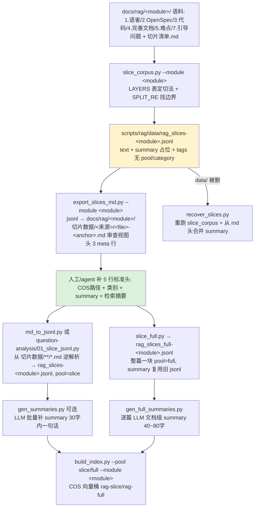

# 分析-02 语料切片与预处理（代码真相）

> summary: 解答「RAG 语料从原始 md 到进库 jsonl 的切片与预处理流水线怎么跑」——按模块语料（语雀/OpenSpec design/代码分析/坑档案/引导问题）由 LAYERS 表 + SPLIT_RE 标题正则识别切分边界（###/####/引导问题头），完善文档整篇一块、其余按 h2/h3 切，超长段落拆块不丢尾，OpenSpec 的 Risks/Migration/OpenQuestions/Non-Goals 段过滤；双池 jsonl（rag_slices-{module}.jsonl 切片池 pool=slice vs rag_slices_full-{module}.jsonl 全量池 pool=full）各自从 切片数据 md 审查视图逆解析产出，字段结构 {text, summary, tags{module/category/source/authority/section/file/file_path/anchor/pool}}；LLM 摘要分两路——gen_summaries 切片级批量 30 字内一句话、gen_full_summaries 全量池逐篇文档级 40~80 字。
> 权威度: 0.8
> 模块: rag-system
> COS路径: rag-source/rag-system/代码/分析-02-语料切片与预处理.md
> 类别：操作流程

## 业务描述与业务场景

**业务描述**：RAG 问答系统要回答面试官"你们怎么把散落的语料变成能检索的知识块"。这套代码就是语料加工流水线——把每模块的原始 md（语雀、设计决策、代码分析、坑档案、引导问题）按固定规则切成检索粒度的小块，配上"解决什么问题"的摘要和模块/来源/权威度/类别标签，最终落成两池 jsonl（细节切片池 + 整篇全量池），再交给索引器进 COS 向量桶。

**业务场景**：
- 面试官问"语料怎么切的、为什么不把整篇都丢进去"，需要讲清切片边界规则（按几级标题切、哪些段过滤掉、超长怎么拆）
- 面试官问"切片池和全量池什么关系"，需要讲清双池各自怎么产、字段结构、摘要怎么生成
- 语料整理的人要新增一个模块（rag-system），需要知道复用哪条脚本路径、5 个来源怎么组织、头部标签怎么写才不被漏

## 职责

**一句话职责**：把 `docs/rag/<module>/` 的原始语料 md 按 `切片清单.md` 定稿逻辑切成检索块，导出人读审查 md 视图，再逆解析成带完整标签的双池 jsonl（切片池 + 全量池），供 `build_index.py` 索引入 COS。

**不做什么**：
- 不做 embedding / 索引 / 查询（那是 `build_index.py`、`core/rag/query.py` 的职责）
- 不做语料内容对齐（那是代码深读/完善文档/语雀 canonical 的职责）
- 不做引导问题列表生成（`guide_pool.py` 单独管）

**分层分工要点**：
- 离线脚本 `scripts/rag/`：切片/导出/摘要/恢复 全在离线完成，不占在线链路
- 核心逻辑 `core/rag/`：只消费 jsonl 索引后的向量桶，不直接读语料 md
- 本模块**无 Java 后端、无前端**，代码层只读 `ai-edu-ai-service` 内 Python 服务与离线脚本

## 高层业务调用链（语料切片与预处理流水线）

**异常/降级分支**：
- 块 < 60 字符（纯标题/空）→ 直接丢弃（`slice_corpus.py:127-128,177-178`）
- 块超长：split 模式按段落贪心拆多块**不丢尾部**（`chunk_paragraphs`，`slice_corpus.py:78-96`）；file/guided 模式 12000 字截断并标注 `[已截断]`（`slice_corpus.py:129-130,142-143`）
- OpenSpec 命中 `Risks/Migration/OpenQuestions/Non-Goals/Goals` 等段 → 整段丢弃不切（`slice_corpus.py:43-45,157-158`）
- LLM summary 批量失败 → 该批留空，可重跑（`gen_summaries.py:57-59`）；全量池逐篇失败 → 留旧摘要（`gen_full_summaries.py:61-63`）
- `data/` jsonl 被删 → `recover_slices.py` 重跑切片 + 从 md 头无损合并 summary（`recover_slices.py:53-79`，但头格式敏感见隐性坑）
- md 头字段缺失 → 只 warn 不中断（`md_to_jsonl.py:106-109`；`question-analysis/01_slice_jsonl.py:126-127`）

## 代码事实

### 切片器怎么识别 md 的切分边界

**边界 = 标题正则 + LAYERS 表的切分等级（split_level）双控**：

- 标题识别：`SPLIT_RE = re.compile(r"^(#{1,4})\s+(.*)$")`，认 `#`~`####` 四级标题（`slice_corpus.py:28`）
- 切分等级由 `LAYERS` 表逐来源指定：`mode="file"` 整文件一块；`mode="split"` 时 `level <= split_level` 的标题作块起点，`###`/`####` 是块内内容（`slice_corpus.py:32-40,146-161`）

| 来源 | 权威度 | split_level | mode | 切法要点 | 出处 |
|---|---|---|---|---|---|
| 4.完善文档/*.md | 1.0 | 0 | file | 整文件一块（一节=一个问题答案，不细切） | slice_corpus.py:33 |
| 1.语雀/*.md | 0.7 | 2 | split | 按 `##` h2 切，保留标注块 | slice_corpus.py:34 |
| 2.OpenSpec design 决策/design-*.md | 0.7 | 3 | split | 按 `###` h3 决策切；Risks/Migration/OpenQuestions/Non-Goals 段过滤 | slice_corpus.py:35 |
| 3.代码/分析-*.md | 0.8 | 2 | split | 按 h2 切 | slice_corpus.py:36 |
| 5.难点/坑档案.md | 0.8 | 3 | split | 按 `###` 每坑一块 | slice_corpus.py:37 |
| 切片数据/引导问题/*.md | 1.0 | 0 | guided | 整文件一块，解析文件头结构化块 | slice_corpus.py:39 |

- **OpenSpec 段级过滤**：`DISCARD_HEADS = {"Risks / Trade-offs", "Risks", "Migration Plan", "Open Questions", "Non-Goals", "Goals", "Migration"}` + `DISCARD_PREFIX = ("Risk", "Open Question", "Migration", "Non-Goals")`，命中则 `discarding=True` 直到下一个同级标题（`slice_corpus.py:43-45,157-158`）
- **引导问题 mode="guided"**：整文件即一块，从文件头解析 `> summary:` / `锚点:` / `> 类别` 三行，正文从 `## 回答` 之后开始，`category` 写进 tags（`slice_corpus.py:106-134`）
- **`检索摘要` 不参与切边界**：`> 检索摘要：...` 是语料 md 正文里的块引用行，split 模式把非标题行原样 append 进当前块（`slice_corpus.py:149-170`），所以检索摘要成为切片块正文首行保留；切片脚本本身不生成它（见对账要点）

### 双池 jsonl 各自怎么产

**字段结构**：每行一块 = `{"text", "summary", "tags"}`；`tags` 含 `module/section/source/authority/file/file_path/anchor` + 可选 `category`、`pool`（`slice_corpus.py:62-75`；`md_to_jsonl.py:119-129`；`slice_full.py:106-116`）。

| 池 | 产出脚本 | 输入 | 输出 | pool 标签 | 要点 |
|---|---|---|---|---|---|
| 切片池 slice | slice_corpus.py --module | docs/rag/&lt;module&gt; 原始语料 | rag_slices-{module}.jsonl | 无（初始） | 直接切原文，summary 空占位 |
| 切片池 slice | md_to_jsonl.py | 切片数据/**/*.md（ai-tutoring） | rag_slices.jsonl | `"slice"` | 从 md 审查视图**逆解析**，带 category/cos_path |
| 切片池 slice | question-analysis/01_slice_jsonl.py | 切片数据/**/切片/*.md | rag_slices-question-analysis.jsonl | `"slice"` | 格式A/B 双兼容，source 从路径顶层目录推导 |
| 全量池 full | slice_full.py | docs/rag/ai-tutoring 语雀/完善/代码 源文档 | rag_slices_full.jsonl | `"full"` | 整篇一块，summary 复用旧 jsonl |
| 全量池 full | question-analysis/02_full_jsonl.py | docs/rag/question-analysis 源文档 | rag_slices_full-question-analysis.jsonl | `"full"` | 25 源整篇一块，summary 取头 `> summary:` |

- **全量池** `slice_full.py`：`LAYERS` 只含 语雀(0.7)/完善文档(1.0)/代码(0.8) 三源（`slice_full.py:34-38`）；`full_text` 去 `#` 标题/小节行 + 开头 `>` 头块，保留正文块引用（`slice_full.py:49-60`）；`file_path` 从源文件头 `> COS路径:` 取，缺省回退 `rag-source/ai-tutoring/{source}/{base}.md`（`slice_full.py:63-68,102`）；summary 复用旧 jsonl——完善文档整篇块直接用、语雀/代码各切片块 summary 拼 `"；"`、category 取多数（`slice_full.py:71-83,103-105`）
- **切片池逆解析** `md_to_jsonl.py`：`HEADER_FIELD = ^>\s*(.*)$` + `SEP = ^---+\s*$`，`# 标题` 首行跳过、`> summary/权威度|来源|锚点/模块|节/COS路径/类别` 解析进 meta、`---` 之后是正文（`md_to_jsonl.py:32-33,45-97`）；`file_path` = 头 `> COS路径:`（`md_to_jsonl.py:68,125`）
- **引导问题 summary 特例**：source=引导问题 时 summary 直接用 anchor（问题标题），不读 LLM 翻译版 `> summary:` 头——翻译版语义错位导致 embedding/BM25 召不回（2026-08-26 实测 sim 0.65）（`md_to_jsonl.py:111-117`）
- **question-analysis 分库脚本**：`01_slice_jsonl.py` 处理两种头格式——格式A（语雀/引导问题/OpenSpec）source 从路径顶层目录推导、section 从文件名入口段切前缀、anchor 取 `# 标题`；格式B（代码/坑档案）authority 无头默认 0.8（`question-analysis/01_slice_jsonl.py:94-113`）；`02_full_jsonl.py` 从 `{1.语雀,3.代码,4.完善文档}` 三源整篇一块（`question-analysis/02_full_jsonl.py:26-30,49-92`）

### 摘要怎么生成（gen_summaries vs gen_full_summaries）

| 维度 | gen_summaries.py（切片池） | gen_full_summaries.py（全量池） |
|---|---|---|
| 数据 | rag_slices.jsonl（硬编码 ai-tutoring） | rag_slices_full.jsonl（硬编码 ai-tutoring） |
| 粒度 | 每块一句话 | 每篇文档级 |
| 调用方式 | 批量 BATCH=5，一次带 N 块 | **逐篇**（批量 index 数组 doubao 会合并成一份摘要） |
| 输入 | file|anchor + text[:800]，prompt[:12000] | 文件头 + text[:3000]（CTX=3000） |
| 输出要求 | JSON 数组 [{"index":0,"summary":"..."}]，一句话 ≤30 字 | 纯 summary 文本，40~80 字，覆盖全文主题 |
| 失败 | 该批留空，可重跑 | 留旧摘要，可重跑 |
| 出处 | gen_summaries.py:26-32,43-59,62-83 | gen_full_summaries.py:33-40,51-63,66-86 |

- 两个脚本共用 LLM 配置：`doubao` + `TUTORING_DECIDE_MODEL` + `temperature=0.0` + `extra_body={"thinking": {"type": "disabled"}}` + `request_timeout=20` + `max_retries=0`（`gen_summaries.py:35-40`；`gen_full_summaries.py:43-48`）
- 摘要用途不同：切片池 build_index 双向量 embed(summary+text)，全量池大文件（>5000 字符）只 embed(summary) 作文档级粗召回，防超 8192 token 截断（`build_index.py:166-179`）

### 切片头部精简 5 行 / 检索摘要 / 类别闭集在代码里怎么体现

- **切片头部精简 5 行**：`export_slices_md.py` 的 `block_md` 写出固定 5 行头——`# {title}` + `> summary:` + `> 权威度|来源|锚点` + `> 模块|节` + `---`（`export_slices_md.py:44-60`）；`md_to_jsonl.py` 逆解析的正是这套头（`md_to_jsonl.py:45-97`）。**但实际 ai-tutoring md 头比 5 行多**（见对账要点）。每模块流水线-tasks.md 定义的"5 行标准头"为 `summary/权威度/模块/COS路径/类别`（每模块流水线-tasks.md:47）
- **检索摘要**：切片脚本均无 `检索摘要` 字样；它是语料 md 正文里的 `> 检索摘要：` 块引用行，split 模式作为普通正文保留进块（`slice_corpus.py:149-170`）。question-analysis 的 jsonl 里 summary 与正文首行 `检索摘要` 内容一致，说明该模块把 `检索摘要` 文本同步进了头 `> summary:`。代码深读提示词明确"代码证据层不强制每个子块写检索摘要"（代码深读-分析文档-提示词.md:84-85）
- **类别闭集（9 类）**：`项目介绍/操作流程/数据关联/开发难点/业务流程/架构设计/业务视角/数据存储/未来演进`（cos向量桶的字段.md:40）。代码侧：guided 模式从 md 头 `> 类别` 写 tags.category（`slice_corpus.py:120-121,133`）；md_to_jsonl/01_slice_jsonl/02_full_jsonl 都从 md 头 `> 类别` 读入 tags.category（`md_to_jsonl.py:69-70,127`；`question-analysis/01_slice_jsonl.py:70-79,104`）；build_index 写进 COS metadata（`build_index.py:149`）

### 5 来源如何组织（scripts/rag/{module}/ 下的子脚本？）

- **ai-tutoring（默认）**：通用脚本直接放 `scripts/rag/` 顶层，`LAYERS` 表统一驱动 5 来源 + 引导问题（`slice_corpus.py:32-40`）；`slice_full.py`/`md_to_jsonl.py`/`recover_slices.py` 的 CORPUS 均硬编码 `docs/rag/ai-tutoring`（`slice_full.py:28`；`md_to_jsonl.py:27`；`recover_slices.py:19`）
- **question-analysis（第一个 per-module 子目录）**：`scripts/rag/question-analysis/` 含 `01_slice_jsonl.py`（分库/切片池）+ `02_full_jsonl.py`（全量库）+ `README.md`，因为该模块切片 md 是**双切片 + 格式A/B 头**，与 ai-tutoring 通用脚本的 LAYERS/头格式不兼容（question-analysis/README.md:1-46）
- **rag-system**：当前 `scripts/rag/` 下**尚无 rag-system 子目录**；按切片清单.md 规划（代码分析按 `###` 语义分组双切片、坑档案一坑一文件双切片）大概率走 question-analysis 模式（per-module 脚本），或复用 `slice_corpus.py --module rag-system` 后调整 LAYERS
- **knowledge-graph**：`scripts/rag/` 下也无独立子目录（仅 question-analysis），其切片由 30 agent 并行产 md（代码双切片 71 + 坑档案双切片 24 + 语雀条目 98 + OpenSpec 242 + 引导问答 64），jsonl 侧未见 `rag_slices-knowledge-graph.jsonl` 落盘

### 枚举/常量/配置

| 类型 | 名称 | 取值 | 出处 |
|---|---|---|---|
| 阈值 | MIN_CHARS | 60（低于此长度丢弃） | slice_corpus.py:25 |
| 阈值 | MAX_CHARS_FILE | 12000（file/guided 整块上限，超长截断） | slice_corpus.py:26 |
| 阈值 | MAX_CHARS_SPLIT | 6000（split 块上限，超限按段落拆块不丢尾） | slice_corpus.py:27 |
| 正则 | SPLIT_RE | `^(#{1,4})\s+(.*)$`（#~#### 标题） | slice_corpus.py:28 |
| 闭集 | 模块 id | ai-tutoring/question-analysis/knowledge-graph/rag-system | slice_corpus.py:190-191 |
| 闭集 | 类别（9 类） | 项目介绍/操作流程/数据关联/开发难点/业务流程/架构设计/业务视角/数据存储/未来演进 | cos向量桶的字段.md:40 |
| 过滤 | DISCARD_HEADS | Risks/Risks / Trade-offs/Migration Plan/Open Questions/Non-Goals/Goals/Migration | slice_corpus.py:43-44 |
| 过滤 | DISCARD_PREFIX | Risk/Open Question/Migration/Non-Goals | slice_corpus.py:45 |
| 池 | POOLS.vector_type | full→rag-full、slice→rag-slice | build_index.py:43-44 |
| key | make_key | `{池前缀}/{module}/{file}/{anchor}#{chunk_idx}` | build_index.py:59-65 |
| 摘要 | gen_summaries.BATCH | 5 | gen_summaries.py:27 |
| 摘要 | gen_full_summaries.CTX | 3000（每篇喂 LLM 正文长度） | gen_full_summaries.py:34 |
| LLM | 模型 | doubao + TUTORING_DECIDE_MODEL，temp 0，thinking disabled，20s 超时，0 重试 | gen_summaries.py:35-40 |
| 导出 | SOURCE_DIR | 完善文档/语雀/OpenSpec/代码/坑档案 → 同名子文件夹 | export_slices_md.py:25-31 |
| 恢复 | HEAD_RE | 匹配 `> summary:` + `> 权威度|来源|锚点` + `> 模块|节` + `\n\n---\n\n` | recover_slices.py:22-26 |

## 隐性坑与注意事项

- **`slice_corpus.py` 不产 category/pool**：split/file 模式的 `_tags` 只有 8 字段，无 category；实际 ai-tutoring jsonl 的 category 是"从切片文件头 `> 类别：` 手动反写"补的（cos向量桶的字段.md:69 明确标注 ⚠️）。走 `slice_corpus --module` 直接产出的 jsonl 缺 category，需 md_to_jsonl 逆解析或补写
- **`recover_slices.py` 的 HEAD_RE 只认 3 行头**：`HEAD_RE` 期望 `summary/权威度|来源|锚点/模块|节` 后紧跟 `\n\n---\n\n`；实际 ai-tutoring 切片 md 头在 `模块|节` 后还有 `> COS路径:` 与 `> 类别：` 两行，HEAD_RE 的 search 会落空 → summary 恢复全失败（`recover_slices.py:22-26` vs 实际 md 头）
- **`export_slices_md.py` 与 md_to_jsonl 头字段不对称**：block_md 只写 3 meta 行（summary/权威度|来源|锚点/模块|节），不写 COS路径/类别；但 md_to_jsonl 逆解析期望 COS路径/类别（缺了只 warn）。两脚本对"头应含哪些字段"定义不一致
- **gen_summaries / gen_full_summaries 硬编码 ai-tutoring 路径**：只读写 `rag_slices.jsonl` / `rag_slices_full.jsonl`，不支持 --module；多模块（question-analysis 等）摘要靠 md 头 `> summary:` 直读，不走这两个脚本
- **`slice_full.py` 硬编码 ai-tutoring**：CORPUS 写死 `docs/rag/ai-tutoring`，summary 复用 `rag_slices.jsonl.bak-20260826`；跨模块全量池要另写脚本（如 question-analysis/02_full_jsonl.py）
- **`file_path` 双口径**：`slice_corpus._tags` 的 file_path = 相对语料根 `docs/rag/<module>/` 的路径（前端定位源文件）；`md_to_jsonl`/`01/02` 的 file_path = 头 `> COS路径:`（COS key，如 `rag-slices/...` / `rag-source/...`）。两条流水线产出同一字段、语义不同
- **COS metadata 硬限制**：metadata 单条 ≤10 entries、单条 ≤2048B，summary 按"非 summary 值字节 + 250B 安全量"截断（`build_index.py:143-165`）；text 全文不进 metadata，命中后按 key 反查 jsonl
- **切块 key 冲突**：同 (file, anchor) 内段落拆多块，靠 chunk_idx 区分；导出 md 时同名文件加 `-2/-3` 后缀防覆盖（`build_index.py:134-142`；`export_slices_md.py:111-114`）

## 设计要点

- **"切归切、改归改"**：切片源头 = `切片数据/**/*.md`（已定稿、带 summary/类别/COS路径 头），`md_to_jsonl.py` 从 md 逆解析，不再重跑 slice_corpus——避免"改了 md 头要重切 jsonl"的耦合（`md_to_jsonl.py:4-5`）
- **双池互补**：全量池整篇一块管"整体/全局"问题（不丢上下文），切片池细块管细节——一池满足不了引导可控 + 自由 RAG 两个目标（`slice_full.py:4-5`）
- **超长不截尾**：split 超长块按段落贪心合并到 ≤6000 再拆，单段超限按 6000 硬切**保尾部进索引**，替代原 2000 会截掉尾段的做法（`slice_corpus.py:78-96,27` 注释）
- **引导问题 summary 用标题不用翻译版**：LLM 翻译版 summary 语义错位导致 embedding/BM25 召不回（实测 sim 0.65），标题即"这段回答解决什么问题"（`md_to_jsonl.py:111-117`）
- **块 key 带 module 段**：多模块共用 rag-full/rag-slice 索引，跨模块同名文件（如两模块的完善文档 01-08）若键不含 module 会冲突覆盖——module 段保证键跨模块唯一（`build_index.py:59-65`）
- **双向量设计**：切片池每块写两个 key（`-c` 内容路 embed(summary+text)、`-q` 问题路 embed(summary)），同索引 rag-slice，key 后缀 role 区分（`build_index.py:166-175`）
- **分库独立脚本**：切片 md 格式因模块而异（ai-tutoring 头 3 行 vs question-analysis 格式A/B + target 双切片），故 per-module 子目录脚本（`question-analysis/01/02`）而非继续堆参数

## 对账要点

| 对账分类 | 项 | 语雀/design/清单口径 | 代码现状 | 结论 |
|---|---|---|---|---|
| 方案vs实现 | 代码分析切分等级 | 切片清单.md：代码分析"按 `###` 语义分组双切片（开发向+面试向）" | slice_corpus.py LAYERS 代码层 split_level=2（h2），且无 target/双切片字段（slice_corpus.py:36,146-161） | ⚠️ 需 per-module 脚本或改 LAYERS |
| 方案vs实现 | 语雀权威度 | rag-system 切片清单：语雀 canonical 0.8 | slice_corpus LAYERS 语雀硬编码 0.7（slice_corpus.py:34） | ⚠️ 需改 LAYERS 才对齐 |
| 方案vs实现 | 头部 5 行标准 | 每模块流水线-tasks.md:47 标准头 = summary/权威度/模块/COS路径/类别 | export_slices_md.block_md 只写 3 meta 行（无 COS路径/类别）；实际 ai-tutoring md 头有 5 行（人工补齐） | ⚠️ 脚本未产 COS路径/类别 |
| 注释vs运行行为 | recover_slices 恢复 | recover_slices.py:78 期望"应=234 块" | 当前 rag_slices.jsonl 实为 294 块；HEAD_RE 对含 COS路径/类别的实际 md 头不匹配 | ⚠️ 数字过期 + 头格式敏感 |
| 方案vs实现 | file_path 语义 | slice_corpus._tags 注释"相对语料根路径"（前端定位源文件） | md_to_jsonl/01/02 的 file_path = COS key（rag-slices/... 或 rag-source/...） | ⚠️ 双口径 |
| 方案vs实现 | doc_type=code_analysis | 代码深读提示词要求 doc_type=code_analysis | build_index 已去掉 doc_type（与 module 同值冗余，2026-08-26），COS metadata 用 module 字段承载（build_index.py:144-148） | ⚠️ 概念在，字段已折叠 |
| 注释vs运行行为 | 全量池块数 | slice_full.py:15 注释"23 块" | 实际 23 块（语雀 5 + 完善文档 8 + 代码 10） | ✅ 对齐 |
| 方案vs实现 | 检索摘要 | 语雀 canonical/design 每个子块带 `> 检索摘要：` | 切片脚本不生成检索摘要，仅作为正文保留；代码证据层不强制写（代码深读提示词.md:84-85） | ✅ 设计如此 |

## 已读代码清单

- **离线脚本**（本主题主体）：
  - `ai-edu-ai-service/scripts/rag/slice_corpus.py`（关键: LAYERS/SPLIT_RE/slice_file 三 mode/chunk_paragraphs/main）
  - `ai-edu-ai-service/scripts/rag/slice_full.py`（关键: full_text/parse_cos_path/load_old_info/main）
  - `ai-edu-ai-service/scripts/rag/md_to_jsonl.py`（关键: parse_md/引导问题 summary 特例/main）
  - `ai-edu-ai-service/scripts/rag/export_slices_md.py`（关键: block_md/block_filename/main）
  - `ai-edu-ai-service/scripts/rag/gen_summaries.py`（关键: _gen_batch/main）
  - `ai-edu-ai-service/scripts/rag/gen_full_summaries.py`（关键: _gen_one/main）
  - `ai-edu-ai-service/scripts/rag/recover_slices.py`（关键: read_md_summaries/HEAD_RE/main）
  - `ai-edu-ai-service/scripts/rag/question-analysis/01_slice_jsonl.py`（关键: parse_slice/格式A/B/ENTRY_MARKERS）
  - `ai-edu-ai-service/scripts/rag/question-analysis/02_full_jsonl.py`（关键: parse_doc/_section）
  - `ai-edu-ai-service/scripts/rag/question-analysis/README.md`（数据流说明）
  - `ai-edu-ai-service/scripts/rag/build_index.py`（关键: make_key/metadata 10 字段/双向量/条件式 embed，行 130-179 + grep 核对）
  - `ai-edu-ai-service/scripts/rag/data/`（实际 jsonl 产物：rag_slices.jsonl 294 块 / rag_slices_full.jsonl 23 块 / rag_slices-question-analysis.jsonl 317 块 / rag_slices_full-question-analysis.jsonl 25 块 + eval/ + 备份）
- **核心逻辑**：本主题不涉及 `core/rag/` 在线链路（切片/预处理全离线）；doc_type/pool 的消费侧仅核对 `build_index.py`。
- **API 入口**：不涉及（切片是离线脚本，无 HTTP 入口）。
- **参照材料（对账用，非真值）**：`docs/rag/rag-system/切片清单.md`、`docs/rag/rag-system/每模块流水线-tasks.md`、`docs/rag/rag-system/2.OpenSpec design 决策/design-python-project-intro-rag.md`、`docs/rag/cos向量桶的字段.md`、`docs/rag/rag-system/3.代码/处理方案/提示词/代码深读-分析文档-提示词.md`、ai-tutoring/question-analysis 的 切片数据 md 样本。

> 本主题跨 1 层（离线脚本层）；核心逻辑/API 入口均无实际读取（切片与预处理是纯离线流水线，不依赖在线链路）。
