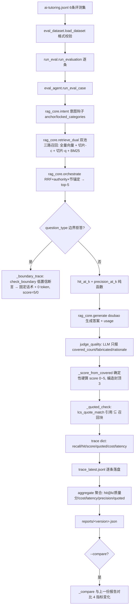

# 分析-06 评测（代码真相）

> summary: 解答「怎么证明 RAG 系统有效」——eval_agent 单条评测走真实检索原语(不降级, 双池四路 RRF)→ hit@5 + precision@5 纯函数算检索质量 → doubao 生成 → LLM 判分只报事实(covered_count/fabricated)、分数由 _score_from_covered 确定性硬算(编造封顶 3 分) → trace 落盘 + 聚合报告 + --compare 版本对比; 当前评测集仅 ai-tutoring 6 条(5 正常 + 1 边界拒答), 无 rag-system 评测集。
> 权威度: 0.8
> 模块: rag-system
> COS路径: rag-source/rag-system/代码/分析-06-评测.md
> 类别：数据关联

## 业务描述与业务场景

**业务描述**：评测 agent 是 rag-system 的"质量把关工具"——预写评测集（Q&A + 预期引用 + 预期要点），对每条问题走一遍真实检索→生成→判分，产出 hit@k（检索是否捞得对）、answer_quality 质量分（答案是否答得好）、cost（贵不贵）、latency（快不快），trace 逐条落盘 + 聚合报告 + 跨语料版本对比，用数据证明"这套 RAG 系统靠谱"。

**业务场景**：
- 面试官问"怎么证明 RAG 有效"，亮出评测集 + hit@k + 质量分 + 成本/耗时报告（语雀-问题12 的"证明方案"）
- 改切片策略/检索参数/提示词后，`run_eval.py --compare` 对比前后 hit@k/质量分变化（回归验证）
- 定位问题：先测 hit@k 看"检索捞得对不对"，再测质量分看"答案答得好不好"，分层定位（design D3）

**定位**：内部评测工具（design Non-Goals），离线/手动触发，不碰 `/api/rag/ask` 主链路（design Migration Plan 第 4 条）。

## 职责

**职责**：评测集加载与格式校验 → 单条评测（真实检索 + hit@k + 生成 + LLM 判分 + 引用校验 + cost/latency）→ 逐条 trace 落盘 → 聚合指标 → 报告对比。
**不做什么**：不做线上/生产评测服务；不引入 RAGAS 全量框架（design Non-Goals，聚焦 hit@k + LLM 判分两个信号）；不自动改语料；不采集真实用户反馈。
**分工要点**：判分核心 `core/rag/eval_agent.py`（纯函数 hit_at_k / precision_at_k / calc_cost / _score_from_covered + LLM 判分 + 单条执行 + 聚合）；评测执行入口 `scripts/rag/run_eval.py`（CLI --compare + trace/报告落盘）；评测集校验 `scripts/rag/eval_dataset.py`（闭集/字段/最小条数）；评测集数据 `scripts/rag/data/eval/ai-tutoring.jsonl`。

## 高层业务调用链（eval集→真实检索→生成→判分→报告）

## 代码事实

### 判分维度：answer_quality 怎么评（eval_agent.py）

1. **LLM 判分只报事实、不报分数**（`eval_agent.py:111-122` `_JUDGE_SYSTEM`）：判分 prompt 要求模型只输出 `{"covered_count": 覆盖了几条预期要点, "fabricated": 是否有编造, "rationale": 理由}`，"分数由外部按规则计算(你不要输出 score)"。这消除了 LLM 直接出分时的百分比计算波动（docstring `eval_agent.py:165` "消除 LLM 百分比计算波动"）。
2. **编造判定依据**：答案表述"在任意一块语料中有直接原文或合理推断支撑即不算编造"；语料含多源（完善文档/代码/坑档案/语雀/OpenSpec）有出处就不算；"语料块因 600 字截断导致无法验证的部分，不算编造"（`eval_agent.py:115`）。判分 prompt 实际拼接 `corpus_texts[:4]`、每块 `t[:600]`（`eval_agent.py:137-139`）。
3. **分数硬算 `_score_from_covered`**（`eval_agent.py:164-183`）：覆盖比例分档 100%→5、≥80%→4、≥60%→3、≥40%→2、>0%→1、0%→0；**`fabricated` 为真时 `min(base, 3)` 封顶 3 分**（`eval_agent.py:183`，"编造权重高于遗漏"）。注意 covered<=0 时直接 return 0（`eval_agent.py:170-171`），编造封顶只在覆盖>0 时生效。
4. **判分重试**：解析失败重试 1 次（`for attempt in range(2)`），仍失败返回 `{"score": 0, "rationale": "判分解析失败", "judged": False}`（`eval_agent.py:140-161`）。
5. **判分模型**：`_make_judge_llm`（`eval_agent.py:186-191`）doubao + `TUTORING_DECIDE_MODEL` + temperature 0.0 + 关 thinking + 超时 30s + max_retries 0，与生成同模型（能力一致，design D5）。生成则 temperature 0.2、超时 60s、max_retries 1（`query.py:751-756`）。

### hit@k 怎么算（eval_agent.py）

1. **命中判定 `_match_file`**（`eval_agent.py:58-68`）：expected 引用与召回块 file 做**双向子串匹配**（`e in str(f) or str(f) in e`）。新格式 expected = 承载答案的源文件标识（"01-模块定位与核心价值"/"引导问题-05-操作流程-怎么防学生套答案"）；旧格式兼容含节号（"ai-tutoring/04-安全与防作弊" ↔ file="04"）。
2. **`hit_at_k`**（`eval_agent.py:71-83`）：`expected_references` 中命中召回 top-k 的比例，返回 0~1（可多条引用部分命中）；expected 空或 k<=0 → 0.0。`k` 默认 `HIT_K=5`（`eval_agent.py:31`，注释明确 2026-08-26 由 3 改 5，对齐生成上下文 top-5）。
3. **`precision_at_k`**（D2，`eval_agent.py:89-105`）：召回 top-k 中相关块占比（分母=k）。与 hit@k 互补：hit@k 看"该捞的捞到没"、precision@k 看"捞上来的干不干净"。
4. **trace 里存 `hit`（bool）与 `hit_score`（比例）双口径**（`eval_agent.py:285-286`）：`hit = bool(hit_score > 0)` 即"至少一条引用命中"。

### 单条评测执行 run_eval_case（eval_agent.py:222-304）

1. **真实检索原语、不降级**（`eval_agent.py:234-242` 注释）：`_load_all_blocks()` 加载双池语料 → `intent(question)` 得 anchor/locked_categories → `retrieve_dual` 双池召回 → `orchestrate` 四路 RRF 出 top-K。**不走 `rag_query`（API 带降级语义），向量挂了就暴露，不让降级掩盖问题**（`eval_agent.py:13-14`）。
2. **边界拒答类型短路**（`eval_agent.py:251-253`）：`question_type == "边界拒答"` 直接走 `_boundary_trace`，不进 generate/判分。
3. **正常路径**（`eval_agent.py:255-267`）：hit@k + precision@k → `generate(hits, question, return_usage=True)`（`query.py:759-783`，doubao 面试口述 + 引用）→ `judge_quality` 判分。
4. **D3 引用校验 `_quoted_check`**（`eval_agent.py:206-219`）：空答案（拒答/降级）→ 空列表 valid=True；否则 `lcs_quote_match`（`assistant.py:226-238`，LCS 硬匹配，连续 ≥8 中文字符/12 英文字符窗口命中即 is_quoted）算 quoted_keys，断言 `quoted_keys ⊆ 召回块 key`。
5. **cost/latency**（`eval_agent.py:46-52, 273-302`）：`calc_cost` 纯函数 = prompt/1000×0.003 + completion/1000×0.009（doubao 单价，`eval_agent.py:37-40`）；latency_ms 拆 retrieve/generate/total 三段；version = `_current_version(blocks)`（`query.py:817-823`，全块 text sha1[:6] + 日期）。

### 边界拒答评测 _boundary_trace（eval_agent.py:307-347）

- 复用 `assistant.check_boundary`（`assistant.py:394-408`）：rerank 空 → 拒答；或 `vec_conf < 0.75 且 bm_conf < 0.5` → 拒答。
- `vec_conf = max(全量, 切片)`（`eval_agent.py:317`，1.13 双池：任一置信即不算低）；拒答正确 score=5、失败 score=0；0 token（不进 generate/判分）；quoted 空。

### run_eval 流程（run_eval.py）

1. **入口**（`run_eval.py:115-125`）：`argparse --compare`。
2. **`run_evaluation`**（`run_eval.py:70-95`）：`eval_dataset.load_dataset()` 加载 → 逐条 `eval_agent.run_eval_case` → `version = results[0]["version"]` → `aggregate` → `_save_trace`（trace_latest.jsonl）+ `_save_report`（reports/{version}.json）。
3. **报告对比 `_compare`**（`run_eval.py:52-67`）：与 `reports[-1]`（排序后最后一份）对比 hit_at_k_avg / quality_avg / total_cost_yuan / avg_latency_ms 4 指标，标 ↑/↓/=；无历史报告则跳过。
4. **报告内容 `_print_report`**（`run_eval.py:98-112`）：条数、hit@k 平均 + 命中条数、precision@k 平均、quoted 合法率、质量分平均 + 判分率、平均耗时、总成本。

### eval_dataset 校验什么（eval_dataset.py）

1. **闭集**（`eval_dataset.py:28-29`）：`BOUNDARY_TYPE="边界拒答"`，`VALID_TYPES = {"项目介绍", "操作", "数据关联", "难点", "最危险", "边界拒答"}`。
2. **最小条数**（`eval_dataset.py:30, 49-50`）：`MIN_PER_MODULE = 5`，不足抛 ValueError。
3. **逐条校验 `_validate`**（`eval_dataset.py:54-77`）：
   - question 必填非空字符串
   - question_type 必填且 ∈ 闭集
   - 边界拒答：expected_references 可为空列表（若提供则元素必须非空字符串）；其余类型：expected_references 必填非空列表、元素非空字符串
   - expected_points 必填非空列表、元素非空字符串（边界类型也必填）
   - **module 硬编码 == "ai-tutoring"**（`eval_dataset.py:76`），否则抛错
4. **失败即抛**（docstring `eval_dataset.py:14`）：评测集 curation 错误必须当场暴露，不静默。JSON 解析失败 → `{path}:{lineno}` 报错（`eval_dataset.py:43-46`）。

### 评测集数据结构（data/eval/ai-tutoring.jsonl，6 条）

每条：`{module, question, question_type, expected_references[], expected_points[]}`。当前 6 条 = 项目介绍/操作/数据关联/难点/最危险 各 1 条 + 边界拒答 1 条（"帮我写一封辞职信。"，expected_references 空，`ai-tutoring.jsonl:1-6`）。`expected_references` 混用全量池 file（"01-模块定位与核心价值"）与切片池 file（"引导问题-01-项目介绍-…"）。**无 rag-system.jsonl**（`data/eval/` 下仅 ai-tutoring.jsonl）。

## 枚举常量配置表

| 类型 | 名称 | 取值 | 出处 |
|---|---|---|---|
| 检索 | HIT_K | 5（2026-08-26 由 3 改 5，对齐生成上下文 top-5） | eval_agent.py:31 |
| 检索 | TOP_K（生成块数） | 5 | query.py:44 |
| 检索 | VEC_K / BM25_K / RRF_K / ANCHOR_WEIGHT | 12 / 10 / 60 / 1.5 | query.py:43,46,47,63 |
| 判分 | _score_from_covered 档位 | 100%→5, ≥80%→4, ≥60%→3, ≥40%→2, >0%→1, 0%→0 | eval_agent.py:172-182 |
| 判分 | 编造封顶 | fabricated → min(base, 3) | eval_agent.py:183 |
| 判分 | 覆盖条数下限 | covered <= 0 → 直接 0 分 | eval_agent.py:170-171 |
| 判分 | corpus 判编造截断 | 前 4 块 × 每块 600 字 | eval_agent.py:139 |
| 成本 | DOUBAO_PRICE_PER_1K | input 0.003 / output 0.009 元·千token | eval_agent.py:37-40 |
| 边界 | BOUNDARY_VEC_CONF / BOUNDARY_BM_CONF | 0.75 / 0.5（双路都低于才拒答） | assistant.py:388-389 |
| 引用 | QUOTE_LEN_CN / QUOTE_LEN_EN | 8 中文字符 / 12 英文字符 | assistant.py:189-190 |
| 评测集 | MIN_PER_MODULE | 5 条/模块 | eval_dataset.py:30 |
| 评测集 | VALID_TYPES | 项目介绍/操作/数据关联/难点/最危险/边界拒答 | eval_dataset.py:29 |
| 报告 | 对比指标 | hit_at_k_avg / quality_avg / total_cost_yuan / avg_latency_ms | run_eval.py:63 |
| 生成 | 生成温度/超时 | 0.2 / 60s / max_retries 1 | query.py:753-755 |
| 判分 | 判分温度/超时 | 0.0 / 30s / max_retries 0 | eval_agent.py:188-190 |

## 隐性坑与注意事项

- **hit_cases 与 hit_score 是两套口径**：`hit_cases` 按 `bool(hit_score>0)` 计（任一引用命中即算），`hit_at_k_avg` 按引用命中比例平均。最新报告 hit_at_k_avg 0.583 但 hit_cases 5/6（`reports/2026-08-26-259c06.json`）——"5 条有命中"不等于"引用命中比例高"。
- **判分失败被记 0 分、不是剔除**：judge_quality 两次解析失败 → score=0 + judged=False（`eval_agent.py:161`），会拉低 quality_avg；aggregate 里 `judged_ratio < 1` 提示有判分失败（`eval_agent.py:383`）。
- **编造封顶只在覆盖>0 时生效**：covered=0 直接 0 分，fabricated 分支不参与；若预期"0 覆盖 + 有编造"应更重罚，但代码没有。
- **判编造的语料看不全**：只拼前 4 块 × 600 字（`eval_agent.py:139`），第 5 块以后及超 600 字部分模型看不到，可能漏判支撑/误判编造（prompt 里已写"600 字截断无法验证的部分不算编造"缓解）。
- **评测集只能建 ai-tutoring**：`_validate` 硬编码 `module == "ai-tutoring"`（`eval_dataset.py:76`），即使 `load_dataset(module="rag-system")` 也会因 item.module 不匹配抛错——这是"没有 rag-system 评测集"的代码根因，多模块评测需要先改这里。
- **_compare 只和最后一份报告比，不是固定基线**：取 `reports[-1]`（排序最后一份，`run_eval.py:58`）；报告文件名 = 语料版本（date-sha1[:6]），同一语料重跑会覆盖同名报告（`_save_report` 按 version 命名），可能丢历史。
- **version 是语料内容指纹，不是运行时间**：`_current_version` = 全块 text sha1[:6]（`query.py:817-823`），同一天多次改语料会产生不同 sha 报告（如 2026-08-25 有两份：27f329 与 e966ac）。
- **边界拒答的 precision 恒为 0**（`eval_agent.py:331`）且计进 precision_at_k_avg；hit 恒为 False、hit_score 0，但正确拒答 score=5 计入 quality_avg。
- **判分与生成共享 TUTORING_DECIDE_MODEL**：判分成本与生成成本同源计算（`calc_cost` 硬编码 doubao 单价），若换模型需同步改单价。

## 设计要点

- **评测走真实检索原语、不降级**（`eval_agent.py:13-14, 234-242`）：评测要看真实质量，向量挂了就暴露，不让 API 降级语义掩盖问题——这是"评测集自证"可信度的关键。
- **判分确定性硬化**（design D5 演进）：LLM 只报事实（covered_count/fabricated/rationale），分数由 `_score_from_covered` 硬算 → 可复现、范围可控（完善文档 08 追问与防御"评分锚定表 + 确定性算分"）。
- **编造封顶 3 分**（`eval_agent.py:167`）：编造权重高于遗漏——宁可漏要点也不许编，符合面试防御场景。
- **hit@k 与 precision@k 互补**（`eval_agent.py:93-95`）：一个看"该捞的捞到没"，一个看"捞上来的干不干净"，分层定位检索问题。
- **D3 引用校验纯函数化**：quoted 用 LCS 硬匹配（无 LLM），可单测可入评估（`assistant.py:226-238`）。
- **cost/latency 可观测**：`calc_cost` 纯函数 + latency 三段时间 + usage 汇总，报告里同时给"贵不贵/快不快"。
- **聚合单一入口**：`aggregate`（`eval_agent.py:353-389`）输出 10+ 指标，报告/对比/CLI 全复用同一份数据。

## 对账要点

| 对账分类 | 项 | 方案口径 | 代码现状 | 结论 |
|---|---|---|---|---|
| 方案vs实现 | hit@k 的 k | design D4「k 取 3（源文档池 top-k）」；完善文档 08「hit@3 0.80」 | `HIT_K=5`（eval_agent.py:31，2026-08-26 注释 3→5） | 翻转（k 3→5，指标口径变化） |
| 方案vs实现 | 判分输出 | design D5「输出 {score, rationale}」 | LLM 只输出 {covered_count, fabricated, rationale}，score 由 `_score_from_covered` 硬算（eval_agent.py:111-122, 164-183） | 翻转（确定性硬算分） |
| 方案vs实现 | 判分维度 | design D4「准确性/引用正确性/覆盖要点」 | 代码只按 covered_count + fabricated 两维；引用正确性改由 D3 quoted_valid 纯函数补（eval_agent.py:206-219） | 部分落地（维度拆分） |
| 方案vs实现 | 编造封顶 3 分 | design 未提「封顶」 | fabricated → min(base, 3)（eval_agent.py:183） | ➕ 代码新增硬约束 |
| 方案vs实现 | question_type 闭集 | design D2「概览/为什么/数据流/难点/指标」 | `VALID_TYPES` = 项目介绍/操作/数据关联/难点/最危险/边界拒答（eval_dataset.py:29） | 翻转（分类体系改名 + 边界拒答） |
| 方案vs实现 | 评测集规模 | design D2「每模块 5 条 × 5 模块 = 25 条」 | 仅 ai-tutoring.jsonl 6 条（5 正常 + 1 边界）；无 rag-system/其他模块评测集 | 未覆盖（仅 1 模块） |
| 方案vs实现 | 边界拒答评测 | 原 25 条方案未含 | `BOUNDARY_TYPE` + `_boundary_trace` 新增（eval_agent.py:34, 307-347） | ➕ 超方案（1.13 双池后新增） |
| 方案vs实现 | 真实检索原语 | design D3「走 rag-retrieval」 | 走 retrieve_dual/orchestrate 真实原语不降级（eval_agent.py:234-242） | 落地 |
| 方案vs实现 | cost/latency | design D4「prompt+completion × 单价 / 检索+生成+总耗时」 | `calc_cost` 纯函数（eval_agent.py:46-52）+ latency 三段时间（298-302） | 落地 |
| 方案vs实现 | trace + 报告对比 | design D6「逐条 trace + 报告对比」 | trace_latest.jsonl + reports/{version}.json + `--compare`（run_eval.py:29-67） | 落地 |
| 方案vs实现 | 每阶段可测试 | design D7「纯函数可单测」 | hit_at_k/precision_at_k/calc_cost/_score_from_covered 均纯函数，判分 LLM 可注入（eval_agent.py:125-126） | 落地 |
| 完善文档08 vs 代码 | 评测集条数 | 完善文档 08「评测集 5 条（5 类各 1）」 | ai-tutoring.jsonl 6 条（含边界拒答） | 过时（6 条含边界） |
| 完善文档08 vs 代码 | 指标数值 | 完善文档 08「hit@3 0.80 / 质量 3.6~4.6 / 单条 ¥0.016 / 5.7s」 | 最新报告 2026-08-26：hit@5 0.583 / 质量 3.833 / 均 ¥0.0181 / 17.4s（reports/2026-08-26-259c06.json） | 过时（双向量 + 6 条 + 判分硬算后指标变化） |

## 已读代码清单

- **判分核心**：`core/rag/eval_agent.py`（HIT_K/calc_cost/_match_file/hit_at_k/precision_at_k/_JUDGE_SYSTEM/judge_quality/_score_from_covered/_make_judge_llm/_extract_json/_quoted_check/run_eval_case/_boundary_trace/aggregate，全文 389 行）
- **执行入口**：`scripts/rag/run_eval.py`（EVAL_DIR/TRACE_PATH/REPORT_DIR/_save_trace/_save_report/_list_reports/_compare/run_evaluation/_print_report/main，全文 125 行）
- **评测集校验**：`scripts/rag/eval_dataset.py`（VALID_TYPES/MIN_PER_MODULE/load_dataset/_validate/main，全文 94 行）
- **评测集数据**：`scripts/rag/data/eval/ai-tutoring.jsonl`（6 条）、`scripts/rag/data/eval/trace_latest.jsonl`（6 条）、`scripts/rag/data/eval/reports/*.json`（4 份历史报告：2026-08-24-e966ac / 2026-08-25-27f329 / 2026-08-25-e966ac / 2026-08-26-259c06）
- **检索/生成依赖（rag_core）**：`core/rag/query.py`（TOP_K/VEC_K/BM25_K/RRF_K/ANCHOR_WEIGHT/MODULE_ANCHORS/intent/_load_all_blocks/retrieve_vector/_split_roles/retrieve_dual/retrieve_bm25/_key_of/_assign_idx/select_corpus/orchestrate/generate/_current_version）
- **边界/引用依赖**：`core/rag/assistant.py`（QUOTE_LEN_CN/QUOTE_LEN_EN/_lcs_longest/_len_of/lcs_quote_match/BOUNDARY_VEC_CONF/BOUNDARY_BM_CONF/BOUNDARY_MSG/check_boundary）
- **参照材料**：`docs/rag/rag-system/2.OpenSpec design 决策/design-python-rag-eval-agent.md`（D1~D7/Risks/Migration）、`docs/rag/rag-system/4.完善文档/08-数据规模与指标.md`、`docs/rag/rag-system/1.语雀/原来的文件/语雀-问题12-ldxmga554l3d6uxp.md`（评测证明方案）、`docs/rag/rag-system/切片清单.md`（分析-01~09 进库清单）
> 本主题仅 Python 端（ai-edu-ai-service）；评测 agent 是内部离线工具，不涉及 Java/前端。
