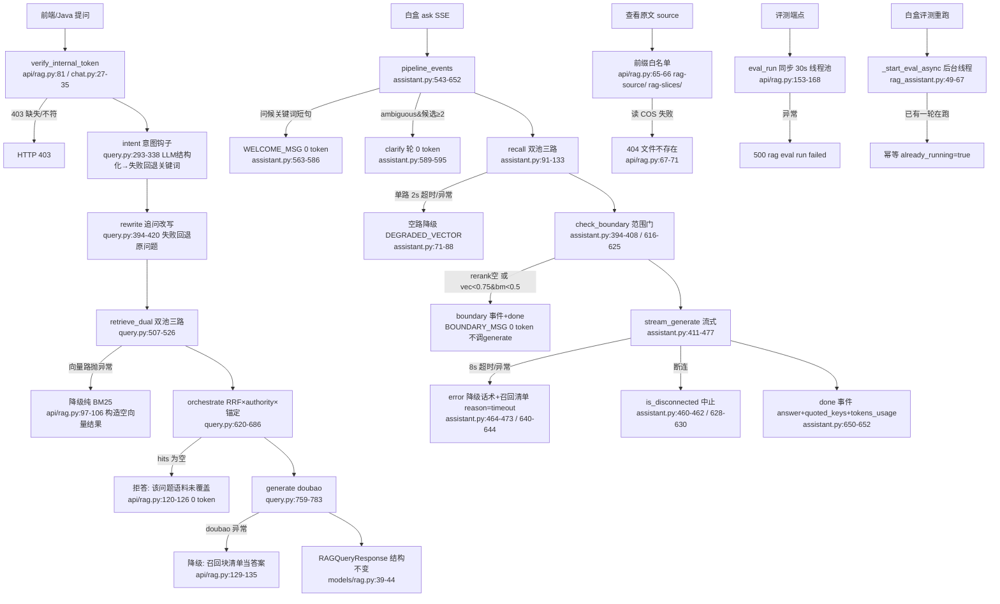

# 分析-07 API 降级与容错（代码真相）

> summary: RAG 系统的 API 降级与容错全貌（代码深读）：①四条降级语义入口（1.6C 检索端点 api/rag.py 的「向量挂→纯 BM25 / doubao 挂→召回块清单当答案 / 无命中→拒答」+ 白盒 assistant 链路的「单路 2s 超时降空路 + 范围门低置信拒答」+ 查看原文 COS 读失败 404 + 评测端点 500）；②范围门 0.75/0.5 只在白盒链路 A9（assistant.py check_boundary）与评测边界拒答类型生效，1.6C /query 端点只有 `if not hits` 空命中拒答、无置信度阈值门（模块 docstring 自称「置信度过低→拒答」与实际代码不符）；③token usage：流式白盒链路已修（ark_stream include_usage + stream_generate 抓 usage chunk + assemble_usage 进 done.tokens_usage），1.6C /query 仍丢（generate 不带 return_usage、RAGQueryResponse 无 usage 字段），embedding 侧 vector_store.embed() 仍丢（resp.usage 未抓）；④降级文案全部写死 0 token（BOUNDARY_MSG / GEN_TIMEOUT_MSG / GEN_FAIL_MSG /「语料未覆盖」），短路纪律=触发边界绝不调 generate 防无谓成本；⑤错误码：403 token 缺失/不符、404 source 文件不存在/无评测报告、500 各端点统一「xxx failed」、SSE 流内错误走 error 事件 code=500。
> 权威度: 0.8
> 模块: rag-system
> COS路径: rag-source/rag-system/代码/分析-07-API降级与容错.md
> 类别：开发难点

## 业务描述与业务场景

**业务描述**：RAG 问答系统对外暴露三类 API——1.6C 检索问答（`/api/tutoring/rag/query`）、白盒链路助手（`/api/rag/assistant/*`，SSE 流式 + 引导 + 评测白盒）、评测工具（`/api/rag/eval/*`）与「查看原文」（`/api/rag/source`）。系统依赖的外部资源有：COS 向量桶（rag-1318177119，向量召回）、COS 普通桶（ai-edu-1318177119，源文件读取）、doubao LLM（意图/改写/生成）、dashscope embedding。任何一个外部依赖挂掉，RAG 都要给前端/面试官一个**结构不变、不空答、不编造、不卡死**的响应——这就是本主题的降级与容错。

**业务场景**：
- 学生/面试官提问时 COS 向量桶网络抖动或 down → 不能 500，要退到本地 BM25 纯关键词召回继续答
- doubao 生成服务超时/异常 → 不能空答，把检索到的召回块清单当答案回
- 问题完全超出语料覆盖（如问天气）→ 拒答固定话术「语料未覆盖」，绝不编造
- 现场演示「重新评测」→ 后台线程真实跑一轮，前端轮询 running 标志，不阻塞 HTTP
- 前端点「查看原文」按 COS key 读源文件 → 读失败给 404 而非 500 崩掉

## 职责

**职责**：把「外部依赖挂掉时的降级语义」落地到每个 API 端点，保证响应结构稳定、话术固定、0 token 兜底、不编造。
**不做什么**：不做权限门/角色过滤（Java 网关产 permission，Python 生产端点从 intent 开始，rag_assistant.py:9 注释）；不做会话状态（turns/close/累计 token 归 Java Redis，Python 无状态）；不做评测的降级掩盖（评测走真实检索原语，向量挂了就暴露，不让降级掩盖真实质量，eval_agent.py:12-15 注释）。

**分工要点**：
- **1.6C 检索端点**（api/rag.py:75-147）：四段降级语义按序（docstring 10-14 行）——向量挂→纯 BM25 / doubao 挂→召回清单 / 无命中→拒答 / 结构不变
- **白盒链路**（core/rag/assistant.py）：单路 2s 超时降空路 + 范围门低置信拒答 + 流式生成超时/异常降级话术 + 断连中止
- **评测**（core/rag/eval_agent.py）：判分解析失败重试 1 次后记 0；边界拒答类型断言触发边界话术（0 token 满分/失败 0 分）
- **CLI 薄壳**（scripts/rag/rag_query.py）：与 API 同语义的降级（向量挂→BM25、无命中→拒答、生成挂→清单），供本地调试

## 高层业务调用链（正常链路 → 异常 → 降级 → 兜底）

> 全部节点对应真实代码；正常链路→异常→降级→兜底的顺序在 api/rag.py:97-147 与 assistant.py:563-652 按注释标明的降级语义排布。

## 代码事实

### api/rag.py 各端点异常处理（1.6C 检索 + source + eval）

| 端点 | try-except 位置 | 降级/兜底返回 | 边界拒答条件 | 证据 |
|---|---|---|---|---|
| `GET /api/rag/source/{file_path}` 查看原文 | 外层 try（67-71） | 读 COS 失败 → **404「文件不存在」**（71） | 前缀非 `rag-source/`/`rag-slices/` → 404（65-66，防任意 COS key 读取）；`verify_internal_token` 不符 → 403 | api/rag.py:57-72 |
| `POST /api/tutoring/rag/query` 1.6C 检索问答 | 内层 try（97-106）包 `retrieve_dual` | **向量路异常 → 降级纯 BM25**：构造 `full/slice/slice_q` 空结果 + `bm25 = retrieve_bm25`，references 仍返回 | 无 | api/rag.py:97-106 |
| 同上 | 内层 try（129-135）包 `generate` | **doubao 异常 → 降级召回块清单当答案**：`"生成服务不可用，以下为检索到的语料：\n- [{file}/{anchor}] {summary}"`（133-135） | 无 | api/rag.py:129-135 |
| 同上 | 无命中分支（120-126） | **拒答**：`answer="该问题语料未覆盖，建议问项目相关话题"`，references=[]，intent/version 仍返回 | `if not hits:`（仅空命中判断，**无置信度阈值**） | api/rag.py:120-126 |
| 同上 | 外层 try（84-142）+ except（143-147） | HTTPException 原样 re-raise（143-144）；其余异常 → **500「rag query failed」**（145-147） | 鉴权 403 | api/rag.py:143-147 |
| `POST /api/rag/eval/run` 触发评测（6.1） | 外层 try（157-165） | 异常 → **500「rag eval run failed」**（166-168）；run_eval 延迟导入 + 线程池不阻塞事件循环 | 鉴权 403 | api/rag.py:153-168 |
| `GET /api/rag/eval/report` 查询报告（6.2） | 外层 try（175-190） | 无报告 → `ok=True, has_report=False, reports=[]`（178-179）；异常 → **500「rag eval report failed」**（191-193） | 鉴权 403 | api/rag.py:171-193 |

### api/rag_assistant.py 白盒端点异常处理

| 端点 | try-except 位置 | 降级/兜底返回 | 证据 |
|---|---|---|---|
| `POST /api/rag/assistant/ask` 非流式 | `_run_once` 无 done → RuntimeError（99-100）；端点 try（117-120） | 异常 → **500「rag assistant ask failed」** | rag_assistant.py:116-120 |
| 同上 流式（SSE） | `gen()` try（127-135） | 异常 → **SSE error 事件 `{"code":"500","message":"rag assistant ask failed"}`**（133-135），不中断已发出的流 | rag_assistant.py:123-141 |
| `POST /api/rag/assistant/eval/run` 重新评测 | `_start_eval_async` 后台线程（49-67） | 已有一轮在跑 → **幂等 `already_running=true`**（不重复触发）；后台异常只记日志（61-62）；线程 daemon 不阻塞 HTTP | rag_assistant.py:49-67 / 203-213 |
| `GET /api/rag/assistant/eval/report` | 外层 try（163-200） | 无报告 → **404「暂无评估报告」**（166-167）；异常 → **500「rag assistant eval report failed」** | rag_assistant.py:155-200 |
| `GET /api/rag/assistant/guide` | 无 try | 静态池 0 token，`current_project` 未知 → `FALLBACK_MODULE`（ai-tutoring，guide_pool.py:313） | rag_assistant.py:144-152 |

### core/rag/query.py 意图/改写/生成的内部降级

| 环节 | 降级行为 | 证据 |
|---|---|---|
| `intent` 意图钩子 | `_llm_intent` 失败/超时/非法 JSON → 返回 `{}` → `intent` 回退关键词锚定（模块 `_fallback_module` + 节 `_fallback_anchor`），`degraded=True` 标记 | query.py:227-258（except 256-258）/ 293-338（degraded 304、回退 306-317） |
| `_llm_intent` LLM 参数 | doubao mini 关思考 + 0 温度 + **20s 超时 + max_retries=0**（意图判断要快，不卡 RAG 查询） | query.py:235-239 |
| `classify`/`_llm_category` | LLM 判类失败 → `""` → 回退 `_fallback_anchor` 关键词 | query.py:341-352 / 355-376（except 374-376） |
| `rewrite_query` 追问改写 | LLM 失败/空 → **回退原问题**（不降级成空串） | query.py:394-420（except 418-420） |
| `_deictic_anchor` 指代兜底 | LLM 把「这个功能底层怎么实现」误判跳 rag-system → 强制 anchor=current_project（改法4） | query.py:275-290 |
| `generate` 生成 | 默认不返回 usage（`return_usage=False` → 仅返回 str）；评测侧传 `return_usage=True` 才拿 usage | query.py:759-783（776-783） |
| `_load_all_blocks` | 多模块 jsonl **缺失文件跳过容错**（os.path.exists 检查），不因一个模块文件缺崩整链路 | query.py:436-449（445-448） |
| `select_corpus` | 该模块无语料 → 返回空池 → 编排层自然低置信过滤（C1 设计：无语料模块拒答正确） | query.py:609-617 |

### 范围门 0.75/0.5：只在白盒链路 A9 生效（1.6C 端点无此门）

- **白盒链路**：`assistant.py:388-391` 定义 `BOUNDARY_VEC_CONF=0.75` / `BOUNDARY_BM_CONF=0.5` / `BOUNDARY_MSG="未找到关联文档，我尚未掌握。"` / `BOUNDARY_REASON="low_confidence"`。
- `check_boundary(rerank, vec_conf, bm_conf)`（assistant.py:394-408）判定规则：
  1. `if not rerank:` → 拒答（C1 唯一拒答路径，rerank 空 = 无语料模块/无命中）
  2. `vec_conf < 0.75 and bm_conf < 0.5` → 拒答（双路都低才算低置信；单路高即过，双路互补）
  3. 否则 → `None` 通过
- 实际调用在 `pipeline_events`（assistant.py:616-625）：`vec_conf = max(rec["vec"]["confidence"], rec["vec2"]["confidence"])`（双池任一置信即不算低）→ 触发则发 boundary 事件 + **立即 done，不调 generate**（短路纪律，注释：rerank 空时 doubao 会自生成"未覆盖"话术 32 token，编排器必须防无谓成本）。
- **1.6C 检索端点无此门**：api/rag.py:120 只 `if not hits:`（空命中拒答），不读 vec_conf/bm_conf，不 import `check_boundary`。低置信但非空的命中仍进 generate。模块 docstring（api/rag.py:13「置信度过低 → 拒答」）与实际代码不符（见对账要点）。
- **评测边界拒答类型**：`eval_agent._boundary_trace`（eval_agent.py:307-347）复用 `check_boundary`（316-320），`vec_conf=max(full, slice)`；触发 → score=5，未触发（意外高置信）→ score=0（334-336），0 token 不进 generate。

### token usage 是否丢失（语雀-问题4 对账）

| 侧 | 现状 | 证据 |
|---|---|---|
| **流式白盒链路** | **已修**：`stream_generate` 传 `include_usage=True`（assistant.py:448）→ ark_stream 发 `stream_options={"include_usage": True}`（ark_stream.py:128-129）→ 流末尾 usage chunk（choices 为空带顶层 usage）被 yield（assistant.py:476-477）→ `assemble_usage` 组装 prompt/completion/cache_hit/total（assistant.py:486-502）→ done 事件 `tokens_usage` 字段（assistant.py:514 / 651） | assistant.py:448, 476-477, 486-502, 514, 651 |
| **1.6C /query 端点** | **仍丢**：`generate(hits, rewritten)` 未带 `return_usage=True`（api/rag.py:130）；`RAGQueryResponse` 模型无 usage 字段（models/rag.py:39-44，契约只有 answer/references/intent/version） | api/rag.py:130；models/rag.py:39-44 |
| **embedding 侧** | **仍丢**：`vector_store.embed()` 只返回向量，`resp.usage.total_tokens` 未抓（语雀-问题4 建议未落地） | vector_store.py:87-103 |
| **评测侧** | **已抓**：`generate(hits, question, return_usage=True)`（eval_agent.py:263）+ `judge_quality` 抓 usage（147, 155-157）→ `aggregate` 算 avg_tokens / cost_yuan | eval_agent.py:263-278, 371, 385-386 |

### 向量 / COS / embedding 挂了的降级路径

| 故障 | 1.6C 端点 | 白盒链路 | 证据 |
|---|---|---|---|
| **COS 向量桶 query 失败** | `retrieve_dual` 抛异常 → 捕获 → 降级纯 BM25（构造空向量结果） | `_recall_vector` 捕获 → 空路 `{"hits":[], "confidence":0.0}` + `DEGRADED_VECTOR="vector_timeout"` | api/rag.py:97-106；assistant.py:71-88, 112-116 |
| **向量召回超时** | 无单独超时（外层异常兜底） | 单路 **2s 超时**（`asyncio.wait_for` + `run_in_threadpool`，`RAG_RECALL_TIMEOUT`）→ 降空路 | assistant.py:79-85；settings.py:119 |
| **embedding（dashscope）失败** | `query_vector` 内 `embed(text)` 抛异常（vector_store.py:159）→ 冒泡到 retrieve_dual → BM25 降级 | 同左（`_recall_vector` 捕获） | vector_store.py:150-175（query_vector raise 172-175）；vector_store.py:87-103（embed） |
| **BM25 路无命中（语料池空/本地无匹配）** | 直接走 orchestrate → hits 可能空 → 拒答 | `DEGRADED_BM25="bm25_empty"` 标记 | api/rag.py:120-126；assistant.py:115-116 |
| **COS 普通桶读源文件失败** | source 端点 → 404 | — | api/rag.py:67-71 |
| **doubao 生成挂（超时/异常）** | 降级召回块清单当答案 | 流式降级话术（超时 `GEN_TIMEOUT_MSG` / 异常 `GEN_FAIL_MSG`）+ 召回清单，`reason="timeout"` | api/rag.py:129-135；assistant.py:161-162, 464-473, 640-644 |
| **全挂（召回+生成都不可用）** | BM25 降级后 hits 仍空 → 拒答话术兜底 | `check_boundary` rerank 空 → BOUNDARY_MSG 兜底 | api/rag.py:120-126；assistant.py:404-405 |

## 枚举常量配置表

### 超时

| 常量 | 值 | 用途 | 证据 |
|---|---|---|---|
| `RAG_RECALL_TIMEOUT` | 2.0s | 白盒向量召回单路超时 | settings.py:119；assistant.py:81 |
| `RAG_GEN_TIMEOUT` | 8.0s | 流式生成超时 | settings.py:120；assistant.py:448, 464 |
| intent/classify/rewrite LLM `request_timeout` | 20s，`max_retries=0` | 意图/改写短调用，快不卡 | query.py:236-238, 361-364, 402-405 |
| generate LLM `request_timeout` | 60s，`max_retries=1` | 生成长调用，允许 1 次重试 | query.py:752-755 |
| judge LLM `request_timeout` | 30s，`max_retries=0` | 判分调用 | eval_agent.py:186-190 |

### 阈值

| 常量 | 值 | 语义 | 证据 |
|---|---|---|---|
| `BOUNDARY_VEC_CONF` | 0.75 | 向量（索引层）低置信阈值，`vec_conf < 0.75 and bm_conf < 0.5` 双路都低才拒答 | assistant.py:388, 406 |
| `BOUNDARY_BM_CONF` | 0.5 | BM25（源）低置信阈值 | assistant.py:389, 406 |
| `ANCHOR_WEIGHT` | 1.5 | 锁定节加权（非降级，属编排） | query.py:63, 665 |
| `RRF_K` | 60 | RRF 融合常数 | query.py:43, 653-659 |
| BM25 confidence | `min(1.0, top_score/10.0)` | BM25 置信度折算 | query.py:577 |

### 降级文案（全部写死，0 token）

| 文案 | 触发 | 证据 |
|---|---|---|
| `"该问题语料未覆盖，建议问项目相关话题"` | 1.6C 无命中拒答 | api/rag.py:122 |
| `"生成服务不可用，以下为检索到的语料：\n- [{file}/{anchor}] {summary}"` | 1.6C doubao 挂 | api/rag.py:133-135 |
| `"未找到关联文档，我尚未掌握。"`（BOUNDARY_MSG） | 白盒范围门低置信拒答 | assistant.py:390 |
| `"生成服务超时，未能生成完整答案。以下为检索到的参考资料："`（GEN_TIMEOUT_MSG） | 流式生成 8s 超时 | assistant.py:161 |
| `"生成服务异常，未能生成完整答案。以下为检索到的参考资料："`（GEN_FAIL_MSG） | 流式生成异常 | assistant.py:162 |
| `"本轮对话已结束，可开启新对话。"`（CLOSED_MSG） | 会话 closed 后提问（Java 网关返回，Python 写死供契约对齐） | assistant.py:165 |
| `WELCOME_MSG` | 问候短句（你好/hi 等 ≤8 字） | assistant.py:362-363, 366-372 |

### 错误码 / 语义标记

| 码/标记 | 语义 | 证据 |
|---|---|---|
| 403 | `verify_internal_token` 缺失或与 `settings.INTERNAL_TOKEN` 不符 | chat.py:27-35 |
| 404 | source 文件不存在 / 前缀非法；无评测报告 | api/rag.py:66, 71；rag_assistant.py:167 |
| 500 | 各端点统一「xxx failed」（rag query / rag eval run / rag eval report / rag assistant ask / rag assistant eval report） | api/rag.py:147, 168, 193；rag_assistant.py:120, 200 |
| SSE error 事件 `{"code":"500",...}` | 流式 ask 异常不中断已发流，改发 error 事件 | rag_assistant.py:133-135 |
| `reason="low_confidence"` | boundary 事件原因 | assistant.py:391, 623-624 |
| `reason="timeout"` | 生成降级原因（超时/异常统一） | assistant.py:483, 642 |
| `DEGRADED_VECTOR="vector_timeout"` / `DEGRADED_BM25="bm25_empty"` | 召回降级标记 | assistant.py:27-28 |

## 隐性坑

- **范围门 0.75/0.5 只在白盒链路生效，1.6C /query 没有置信度门**：api/rag.py:120 只有 `if not hits`（空命中拒答），模块 docstring（api/rag.py:13）却写「置信度过低 → 拒答」——面试时若说「所有端点都有 0.75/0.5 范围门」会被 1.6C 端点反证。真实是：白盒 A9 有阈值门（assistant.py:388-408），1.6C 端点只有空命中门。
- **`DEGRADED_VECTOR`/`DEGRADED_BM25` 标记定义了但未透传**：`recall` 返回 `degraded` 列表（assistant.py:112-116, 129），注释声明「供 done/boundary 事件透传 degraded 语义」（26-28 行），但 `pipeline_events` 的 rerank 事件只发 `{"blocks":...}`（613）、done 事件只走 `assemble_done`（无 degraded 参数，505-518）——降级标记实际没进任何 SSE 事件，前端拿不到「这轮是降级」的显式信号。
- **1.6C 端点生成失败降级不区分超时/异常**：doubao 挂只有一种话术「生成服务不可用」（api/rag.py:133），而白盒链路区分 `GEN_TIMEOUT_MSG`/`GEN_FAIL_MSG` 且 reason 统一 "timeout"（assistant.py:161-162, 483）。
- **`_llm_intent`/`_llm_category` 关重试（max_retries=0）+ 20s 超时**：意图判断失败就降级关键词，不会重试拖慢；但代价是网络抖动时意图质量不稳（对账 K1 的「6/10→10/10」就是靠 LLM 而非关键词）。
- **查看原文的 404 语义**：读 COS 失败与「文件不存在」都返回 404（api/rag.py:66, 71），前端无法区分「真的没有」vs「COS 挂了」——但换来了不暴露内部错误。
- **评测边界拒答走 `_boundary_trace` 而非普通链路**：边界拒答类型 0 token、quoted 空、score 0/5 二值（eval_agent.py:307-347），聚合时 `judged=True` 但 `hit=False`/`precision=0`——评测报告里边界用例与普通用例指标不可混读。
- **流式生成断连只在 generate 前/中检测**：`request.is_disconnected()` 在 generate 前（assistant.py:628-630）和每轮 queue.get 前（460-462）检测，但注释明确「不掐 httpx 流，在途流由前端取消」——断开后到下一次检测之间有残留 token 会继续产出。

## 设计要点

- **四段降级语义按序 + 结构不变**（api/rag.py:10-14）：向量挂→纯 BM25（references 仍返回）/ doubao 挂→召回块清单当答案（不空答）/ 无命中→拒答（不编造）/ 所有路径 `RAGQueryResponse` 结构一致——前端只按同一结构渲染，这是「降级对前端透明」的关键（models/rag.py:39-44）。
- **短路纪律（防无谓成本）**：白盒边界触发后**立即 done、绝不调 generate**——注释明确 rerank 空时 doubao 会自生成「未覆盖」话术 32 token，编排器必须拦（assistant.py:556 注释, 616-625）。
- **单路超时降级而非整链路失败**：白盒向量召回每路独立 2s 超时（`_recall_vector`），一路挂只影响该路，BM25 本地路永远可用（assistant.py:71-88, 91-133；BM25 纯本地 query.py:533-578）。
- **评测不降级**：评测走真实检索原语（`retrieve_vector`/`retrieve_bm25`/`orchestrate`），不走带降级语义的 API——向量挂了就暴露，不让降级掩盖真实质量问题（eval_agent.py:12-15, 235-242）。
- **0 token 兜底矩阵**：边界拒答（BOUNDARY_MSG）、生成超时/异常（GEN_TIMEOUT_MSG/GEN_FAIL_MSG）、问候/澄清（WELCOME_MSG/CLARIFY_MSG）、会话关闭（CLOSED_MSG）全是写死话术，不调 LLM，成本为 0。
- **异步评测防重复**：`_start_eval_async` 用 threading.Lock 包裹 `_eval_running` 全局标志，已有一轮在跑 → 幂等 `already_running=true`（rag_assistant.py:49-67, 203-213），后台线程 daemon 不阻塞 HTTP。
- **降级语义复用**：CLI（scripts/rag/rag_query.py:34-72）与 1.6C API 同一套降级（向量挂→BM25 / 无命中→拒答 / 生成挂→清单），本地调试所见即线上行为。

## 对账要点

| 对账分类 | 项 | 语雀/完善文档口径 | 代码现状 | 结论 |
|---|---|---|---|---|
| 方案vs实现 | 范围门 0.75/0.5 | 完善文档 09 称「范围门(后置)：检索置信度阈值——索引层 0.75 / 源文档池 0.5」 | 仅白盒链路 A9 生效（assistant.py:388-408 + pipeline_events:616-625）+ 评测边界类型（eval_agent.py:307-347）；1.6C /query 端点无此门，只有 `if not hits` 空命中拒答 | ⚠️ 部分落地（白盒有、1.6C 端点无） |
| 注释vs行为 | 1.6C「置信度过低→拒答」 | api/rag.py:13 模块 docstring 自称降级语义 3 | 代码只判 `not hits`（api/rag.py:120-126），不读置信度 | ⚠️ 翻转（docstring 高于实际） |
| 方案vs实现 | token usage 真算 | 语雀-问题4「现有代码在丢 usage」，建议加 `stream_options.include_usage` + 抓结尾 usage chunk | 流式白盒已修（ark_stream.py:128-129 + assistant.py:448, 476-477, 486-502, 651）；1.6C /query 仍丢（api/rag.py:130 不带 return_usage，RAGQueryResponse 无 usage 字段）；embedding 侧仍丢（vector_store.py:87-103 未抓 resp.usage） | ⚠️ 半落地（流式修、1.6C 与 embedding 未修） |
| 方案vs实现 | 降级标记透传 | assistant.py:26-28 注释声明 `DEGRADED_VECTOR/DEGRADED_BM25`「供 done/boundary 事件透传 degraded 语义」 | `recall` 返回 `degraded` 列表但 `pipeline_events` 未把它放进 rerank/done 事件（613, 650-652） | ⚠️ 方案有/代码无（标记未透传） |
| 方案vs实现 | 降级矩阵 | 完善文档 06「多路召回本身就是降级备份（向量挂→纯 BM25）；生成失败 → 预写答案兜底；全挂 → 边界话术」 | 向量挂→纯 BM25（api/rag.py:97-106）、生成挂→召回清单（129-135）、全挂→拒答话术（120-126）均落地 | ✅ 落地 |
| 方案vs实现 | 边界原则三则 | 完善文档 09「语料没覆盖→拒答不编造 / 生成失败→references 当答案不空答 / 全挂→边界话术兜底」 | 1.6C 三则全落地；白盒链路用 BOUNDARY_MSG + GEN_*_MSG 各自落地 | ✅ 落地 |
| 方案vs实现 | 两道门 | 语雀-问题4「权限门(前置)+范围门(后置)」 | 权限门=`verify_internal_token`（chat.py:27-35，Java 网关产 permission，Python 从 intent 开始）；范围门=白盒 A9（0.75/0.5） | ✅ 权限门落地/范围门仅白盒（见上） |
| 方案vs实现 | 评测边界拒答 0 token | eval_agent.py:33-34 注释「断言=触发固定话术+0 token」 | `_boundary_trace` 0 token、不进 generate、score 5/0 | ✅ 落地 |

## 已读代码清单

- `ai-edu-ai-service/api/rag.py`（193 行，全文：1.6C 检索四段降级 + source 404 + eval 500）
- `ai-edu-ai-service/api/rag_assistant.py`（213 行，全文：白盒 ask SSE/非流式异常 + guide + eval 异步跑/报告）
- `ai-edu-ai-service/core/rag/query.py`（823 行，全文：intent/classify/rewrite 降级 + retrieve_dual + orchestrate + generate/usage）
- `ai-edu-ai-service/core/rag/assistant.py`（652 行，全文：_recall_vector 超时降级 + check_boundary 范围门 + stream_generate 降级 + pipeline_events）
- `ai-edu-ai-service/core/rag/eval_agent.py`（389 行，全文：judge 重试记 0 + _boundary_trace 边界拒答 + usage/cost）
- `ai-edu-ai-service/scripts/rag/rag_query.py`（76 行，全文：CLI 降级语义同 API）
- `ai-edu-ai-service/models/rag.py`（65 行，全文：RAGQueryResponse 无 usage 字段）
- `ai-edu-ai-service/config/settings.py`（超时 RAG_RECALL_TIMEOUT/RAG_GEN_TIMEOUT + COS 桶配置）
- `ai-edu-ai-service/core/tutoring/vector_store.py`（embed 未抓 usage / query_vector 异常冒泡 / get_normal_cos_client）
- `ai-edu-ai-service/api/chat.py`（verify_internal_token 27-35）
- `ai-edu-ai-service/core/tutoring/ark_stream.py`（include_usage 39/59/128-129 流式 usage 已修）
- `ai-edu-ai-service/core/rag/guide_pool.py`（FALLBACK_MODULE=ai-tutoring，313 行）

**参照材料（对账用，非代码真值）**：`docs/rag/rag-system/1.语雀/原来的文件/语雀-问题4-pfvgr18xlii4tfg4.md`（token usage 丢失）、`docs/rag/rag-system/4.完善文档/09-权限与边界.md` + `06-关键坑与解法.md`、`docs/rag/rag-system/5.难点/坑档案-开发与验证.md`。
