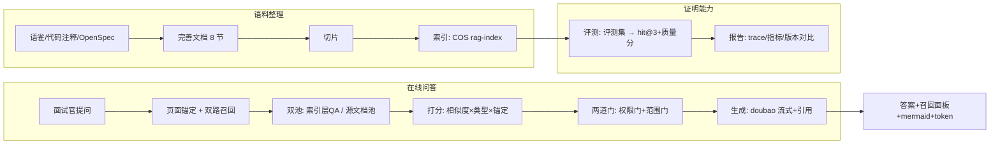

# 04 数据流转

> 模块=rag-system｜节=04｜问题表=数据关联｜权威度=高（正文）

## 为什么（语雀/动机）

面试官要看"这系统数据怎么流转"——从语料整理到检索到生成到评测，一条链路讲清楚。也涉及跨模块（RAG 怎么讲 AI答疑/知识图谱的故事）。

## 怎么设计（方案）——数据流全景



**跨模块数据流**（RAG 怎么讲业务）：
```
AI答疑 → 掌握度 → 图谱点亮 → 薄弱点分析（闭环）
```
RAG 通过**跨页检索多页引用**来呈现这个闭环（一页答主线，跨页引用其他模块的支撑）。

## 落地真相（代码）

- 语料层：`docs/rag/<模块>/`（语雀/OpenSpec/代码分析/完善文档/坑档案），AI答疑 234 块已切片索引。
- 检索层：`core/rag/query.py`——向量(COS query_vectors) + BM25(本地 jsonl) → RRF → 编排。
- 生成层：`POST /api/tutoring/rag/query` → `{answer, references[], intent, version}`。
- 评测层：`scripts/rag/run_eval.py` → trace + 报告 + 版本对比。

## 追问与防御

- **"双池怎么关联？"** → 索引层 QA ↔ 源文档池，doc_type 区分（qa/source），共用同一 COS 索引；QA 条目带 references 回源。
- **"跨模块怎么讲？"** → 跨页检索多页引用（每页标注 §节号），一答串起闭环。
