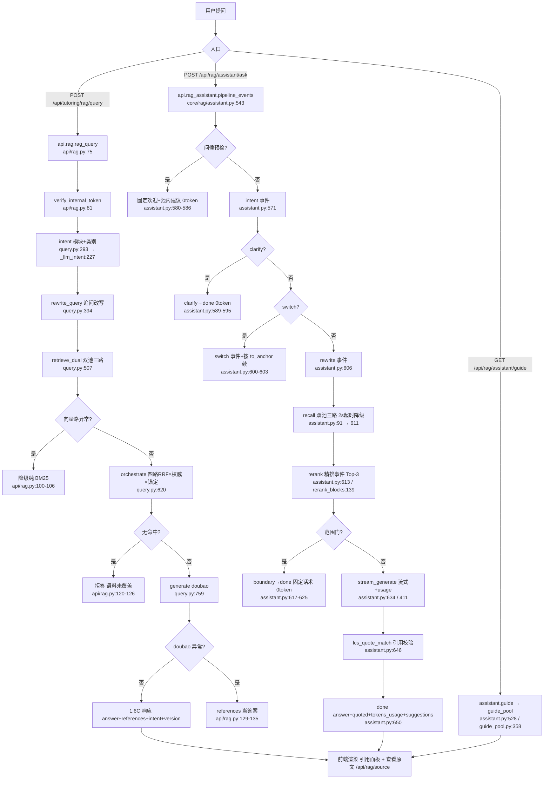

# 分析-01-整体架构与调用链-业务与流程

> summary: 整体架构与调用链业务与流程
> 来源: 切片 ｜ 锚点: 业务与流程
> 节: 分析-01-整体架构与调用链
> COS路径: rag-slices/rag-system/代码/分析-01-整体架构与调用链-业务与流程.md
> 类别：业务流程
> target: 面试项目问答

---

## 业务描述与业务场景

RAG 问答系统是给「AI答疑」项目面试准备用的问答引擎：把项目语料（完善文档/代码/语雀/OpenSpec）切片进向量桶，面试官提问后双池召回 + doubao 生成带引用的口述答案，并用评测 agent 用数据证明"检索准、答案好"。它不是纯 RAG——产品是"讲清每个页面"，RAG 是证明能力的引擎。

典型场景：
1. **面试问答（主链路）**：面试官在页面提问 → 系统返回答案 + 来源引用 + 语料版本；追问靠 history 改写补全指代，期望答案可溯源、不编造。
2. **引导入口**：用户进页面点引导问题，或会话结束给建议 → 期望 0 token 返回池内原题，点开即答。
3. **评测闭环（离线）**：触发评测（API 或 CLI）→ 跑评测集 → 聚合 hit@k/质量分/cost/latency 落盘报告，期望可版本对比证明有效。

## 职责

一句话：编排"意图 → 双池召回 → RRF 融合 → 生成"的检索问答链路，并给评测/引导/查看原文配套端点。明确不做三件事：不落会话状态（Python 无状态，history/trace_id 由 Java 传入只消费，turns/close/累计 token 归 Java Redis）；不产权限（角色门在 Java）；不做图谱检索召回（语料是文档不是图谱）。

模块分工要点（两个生产入口 + 一套核心单元）：
- 旧 1.6C 契约端点：同步非流式问答（带三级降级）+ 查看原文 + 评测触发/查报告。
- 白盒链路端点：SSE 流式/非流式问答（事件时序 intent→clarify|switch→rewrite→rerank→boundary|token→done）+ 引导入口 + 报告白盒 + 后台线程重跑评测。
- 检索编排核心单元（两入口共用）：intent（模块+类别）→ rewrite → retrieve_dual（双池三路）→ orchestrate（四路 RRF×authority×锚定）→ generate。
- 白盒编排引擎：把检索单元编排成事件流，追加澄清/切换/范围门/引用校验/建议/usage 组装。
- 评测 agent：真实检索原语（不降级）+ hit@k + LLM 判分 + 聚合。
- 引导底座池：每模块 {方向→问题} 静态池，是引导/建议的数据源。
- CLI 薄壳与评测执行脚本：复用同一套检索单元，供本地调试与批量评测落盘。

## 高层业务调用链（用户提问→双池检索→生成）

两条生产入口共享同一套检索单元，但分支语义不同。

关键降级分支汇总：
- 旧 query 端点三级降级：COS 向量挂 → 纯 BM25；doubao 挂 → references 当答案；无命中 → 拒答"该问题语料未覆盖"。所有降级响应结构不变。
- 白盒链路降级：向量路超时 → 空路 + degraded 标记；BM25 无命中 → degraded；范围门触发 → boundary 固定话术、短路不调 generate；生成超时/异常 → 写死话术 + 召回清单，0 token。

> 证据：详见 `3.代码/分析-01-整体架构与调用链.md`（§业务描述与业务场景 / §职责 / §高层业务调用链）｜ `4.完善文档/01-产品定位.md` / `02-核心功能.md`
