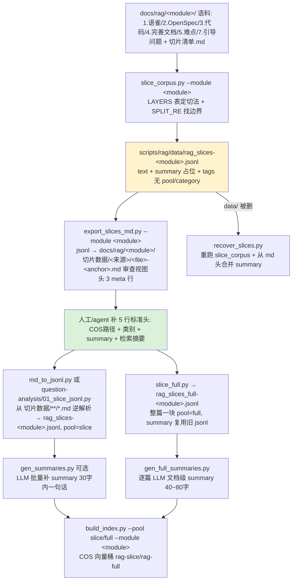

# 分析-02-语料切片与预处理-业务与流程

> summary: 语料切片与预处理业务与流程
> 来源: 切片 ｜ 锚点: 业务与流程
> 节: 分析-02-语料切片与预处理
> COS路径: rag-slices/interview/rag-system/分析-02-语料切片与预处理-业务与流程.md
> 类别：业务流程
> target: 面试项目问答

---

## 业务描述与业务场景

RAG 问答系统要回答面试官"你们怎么把散落的语料变成能检索的知识块"。这套代码就是语料加工流水线——把每模块的原始 md（语雀、设计决策、代码分析、坑档案、引导问题）按固定规则切成检索粒度的小块，配上"解决什么问题"的摘要和模块/来源/权威度/类别标签，最终落成两池 jsonl（细节切片池 + 整篇全量池），再交给索引器进 COS 向量桶。

典型场景：
1. 面试官问"语料怎么切的、为什么不把整篇都丢进去"，需要讲清切片边界规则（按几级标题切、哪些段过滤掉、超长怎么拆）。
2. 面试官问"切片池和全量池什么关系"，需要讲清双池各自怎么产、字段结构、摘要怎么生成。
3. 语料整理的人要新增一个模块（rag-system），需要知道复用哪条脚本路径、5 个来源怎么组织、头部标签怎么写才不被漏。

## 职责

把 `docs/rag/<module>/` 的原始语料 md 按 `切片清单.md` 定稿逻辑切成检索块，导出人读审查 md 视图，再逆解析成带完整标签的双池 jsonl（切片池 + 全量池），供索引导入 COS。

**不做什么**：不做 embedding / 索引 / 查询（那是索引器与查询链路的职责）；不做语料内容对齐（那是代码深读/完善文档/语雀 canonical 的职责）；不做引导问题列表生成（单独脚本管）。

**分层分工要点**：离线脚本层负责切片/导出/摘要/恢复全流程，不占在线链路；核心逻辑层只消费 jsonl 索引后的向量桶，不直接读语料 md。本模块无 Java 后端、无前端，代码层只在 Python 服务与离线脚本范围内。

## 高层业务调用链（语料切片与预处理流水线）

**文字链路复述**：各模块原始语料（语雀/OpenSpec/代码/完善文档/坑档案/引导问题 + 切片清单.md）先进切片脚本——用 LAYERS 表定每来源切法、SPLIT_RE 找标题边界，产出 jsonl（text + summary 占位 + 无 pool/category 的 tags）。再把 jsonl 导出成人读的审查视图 md（每块一个文件、头 3 meta 行），由人工/agent 补上 5 行标准头（COS路径 + 类别 + summary + 检索摘要）。此后分两条路：切片池从审查视图 md 逆解析回 jsonl（pool=slice），可选用 LLM 批量补每块 ≤30 字一句话摘要；全量池把源文档整篇做成一块（pool=full），逐篇用 LLM 生成 40~80 字文档级摘要。两池 jsonl 汇入索引器，分别进 COS 向量桶 rag-slice / rag-full。

**异常/降级分支**：
- 块不足 60 字符（纯标题/空）→ 直接丢弃
- 超长块：split 模式按段落贪心拆成多块、不丢尾部；file/guided 模式超 12000 字截断并标注 `[已截断]`
- OpenSpec 命中 `Risks/Migration/OpenQuestions/Non-Goals/Goals` 等段 → 整段丢弃不切
- LLM 摘要批量失败 → 该批留空，可重跑；全量池逐篇失败 → 保留旧摘要
- `data/` jsonl 被删 → 恢复脚本重跑切片 + 从 md 头合并摘要（头格式敏感）
- md 头字段缺失 → 只告警不中断

> 证据：详见 `3.代码/分析-02-语料切片与预处理.md`（§业务描述与业务场景 / §职责 / §高层业务调用链）｜ `4.完善文档/04-数据流转.md`
