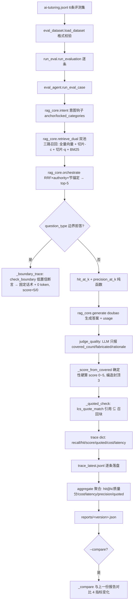

# 分析-06-评测-业务与流程
> summary: 评测agent业务与流程
> 来源: 切片 ｜ 锚点: 业务与流程
> 节: 分析-06-评测
> COS路径: rag-slices/interview/rag-system/分析-06-评测-业务与流程.md
> 类别：业务流程
> target: 面试项目问答

---

## 业务描述与业务场景

**业务描述**：评测 agent 是 rag-system 的"质量把关工具"——预写评测集（Q&A + 预期引用 + 预期要点），对每条问题走一遍真实检索→生成→判分，产出 hit@k（检索是否捞得对）、answer_quality 质量分（答案是否答得好）、cost（贵不贵）、latency（快不快），trace 逐条落盘 + 聚合报告 + 跨语料版本对比，用数据证明"这套 RAG 系统靠谱"。

**业务场景**：
- 面试官问"怎么证明 RAG 有效"，亮出评测集 + hit@k + 质量分 + 成本/耗时报告（语雀-问题12 的"证明方案"）
- 改切片策略/检索参数/提示词后，运行带版本对比的评测命令，对比前后 hit@k/质量分变化（回归验证）
- 定位问题：先测 hit@k 看"检索捞得对不对"，再测质量分看"答案答得好不好"，分层定位

**定位**：内部评测工具，离线/手动触发，不碰线上问答主链路。

## 职责

**职责**：评测集加载与格式校验 → 单条评测（真实检索 + hit@k + 生成 + LLM 判分 + 引用校验 + cost/latency）→ 逐条 trace 落盘 → 聚合指标 → 报告对比。
**不做什么**：不做线上/生产评测服务；不引入 RAGAS 全量框架（聚焦 hit@k + LLM 判分两个信号）；不自动改语料；不采集真实用户反馈。
**分工要点**：判分核心模块负责纯函数指标（hit_at_k / precision_at_k / calc_cost / 分数硬算）+ LLM 判分 + 单条执行 + 聚合；评测执行入口是命令行（--compare + trace/报告落盘）；评测集校验模块负责闭集/字段/最小条数校验；评测集数据当前为 ai-tutoring.jsonl。

## 高层业务调用链（eval集→真实检索→生成→判分→报告）

**文字链路复述**：评测集 ai-tutoring.jsonl（6 条）→ 格式校验 → 逐条评测 → 单条执行：先意图钩子拿锚点（anchor/locked_categories）→ 双池召回（全量向量 + 切片-c + 切片-q + BM25）→ RRF×authority×节锚定出 top-5 → 判断是否边界拒答：是则低置信断言走固定话术（0 token，score=5/0）；否则纯函数算 hit@k / precision@k → doubao 生成答案（带回 usage）→ LLM 判分只报事实（covered_count/fabricated/rationale）→ 确定性硬算 score 0~5（编造封顶 3）→ LCS 引用校验（引用 ⊆ 召回块）→ 组装 trace（recall/hit/score/quoted/cost/latency）→ 逐条落盘 → 聚合（hit@k/质量分/cost/latency/precision/quoted）→ 报告落盘 → 可选与上一份报告对比 4 指标变化。

> 证据：详见 `3.代码/分析-06-评测.md`（§业务描述与业务场景/§职责/§高层业务调用链）｜ `4.完善文档/08-数据规模与指标.md`
