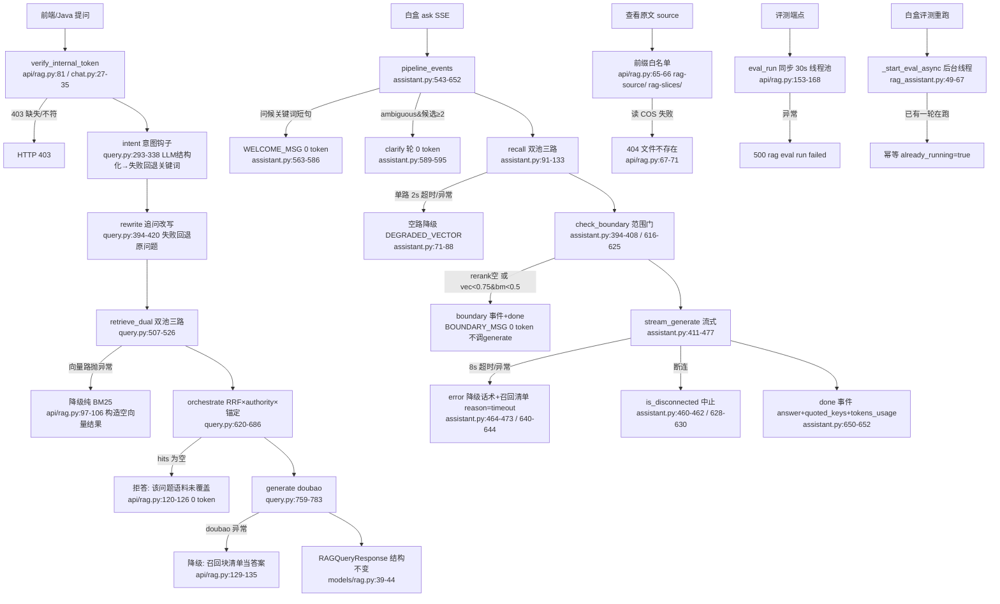

# 分析-07-API降级与容错-业务与流程

> summary: API降级与容错完整降级流程业务与流程
> 来源: 切片 ｜ 锚点: 业务与流程
> 节: 分析-07-API降级与容错
> COS路径: rag-slices/interview/rag-system/分析-07-API降级与容错-业务与流程.md
> 类别：业务流程
> target: 面试项目问答

---

## 业务描述与业务场景

**业务描述**：RAG 问答系统对外暴露三类 API——1.6C 检索问答（`/api/tutoring/rag/query`）、白盒链路助手（`/api/rag/assistant/*`，SSE 流式 + 引导 + 评测白盒）、评测工具（`/api/rag/eval/*`）与「查看原文」（`/api/rag/source`）。系统依赖的外部资源有：COS 向量桶（向量召回）、COS 普通桶（源文件读取）、doubao LLM（意图/改写/生成）、dashscope embedding。任何一个外部依赖挂掉，RAG 都要给前端/面试官一个**结构不变、不空答、不编造、不卡死**的响应——这就是本主题的降级与容错。

**业务场景**：
- 学生/面试官提问时 COS 向量桶网络抖动或 down → 不能 500，要退到本地 BM25 纯关键词召回继续答
- doubao 生成服务超时/异常 → 不能空答，把检索到的召回块清单当答案回
- 问题完全超出语料覆盖（如问天气）→ 拒答固定话术「语料未覆盖」，绝不编造
- 现场演示「重新评测」→ 后台线程真实跑一轮，前端轮询 running 标志，不阻塞 HTTP
- 前端点「查看原文」按 COS key 读源文件 → 读失败给 404 而非 500 崩掉

## 职责

**职责**：把「外部依赖挂掉时的降级语义」落地到每个 API 端点，保证响应结构稳定、话术固定、0 token 兜底、不编造。
**不做什么**：不做权限门/角色过滤（Java 网关产 permission，Python 生产端点从 intent 开始）；不做会话状态（turns/close/累计 token 归 Java Redis，Python 无状态）；不做评测的降级掩盖（评测走真实检索原语，向量挂了就暴露，不让降级掩盖真实质量）。

**分工要点**：
- **1.6C 检索端点**：四段降级语义按序——向量挂→纯 BM25 / doubao 挂→召回清单 / 无命中→拒答 / 结构不变
- **白盒链路**（core/rag/assistant.py）：单路 2s 超时降空路 + 范围门低置信拒答 + 流式生成超时/异常降级话术 + 断连中止
- **评测**（core/rag/eval_agent.py）：判分解析失败重试 1 次后记 0；边界拒答类型断言触发边界话术（0 token 满分/失败 0 分）
- **CLI 薄壳**（scripts/rag/rag_query.py）：与 API 同语义的降级（向量挂→BM25、无命中→拒答、生成挂→清单），供本地调试

## 高层业务调用链（正常链路 → 异常 → 降级 → 兜底）

> 文字链路复述：前端/Java 提问先过内部 token 鉴权（不符给 403）→ intent 意图钩子（LLM 结构化，失败回退关键词）→ rewrite 追问改写（失败回退原问题）→ retrieve_dual 双池三路召回（向量路异常降级纯 BM25）→ orchestrate 编排（RRF × authority × 锚定，hits 为空则拒答「语料未覆盖」0 token）→ generate doubao（异常降级召回块清单当答案）→ RAGQueryResponse 结构不变。白盒 ask 走 SSE 事件流：问候/澄清先短路 0 token → recall 双池三路（单路 2s 超时降空路）→ check_boundary 范围门（rerank 空或 vec<0.75 且 bm<0.5 → boundary 事件 + 立即 done，不调 generate）→ 流式生成（8s 超时/异常发 error 降级话术 + 召回清单，断连中止）→ done 事件带 answer + quoted_keys + tokens_usage。查看原文按前缀白名单读 COS，失败给 404；评测端点在同步线程池跑、异常 500；白盒评测重跑走后台线程，已有轮次则幂等 already_running。

> 证据：详见 `3.代码/分析-07-API降级与容错.md`（§业务描述与业务场景 / §职责 / §高层业务调用链）｜ `4.完善文档/06-关键坑与解法.md`、`4.完善文档/09-权限与边界.md`
